# EduOS Agent Design Specification (ADS)

Version: 1.0

Status: Foundational Design

Purpose:

Define all agents, responsibilities, workflows, permissions, memory access patterns, communication protocols, and collaboration mechanisms inside EduOS.

---

# 1. Agent Philosophy

EduOS does not rely on a single monolithic AI.

Instead, intelligence emerges through collaboration between specialized agents.

Each agent has:

* Responsibilities
* Permissions
* Memory Access Rules
* Tool Access Rules
* Communication Protocols

---

# 2. Agent Ecosystem Overview

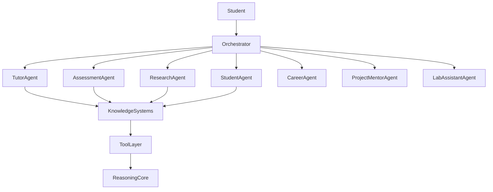

---

# 3. Agent Hierarchy

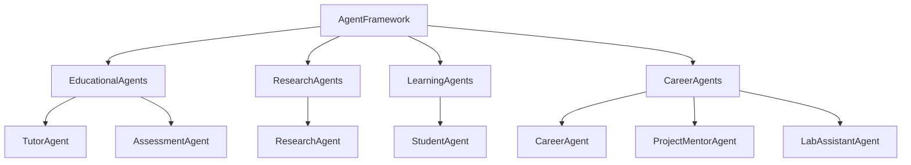

---

# 4. Core Agent Interface

Every agent implements:

```yaml
Agent:
  id:
  name:
  description:

Capabilities:
  - capability_1
  - capability_2

Inputs:
  - input_types

Outputs:
  - output_types

Memory:
  read:
  write:

Tools:
  allowed:
  denied:

Events:
  consumes:
  produces:
```

---

# 5. Tutor Agent

## Purpose

Primary teaching agent.

Responsible for delivering educational content.

---

## Responsibilities

* Concept Explanation
* Analogies
* Examples
* Guided Learning
* Socratic Teaching
* Misconception Detection
* Knowledge Reinforcement

---

## Internal Workflow

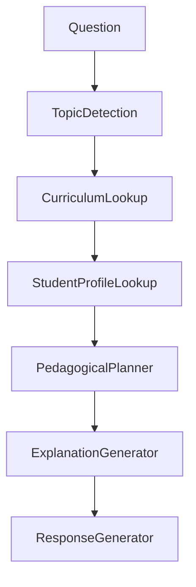

---

## Memory Access

Read:

* Student Memory
* Curriculum Memory
* Knowledge Graph

Write:

* Learning Progress
* Topic Interactions

---

## Tool Permissions

Allowed:

* Curriculum Search
* Knowledge Graph Search
* Diagram Generator
* Research Summary Tool

Denied:

* Profile Modification
* Assessment Grading

---

# 6. Assessment Agent

## Purpose

Evaluate learning.

---

## Responsibilities

* Quiz Generation
* Assignment Generation
* Viva Questions
* Evaluation
* Skill Gap Analysis

---

## Workflow

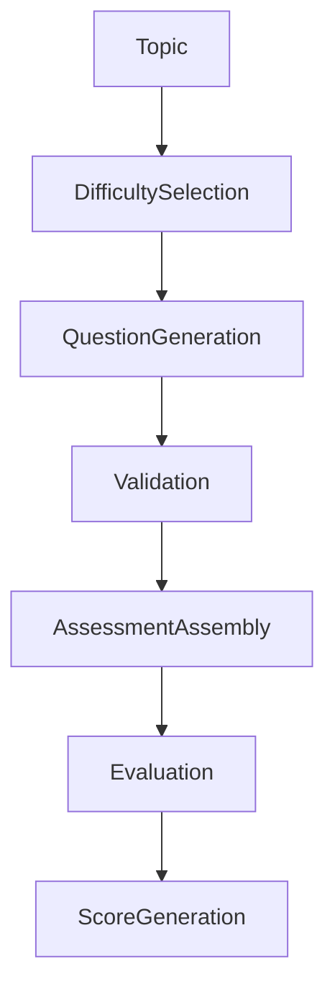

---

## Memory Access

Read:

* Student Profile
* Curriculum Data

Write:

* Assessment Records
* Mastery Scores

---

## Generated Outputs

* MCQs
* Short Answers
* Long Answers
* Coding Problems
* Research Questions

---

# 7. Research Agent

## Purpose

Provide latest academic knowledge.

---

## Responsibilities

* Paper Discovery
* Citation Management
* Trend Analysis
* Research Summaries

---

## Workflow

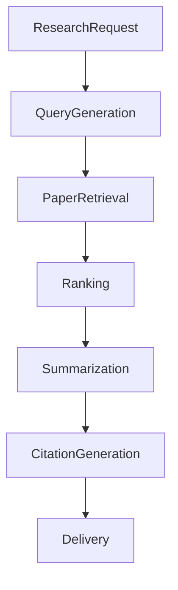

---

## Tool Access

Allowed:

* IEEE Search
* ACM Search
* arXiv Search
* Citation Tools

---

## Output Types

* Research Summary
* Citation List
* Research Roadmap
* Literature Review

---

# 8. Student Agent

## Purpose

Maintain learner digital twin.

---

## Responsibilities

* Knowledge State Tracking
* Progress Monitoring
* Weak Area Detection
* Learning Analytics

---

## Student Profile Model

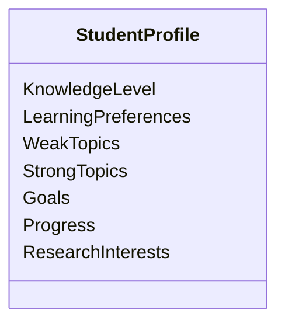

---

## Workflow

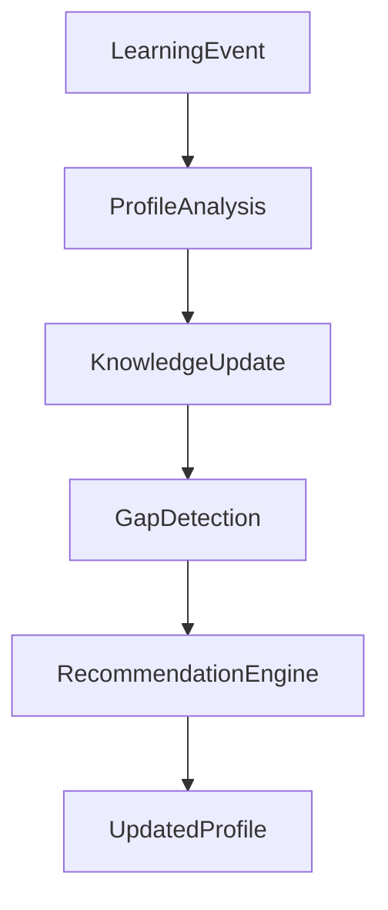

---

# 9. Career Agent

## Purpose

Bridge learning and industry.

---

## Responsibilities

* Skill Mapping
* Industry Trends
* Career Guidance
* Learning Recommendations

---

## Workflow

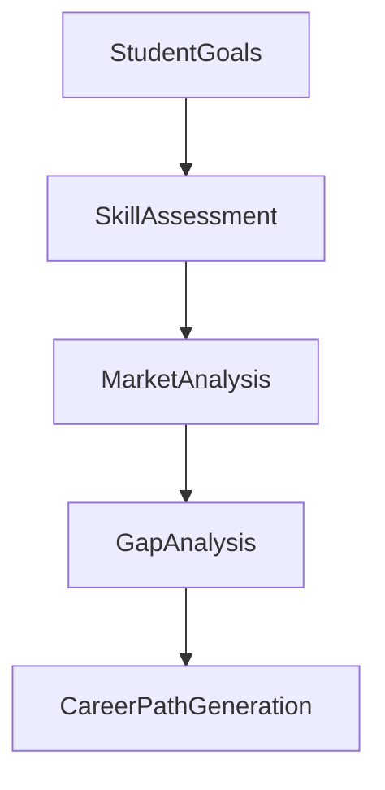

---

# 10. Project Mentor Agent

## Purpose

Guide project development.

---

## Responsibilities

* Project Suggestions
* Architecture Reviews
* Technology Selection
* Research Directions

---

## Workflow

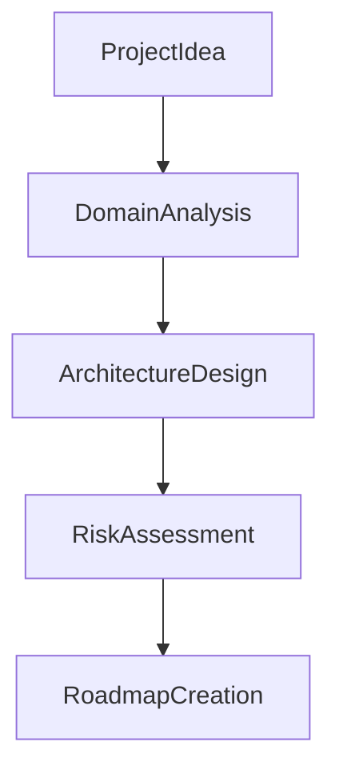

---

# 11. Lab Assistant Agent

## Purpose

Support practical learning.

---

## Responsibilities

* Lab Guidance
* Simulation Support
* Experiment Planning
* Result Analysis

---

## Workflow

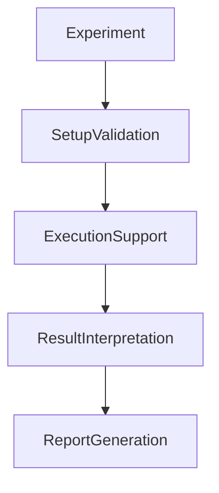

---

# 12. Future Agents

## Planned Agents

### Whiteboard Agent

Responsibilities:

* Handwriting Recognition
* Diagram Understanding
* Visual Teaching

---

### Video Learning Agent

Responsibilities:

* Lecture Analysis
* Topic Extraction
* Quiz Generation

---

### Audio Tutor Agent

Responsibilities:

* Voice Conversations
* Pronunciation Assessment
* Spoken Tutoring

---

### Research Supervisor Agent

Responsibilities:

* Thesis Guidance
* Research Planning
* Publication Support

---

# 13. Agent Communication Protocol

Agents never communicate directly.

All communication flows through the orchestrator.

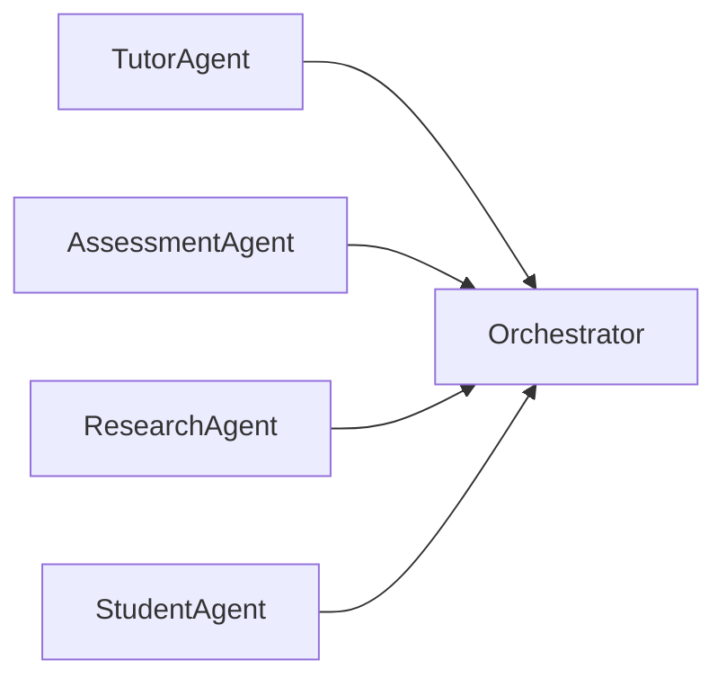

---

# 14. Event System

## Agent Events

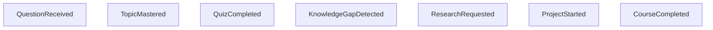

---

## Event Lifecycle

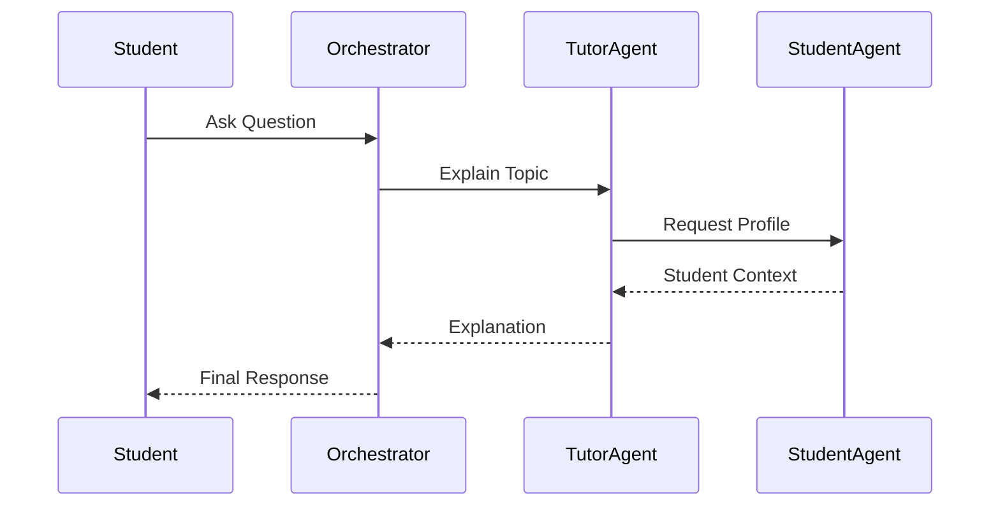

---

# 15. Agent Memory Permissions

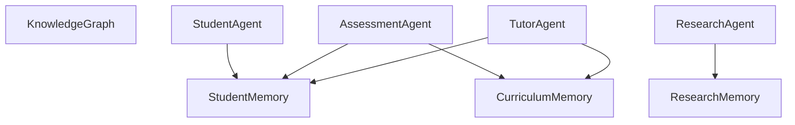

---

# 16. Agent Trust Model

Each response receives:

* Confidence Score
* Source Verification
* Citation Validation

---

## Verification Pipeline

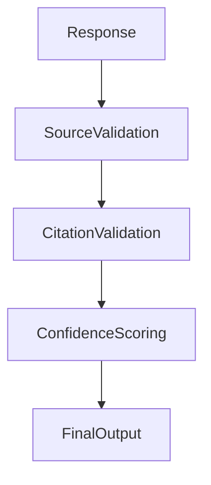

---

# 17. Agent Marketplace Vision

Future contributors can publish:

### Educational Agents

* Medical Tutor
* Law Tutor
* AI Tutor

### Research Agents

* IEEE Specialist
* Healthcare Research Agent

### Career Agents

* Software Engineering Advisor
* Data Science Advisor

### Learning Agents

* Exam Coach
* Interview Coach

---

# 18. Long-Term Agent Evolution

Phase 1

Tutor + Assessment

↓

Phase 2

Student Modeling

↓

Phase 3

Research Intelligence

↓

Phase 4

Career Intelligence

↓

Phase 5

Multimodal Agents

↓

Phase 6

Collaborative Agent Ecosystem

↓

Phase 7

Educational Agent Marketplace

---

# Success Criteria

The Agent System succeeds when:

1. New agents can be added without modifying existing agents.
2. Agents remain model-independent.
3. Agents communicate through standardized contracts.
4. Educational workflows are composable.
5. Multimodal agents integrate seamlessly.
6. Community-developed agents can operate safely.
7. Intelligence emerges from collaboration rather than a single model.
