# Agent Orchestration System (AOS)

Version: 1.0

Status: Core Intelligence Coordination Layer

Dependencies:

* TAS.md
* ADS.md
* EKS.md
* KGS.md
* LMS.md
* PES.md

---

# 1. Purpose

The Agent Orchestration System (AOS) is responsible for coordinating all educational agents, tools, memories, and reasoning systems within EduOS.

Without AOS:

```text
Agents exist.
```

With AOS:

```text
Agents collaborate.
```

AOS acts as the operating system scheduler of EduOS.

---

# 2. Why AOS Exists

Most AI systems use:

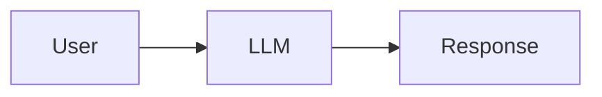

EduOS uses:

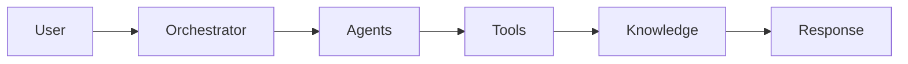

This requires coordination.

---

# 3. System Position

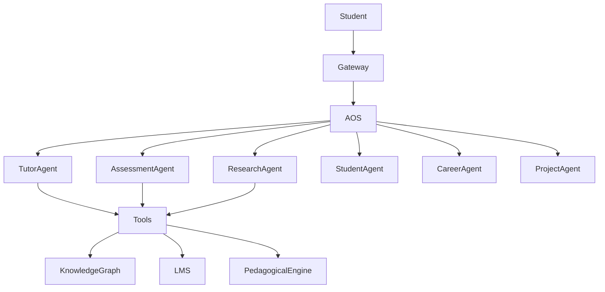

---

# 4. Responsibilities

The AOS is responsible for:

### Intent Understanding

Determine:

```text
What is the user trying to achieve?
```

---

### Agent Selection

Determine:

```text
Which agents should participate?
```

---

### Workflow Planning

Determine:

```text
In what order should agents execute?
```

---

### Context Assembly

Determine:

```text
What information should each agent receive?
```

---

### Conflict Resolution

Determine:

```text
Which agent output should be trusted?
```

---

### Memory Synchronization

Determine:

```text
What should be remembered?
```

---

# 5. Core Architecture

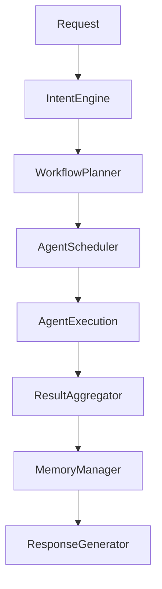

---

# 6. Intent Understanding Engine

Purpose:

Convert user input into educational objectives.

---

Example

Input:

```text
Explain OSPF and provide latest research.
```

Intent Engine Output:

```yaml
intent:
  learning: true
  research: true
  assessment: false

required_agents:
  - tutor
  - research
```

---

# 7. Agent Selection Engine

Purpose:

Choose participating agents.

---

Example Mapping

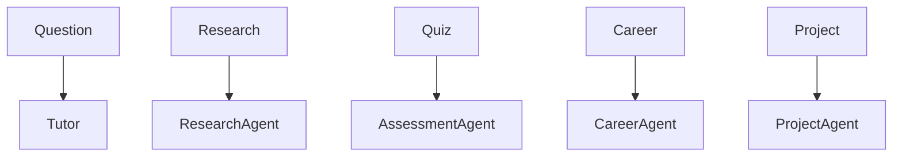

---

# 8. Workflow Planner

Purpose:

Create execution graph.

---

Example

Request:

```text
Explain OSPF and create a quiz.
```

Execution Graph:

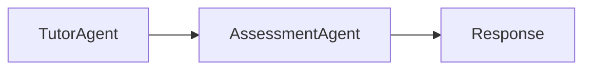

---

Research Example

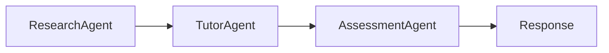

---

# 9. Agent Scheduler

Purpose:

Determine execution order.

---

Execution Modes

### Sequential

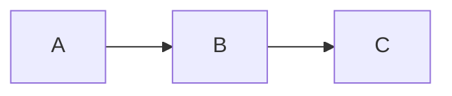

---

### Parallel

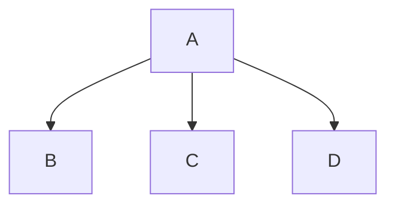

---

### Hybrid

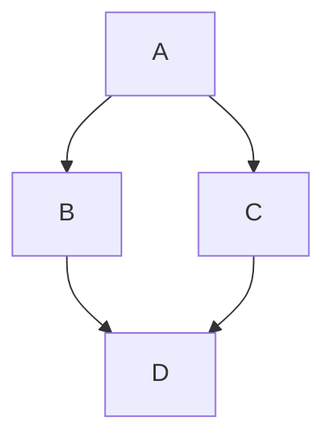

---

# 10. Context Management System

One of the hardest problems.

Agents should not receive everything.

---

Bad

```text
Entire Database
```

---

Good

```text
Relevant Context
```

---

Architecture

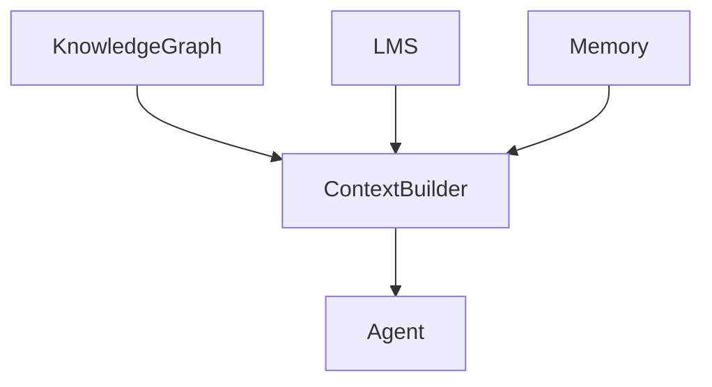

---

# 11. Shared Context Protocol

Each agent receives:

```yaml
context:

  student_profile:

  learning_goal:

  curriculum_context:

  knowledge_state:

  active_task:
```

---

# 12. Agent Communication Bus

Agents never communicate directly.

---

Bad

```text
Tutor → Research
```

---

Good

```text
Tutor
    ↓
AOS
    ↓
Research
```

---

Architecture

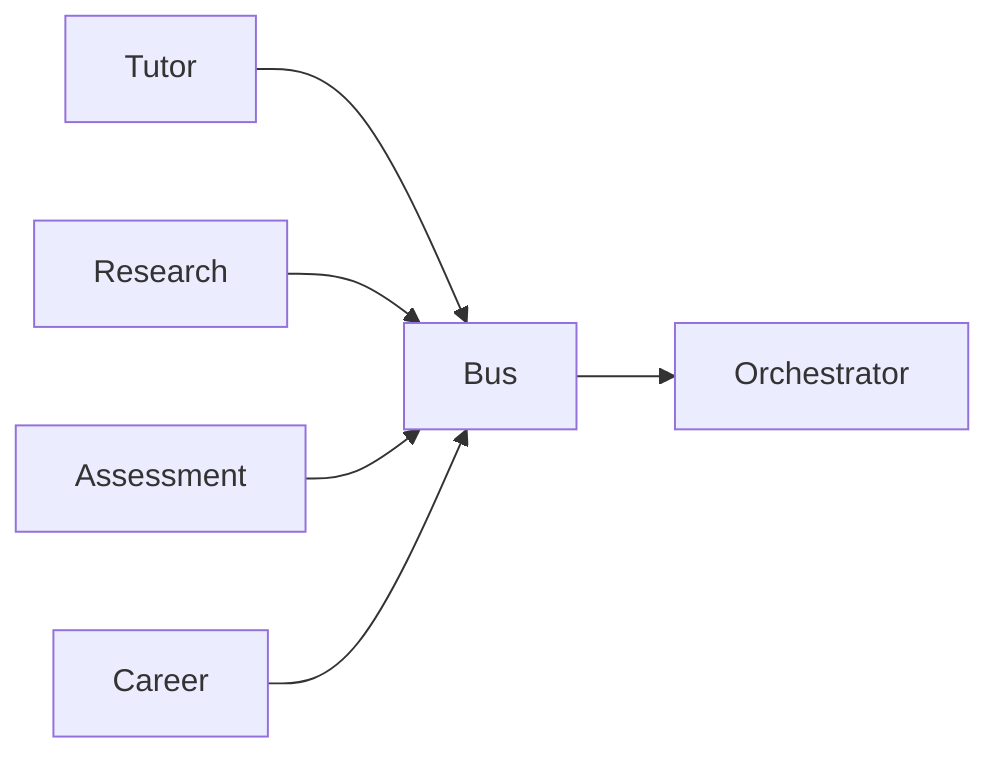

---

# 13. Memory Synchronization Layer

Every interaction updates memory.

---

Workflow

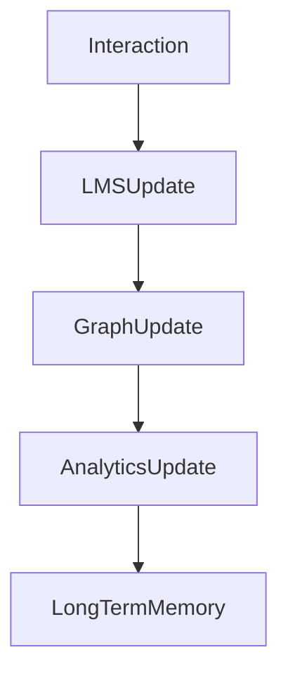

---

# 14. Multi-Agent Collaboration

Example:

Student asks:

```text
I want to become an AI Engineer.
```

Workflow:

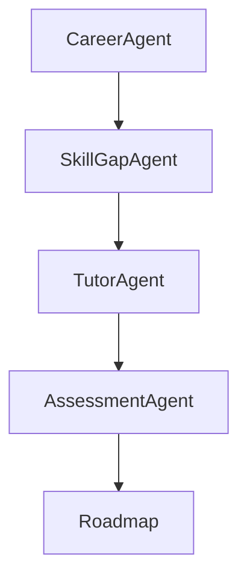

---

# 15. Conflict Resolution Engine

Problem:

Agents may disagree.

---

Example

Tutor:

```text
Mastery = 80%
```

Assessment:

```text
Mastery = 50%
```

Conflict.

---

Resolution:

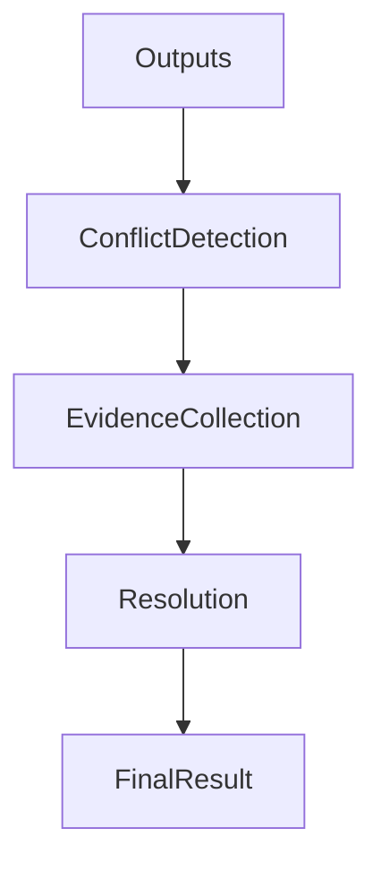

---

# 16. Confidence Framework

Every agent returns:

```yaml
response:

  confidence:

  evidence:

  citations:
```

---

Example

```yaml
confidence: 92
```

---

# 17. Tool Invocation Engine

Purpose:

Decide when tools are needed.

---

Workflow

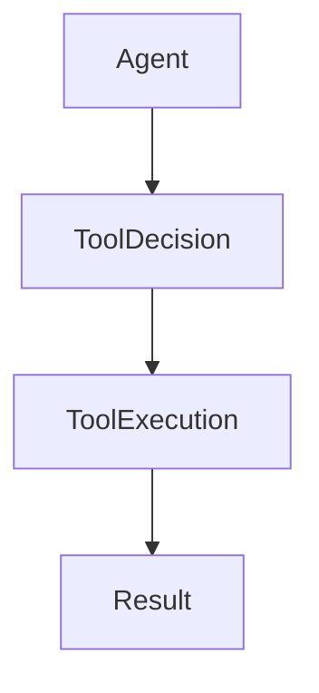

---

# 18. Event-Driven Architecture

Everything becomes events.

---

Core Events

```text
QuestionAsked
TopicLearned
QuizCompleted
ResearchRequested
GoalUpdated
MasteryChanged
```

---

Event Pipeline

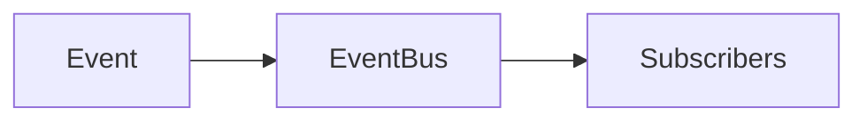

---

# 19. Learning Workflow Example

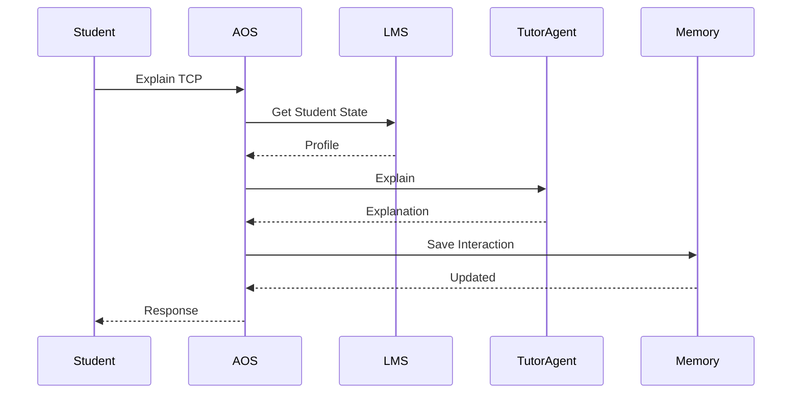

---

# 20. Research Workflow Example

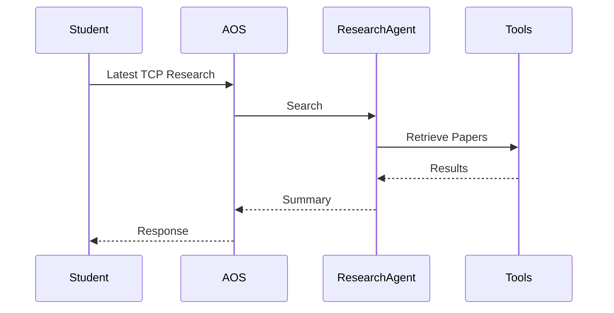

---

# 21. Scalability Architecture

Current

```text
5 Agents
```

Future

```text
500+ Agents
```

AOS must support:

* Dynamic Registration
* Discovery
* Capability Matching

---

Architecture

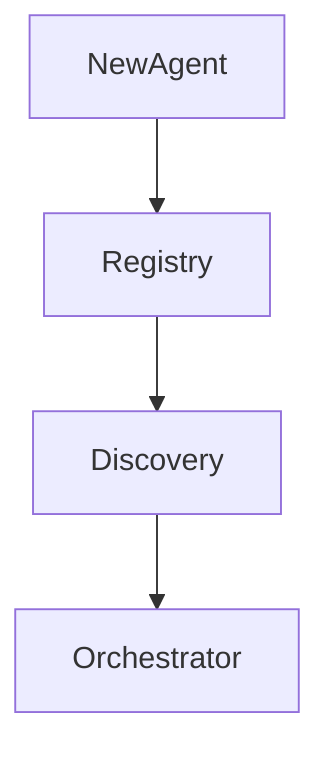

---

# 22. Agent Registry

Every agent publishes:

```yaml
agent:

  id:

  capabilities:

  permissions:

  version:
```

---

# 23. Inspiration & Research Foundations

### Multi-Agent Systems

Wooldridge, M.

Introduction to MultiAgent Systems

---

### Blackboard Architecture

Nii, H. P.

The Blackboard Model of Problem Solving

---

### AutoGen

Wu et al.

AutoGen:
Enabling Next-Gen LLM Applications

---

### CAMEL

Li et al.

Communicative Agents for Mind Exploration

---

### MetaGPT

Hong et al.

MetaGPT:
Meta Programming for Multi-Agent Systems

---

### LangGraph

State-machine based agent orchestration.

---

### Distributed Systems

Lamport

Time, Clocks, and Ordering of Events

---

# 24. Long-Term Evolution

Phase 1

```text
Static Workflows
```

↓

Phase 2

```text
Dynamic Agent Selection
```

↓

Phase 3

```text
Agent Collaboration
```

↓

Phase 4

```text
Self-Improving Workflows
```

↓

Phase 5

```text
Educational Agent Ecosystem
```

↓

Phase 6

```text
Autonomous Educational Society
```

---

# Success Criteria

AOS succeeds when:

1. Agents can be added without modifying existing agents.
2. Agent workflows are dynamically generated.
3. Context is efficiently shared.
4. Conflicts are resolved automatically.
5. Memory remains synchronized.
6. Tool usage is optimized.
7. EduOS behaves like a coordinated educational organization rather than isolated AI components.
