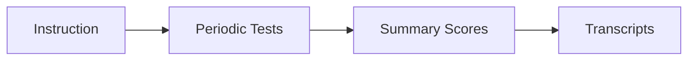
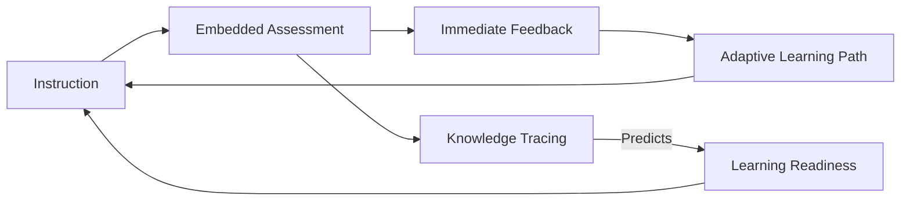
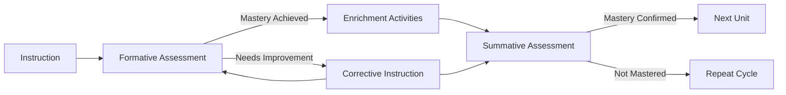
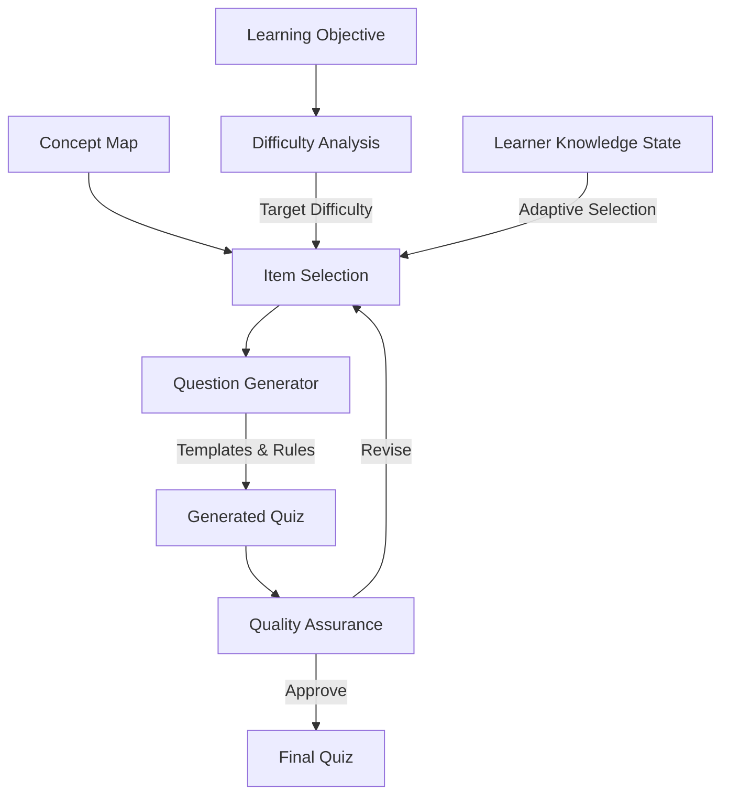
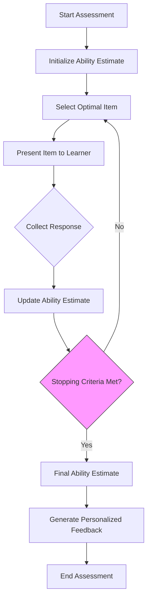
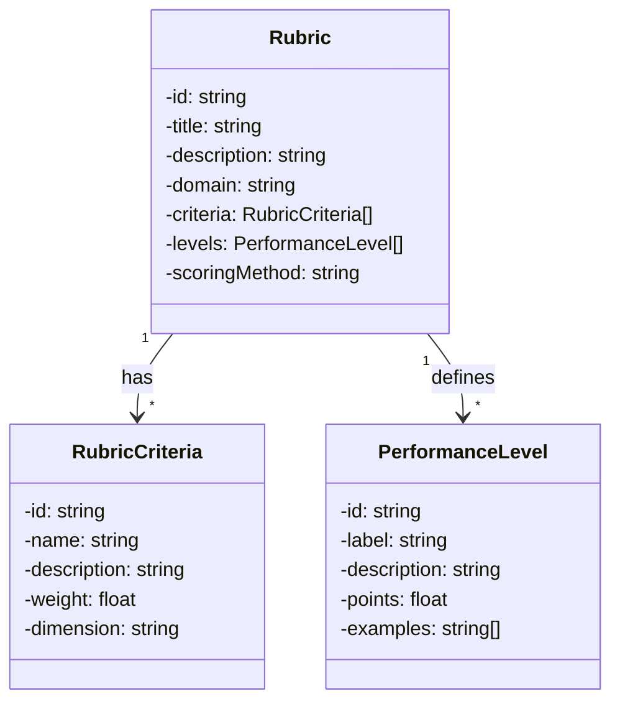
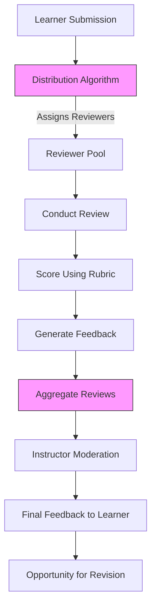
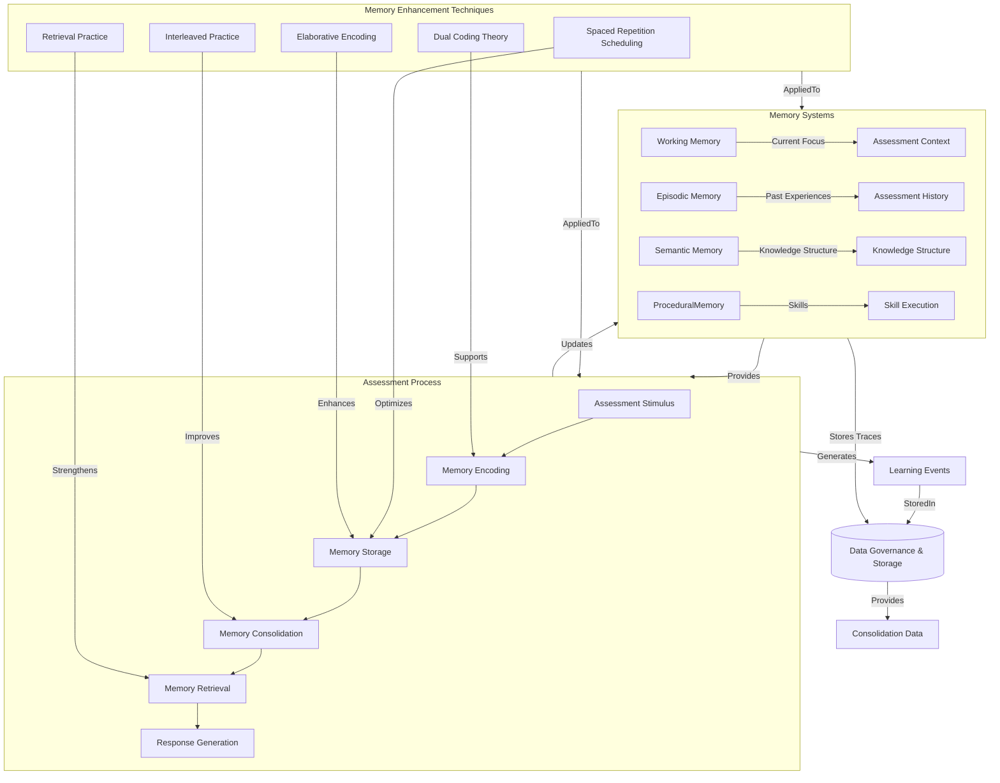
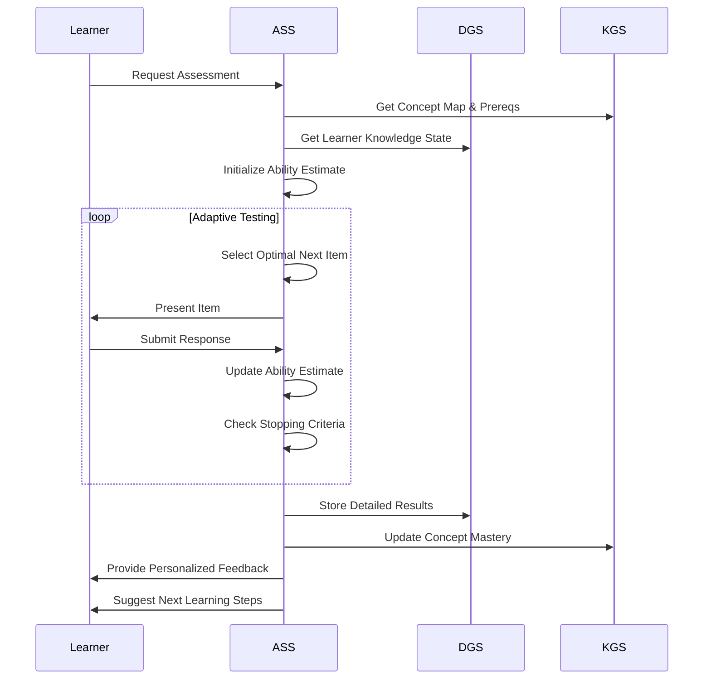

# Assessment System Specification (ASS)

Version: 2.0

Status: Foundational Assessment Infrastructure

Dependencies:

* KIS.md
* KGS.md
* LMS.md
* MAS.md
* DGS.md
* AOS.md

---

# 1. Purpose

The Assessment System Specification (ASS) defines the complete assessment intelligence layer for EduOS, encompassing all forms of educational evaluation, from formative checks to comprehensive competency validation.

Without ASS:

```text
Assessments are isolated events.
Feedback is delayed.
Mastery is poorly measured.
```

With ASS:

```text
Assessments are continuous learning experiences.
Feedback is immediate and actionable.
Mastery is precisely tracked and predicted.
```

ASS acts as the assessment intelligence system of EduOS.

---

# 2. Why ASS Exists

Most educational assessment systems use:



EduOS uses:



This requires assessment to be integrated into the learning process itself.

---

# 3. Assessment Architecture

```mermaid
flowchart TD
    subgraph ASS[Assessment System]
        direction TB
        AssessmentEngine[Assessment Engine]:::component
        ItemBank[(Item Bank)]:::storage
        RubricEngine[Rubric Engine]:::component
        AdaptiveEngine[Adaptive Testing Engine]:::component
        FeedbackGenerator[Feedback Generator]:::component
        AnalyticsEngine[Analytics Engine]:::component
        MemoryInterface[Memory Interface]:::component
    end
    
    subgraph Storage[Assessment Storage]
        ItemBank -->|Items| Assessments[(Assessments)]
        RubricEngine -->|Rubrics| Rubrics[(Rubrics)]
        Assessments -->|Results| Results[(Assessment Results)]
        FeedbackGenerator -->|Feedback| Feedback[(Feedback Store)]
        AnalyticsEngine -->|Metrics| Metrics[(Assessment Analytics)]
        MemoryInterface -->|Traces| KnowledgeTraces[(Knowledge Traces)]
    end
    
    subgraph EduOSModules[EduOS Integration]
        LMS[LMS] -->|Learning Context| ASS
        KIS[KIS] -->|Content Difficulty| ASS
        KGS[KGS] -->|Concept Maps| ASS
        AOS[AOS] -->|Agent Coordination| ASS
        DGS[DGS] -->|Data Storage| ASS
        MAS[MAS] -->|Admin Requirements| ASS
        TCS[TCS] -->|Competency Mapping| ASS
    end
    
    ASS -->|Adaptive Assessments| LMS
    ASS -->|Diagnostic Results| KIS
    ASS -->|Mastery Predictions| KGS
    ASS -->|Performance Analytics| MAS
    ASS -->|Skill Validation| TCS
    ASS -->|Learning Events| DGS
    
    classDef component fill:#bf9,stroke:#333,stroke-width:2px;
    classDef storage fill:#f9f,stroke:#333,stroke-width:2px;
    classDef module fill:#bbf,stroke:#333,stroke-width:2px;
```



---

# 4. Types of Assessments

## 4.1 Formative Assessments
Continuous, low-stakes evaluations that provide immediate feedback to improve learning.

**Characteristics:**
- Embedded within learning activities
- Immediate, specific feedback
- Focus on improvement, not grades
- High frequency, low stakes
- Diagnostic in nature

**Examples:**
- Concept checks during lectures
- Practice problems with hints
- Peer instruction questions
- One-minute papers
- Exit tickets

## 4.2 Summative Assessments
Comprehensive evaluations of learning at the end of an instructional unit.

**Characteristics:**
- Evaluates cumulative learning
- Higher stakes for certification/progression
- Comprehensive coverage of objectives
- Standardized administration
- Used for accountability

**Examples:**
- Final exams
- Certification tests
- Portfolio reviews
- Capstone projects
- Standardized tests

## 4.3 Diagnostic Assessments
Pre-instruction evaluations to identify learner strengths, weaknesses, and prior knowledge.

**Characteristics:**
- Administered before instruction
- Identifies prerequisite knowledge
- Reveals misconceptions
- Informs instructional planning
- Establishes baseline

**Examples:**
- Prerequisite quizzes
- Skills inventories
- Concept inventories
- Learning style assessments
- Knowledge probes

## 4.4 Adaptive Assessments
Computer-administered tests that adapt difficulty based on learner responses.

**Characteristics:**
- Item Response Theory (IRT) based
- Real-time difficulty adjustment
- Efficient measurement with fewer items
- Precise ability estimation
- Personalized challenge level

**Examples:**
- Computerized Adaptive Testing (CAT)
- Tailored testing algorithms
- Multistage adaptive testing
- Linear-on-the-fly testing (LOFT)

## 4.5 Project Assessments
Evaluation of extended, complex learning artifacts.

**Characteristics:**
- Authentic, real-world tasks
- Extended timeframes
- Multiple deliverables
- Process and product evaluation
- Often collaborative

**Examples:**
- Research projects
- Software development
- Design prototypes
- Business plans
- Multimedia productions

## 4.6 Research Assessments
Evaluation of scholarly inquiry and investigation skills.

**Characteristics:**
- Focus on research methodology
- Evaluation of inquiry process
- Assessment of literature review
- Validation of findings
- Peer review components

**Examples:**
- Research proposals
- Literature reviews
- Methodology assessments
- Results interpretation
- Presentation defenses

---

# 5. Educational Frameworks

## 5.1 Bloom Taxonomy (Revised)

```mermaid
flowchart TD
    Remember[Remember] --> Understand[Understand]
    Understand --> Apply[Apply]
    Apply --> Analyze[Analyze]
    Analyze --> Evaluate[Evaluate]
    Evaluate --> Create[Create]
    
    classDef level fill:#e9f7ef,stroke:#333,stroke-width:1px;
    classRemember Remember :::level
    classUnderstand Understand :::level
    classApply Apply :::level
    classAnalyze Analyze :::level
    classEvaluate Evaluate :::level
    classCreate Create :::level
```

**Assessment Applications:**
- Remember: Recall questions, definitions, facts
- Understand: Explain, summarize, interpret
- Apply: Solve problems, implement procedures
- Analyze: Compare, contrast, categorize
- Evaluate: Critique, judge, justify
- Create: Design, construct, produce

## 5.2 Mastery Learning



**Key Principles:**
- All students can achieve mastery with appropriate support
- Learning objectives are clearly defined
- Formative assessment guides instruction
- Corrective feedback is provided when needed
- Time varies for learning, not the standard

## 5.3 Knowledge Tracing

```mermaid
stateDiagram-v2
    [*] --> Unknown
    Unknown --> Known: Learning Event (pLearn)
    Known --> Unknown: Forgetting (pForget)
    Known --> Known: Correct Application (pGuess)
    Unknown --> Unknown: Incorrect Application (pSlip)
    
    state Unknown {
        [*] --> LowConfidence
        LowConfidence --> MediumConfidence: pLearn
        MediumConfidence --> HighConfidence: pLearn
        HighConfidence --> Known: pLearn
    }
    
    state Known {
        [*] --> HighConfidence
        HighConfidence --> MediumConfidence: pForget
        MediumConfidence --> LowConfidence: pForget
        LowConfidence --> Unknown: pForget
    }
```

**Parameters:**
- pLearn: Probability of learning from opportunity
- pForget: Probability of forgetting
- pGuess: Probability of correct guess
- pSlip: Probability of careless error

---

# 6. Core Features

## 6.1 Automatic Quiz Generation



**Process:**
1. Analyze learning objectives and concept relationships
2. Determine target difficulty based on learner state
3. Select appropriate items from item bank
4. Generate questions using templates and rules
5. Apply quality assurance checks
6. Deliver personalized quiz

**Templates Include:**
- Multiple choice with plausible distractors
- Fill-in-the-blank with context
- Matching exercises
- Short answer with rubrics
- Problem-solving scenarios

## 6.2 Difficulty Estimation

```mermaid
flowchart LR
    ItemFeatures[Item Features] --> IRTModel[IRT Model]
    HistoricalData[Historical Performance Data] --> IRTModel
    ExpertJudgment[Expert Judgment] --> IRTModel
    IRTModel -->|Item Parameters| DifficultyEstimate[Difficulty Estimate]
    DifficultyEstimate -->|a (discrimination)|
    DifficultyEstimate -->|b (difficulty)|
    DifficultyEstimate -->|c (guessing)|
    
    subgraph IRTModel[IRT Model Types]
        Direction[1PL/Rasch] --> IRTModel
        2PL[2PL] --> IRTModel
        3PL[3PL] --> IRTModel
    end
```

**Implementation:**
- Uses 3PL Item Response Theory model
- Combines statistical analysis with expert judgment
- Continuously updated with new performance data
- Considers item features (cognitive load, reading level, etc.)
- Provides confidence intervals for estimates

## 6.3 Adaptive Testing



**Stopping Criteria:**
- Maximum items reached
- Standard error below threshold
- Classification consistency achieved
- Time limit exceeded
- Content distribution requirements met

## 6.4 Rubrics



**Types:**
- Analytic rubrics: Separate scores for each criterion
- Holistic rubrics: Single overall score
- Developmental rubrics: Show progression over time
- Checklist rubrics: Binary yes/no criteria

**Features:**
- Auto-generated from learning objectives
- Peer review capabilities
- Self-assessment versions
- Exemplar-based scoring
- Rubric validation analytics

## 6.5 Peer Evaluation



**Features:**
- Anonymous or attributed options
- Calibration algorithms for reviewer accuracy
- Multiple review rounds
- Feedback quality metrics
- Detection of collusion or bias
- Reputation systems for reviewers

## 6.6 Oral Assessments

```mermaid
flowchart TD
    Prompt[Assessment Prompt] --> Preparation[Preparation Time]
    Preparation --> Recording[A/V Recording]
    Recording --> Transcription[Automatic Transcription]
    Transcription --> Analysis[NLP Analysis]
    Analysis --> RubricMapping[Map to Rubric Criteria]
    RubricMapping --> Scoring[Generate Scores]
    Scoring --> Feedback[Generate Feedback]
    Feedback --> Delivery[Deliver to Learner & Instructor]
    
    subgraph NLPAnalysis[NLP Analysis]
        Direction[Content Analysis] --> NLPAnalysis
        Fluency[Fluency Metrics] --> NLPAnalysis
        Pronunciation[Pronunciation Score] --> NLPAnalysis
        ArgumentStructure[Argument Structure] --> NLPAnalysis
        EvidenceUse[Evidence Use] --> NLPAnalysis
    end
```

**Components:**
- Automated speech-to-text with domain adaptation
- Prosody analysis (pace, tone, emphasis)
- Argument mining and structure analysis
- Evidence and citation verification
- Language proficiency assessment
- Non-verbal cue analysis (when video available)

## 6.7 Coding Assessments

```mermaid
flowchart TD
    Specification[Problem Specification] --> Environment[Provision Coding Environment]
    Environment --> Coding[Learner Coding Session]
    Coding --> Execution[Automatic Test Execution]
    Execution --> TestResults[Test Results Collection]
    TestResults --> StaticAnalysis[Static Code Analysis]
    StaticAnalysis --> PlagiarismCheck[Plagiarism Detection]
    PlagiarismCheck --> FeedbackGeneration[Generate Comprehensive Feedback]
    FeedbackGeneration --> Delivery[Deliver to Learner]
    
    subgraph TestExecution[Test Execution]
        UnitTests[Unit Tests] --> TestExecution
        IntegrationTests[Integration Tests] --> TestExecution
        PropertyTests[Property-Based Tests] --> TestExecution
        PerformanceTests[Performance Tests] --> TestExecution
        SecurityTests[Security Tests] --> TestExecution
    end
    
    subgraph StaticAnalysis[Static Analysis]
        Style[Code Style] --> StaticAnalysis
        Complexity[Cyclomatic Complexity] --> StaticAnalysis
        Maintainability[Maintainability Index] --> StaticAnalysis
        Security[Security Vulnerabilities] --> StaticAnalysis
        Dependencies[Dependency Analysis] --> StaticAnalysis
    end
```

**Features:**
- Multi-language support (Python, Java, JavaScript, C++, etc.)
- Containerized, secure execution environments
- Comprehensive test suites (unit, integration, property-based)
- Static analysis for code quality and security
- Plagiarism detection using AST comparison
- Real-time collaboration and pair programming options
- Execution time and memory profiling

## 6.8 Simulation Assessments

```mermaid
flowchart TD
    Scenario[Simulation Scenario] --> Environment[Virtual Environment]
    Environment --> Interaction[Learner Interaction]
    Interaction --> DataCollection[Behavioral Data Collection]
    DataCollection --> EventStream[Timestamped Event Stream]
    EventStream --> PatternAnalysis[Pattern Recognition Analysis]
    PatternAnalysis --> CompetencyMapping[Map to Competencies]
    CompetencyMapping --> Scoring[Generate Competency Scores]
    Scoring --> Feedback[Generate Behavioral Feedback]
    Feedback --> Debrief[Structured Debrief Session]
    
    subgraph DataCollection[Data Collected]
        Direction[Actions Taken] --> DataCollection
        Timing[Response Times] --> DataCollection
        Resources[Resource Usage] --> DataCollection
        Errors[Errors Made] --> DataCollection
        HelpSeeking[Help-Seeking Behavior] --> DataCollection
        Collaboration[Collaboration Patterns] --> DataCollection
    end
    
    subgraph PatternAnalysis[Pattern Analysis]
        Sequence[Sequential Pattern Mining] --> PatternAnalysis
        Frequency[Frequency Analysis] --> PatternAnalysis
        Deviation[Deviation from Norms] --> PatternAnalysis
        Efficiency[Efficiency Metrics] --> PatternAnalysis
        Adaptation[Adaptation Over Time] --> PatternAnalysis
    end
```

**Types:**
- Virtual laboratories (chemistry, physics, biology)
- Business simulations (marketing, finance, operations)
- Medical simulations (patient interactions, procedures)
- Social simulations (negotiation, conflict resolution)
- Technical simulations (network configuration, circuit design)
- Emergency response simulations

---

# 7. Assessment Graph Architecture

```mermaid
graph TD
    subgraph AssessmentGraph[Assessment Knowledge Graph]
        Learner[(Learner)] -->|HasMastery| Concept[(Concept)]
        Learner -->|Demonstrates| Skill[(Skill)]
        Learner -->|Exhibits| Behavior[(Behavior)]
        Concept -->|PrerequisiteOf| Concept
        Skill -->|ComponentOf| Competency[(Competency)]
        Behavior -->|IndicatorOf| Skill
        Assessment[(Assessment)] -->|Measures| Concept
        Assessment -->|Evaluates| Skill
        Assessment -->|Observes| Behavior
        Item[(Assessment Item)] -->|PartOf| Assessment
        Item -->|Targets| Concept
        Item -->|Requires| Skill
        Item -->|Elicits| Behavior
    end
    
    subgraph TemporalAspects[Temporal Dimensions]
        Learner -->|AtTimestamp| State[(Knowledge State)]
        State -->|Includes| MasteryLevel[Mastery Levels]
        State -->|Includes| Confidence[Confidence Scores]
        State -->|Includes| Uncertainty[Uncertainty Estimates]
        State -->|UpdatedBy| AssessmentEvent[Assessment Events]
    end
    
    %% Styling
    classDef entity fill:#e9f7ef,stroke:#333,stroke-width:1px;
    classDef assessment fill:#fff2cc,stroke:#333,stroke-width:1px;
    classDef temporal fill:#d9e2f3,stroke:#333,stroke-width:1px;
    classLearner,Concept,Skill,Behavior,Competency,Assessment,Item,State,MasteryLevel,Confidence,Uncertainty,AssessmentEvent :::entity
    classAssessment :::assessment
    classState,MasteryLevel,Confidence,Uncertainty,AssessmentEvent :::temporal
```

**Graph Properties:**
- Directed, weighted edges representing relationships
- Temporal versioning for tracking knowledge evolution
- Probabilistic edges representing uncertainty
- Multi-relational (different edge types for different relationships)
- Scalable to millions of learners and concepts
- Supports both taxonomic and network structures

---

# 8. Assessment Memory Integration



**Memory Systems Integration:**
- Working memory: Manages cognitive load during assessment
- Episodic memory: Stores assessment experiences for future reference
- Semantic memory: Organizes knowledge structures being assessed
- Procedural memory: Tracks skill automation and fluency

**Enhancement Techniques:**
- Spaced repetition: Optimizes review scheduling based on forgetting curves
- Retrieval practice: Strengthens memory through active recall
- Interleaving: Improves discrimination by mixing related concepts
- Elaboration: Enhances encoding through explanation and connection-making
- Dual coding: Combines verbal and visual information for richer encoding

---

# 9. Assessment Analytics

```mermaid
flowchart TD
    subgraph DataSources[Data Sources]
        RawResponses[Raw Assessment Responses] -->|Stream| Processing[Real-time Processing]
        TimingData[Response Timing Data] -->|Stream| Processing
        BehavioralData[Interaction Patterns] -->|Stream| Processing
        FeedbackData[Feedback Responses] -->|Stream| Processing
        Metadata[Contextual Metadata] -->|Stream| Processing
    end
    
    subgraph Processing[Analytics Pipeline]
        Processing --> Validation[Data Validation]
        Validation --> Enrichment[Context Enrichment]
        Enrichment --> DimensionAnalysis[Dimensional Analysis]
        DimensionAnalysis --> TrendAnalysis[Trend Analysis]
        TrendAnalysis --> PredictiveModeling[Predictive Modeling]
        PredictiveModeling --> InsightGeneration[Insight Generation]
    end
    
    subgraph Outputs[Analytics Outputs]
        InsightGeneration --> LearnerInsights[Learner-Facing Insights]
        InsightGeneration --> InstructorInsights[Instructor Dashboards]
        InsightGeneration --> AdministrativeReports[Administrative Reports]
        InsightGeneration --> ResearchMetrics[Research Metrics]
        InsightGeneration --> SystemOptimization[System Optimization]
    end
    
    %% Styling
    classDef source fill:#f9f,stroke:#333,stroke-width:1px;
    classDef process fill:#bf9,stroke:#333,stroke-width:1px;
    classDef output fill:#9f9,stroke:#333,stroke-width:1px;
    classRawResponses,TimingData,BehavioralData,FeedbackData,Metadata :::source
    classValidation,Enrichment,DimensionAnalysis,TrendAnalysis,PredictiveModeling,InsightGeneration :::process
    classLearnerInsights,InstructorInsights,AdministrativeReports,ResearchMetrics,SystemOptimization :::output
```

**Analytics Categories:**

1. **Learner Analytics**
   - Mastery trajectories and predictions
   - Learning velocity and efficiency
   - Strength/weakness profiling
   - Engagement and persistence metrics
   - Metacognitive awareness indicators

2. **Instructional Analytics**
   - Item effectiveness and discrimination
   - Difficulty calibration validation
   - Learning objective coverage analysis
   - Instructional strategy effectiveness
   - Resource utilization optimization

3. **Assessment Quality**
   - Reliability coefficients (Cronbach's alpha, KR-20)
   - Validity evidence collection
   - Fairness and bias detection
   - Standard error of measurement
   - Item response theory fit statistics

4. **System Analytics**
   - Assessment completion rates
   - Time distribution analysis
   - Adaptive algorithm effectiveness
   - Feedback utilization rates
   - Remediation impact measurement

**Predictive Models:**
- Mastery prediction (next concept readiness)
- At-risk learner identification
- Intervention effectiveness forecasting
- Learning path optimization
- Skill transfer prediction

---

# 10. Assessment Agents

```mermaid
flowchart TD
    subgraph AssessmentAgents[Assessment Agent Ecosystem]
        ItemGeneratorAgent[Item Generator Agent] -->|Creates| AssessmentItems[Assessment Items]
        DifficultyAgent[Difficulty Agent] -->|Estimates| ItemDifficulty[Item Difficulty]
        AdaptiveAgent[Adaptive Agent] -->|Controls| TestAdaptation[Test Adaptation]
        FeedbackAgent[Feedback Agent] -->|Generates| PersonalizedFeedback[Personalized Feedback]
        RubricAgent[Rubric Agent] -->|Builds| EvaluationRubrics[Evaluation Rubrics]
        PeerReviewAgent[Peer Review Agent] -->|Facilitates| PeerReviewProcess[Peer Review Process]
        AnalyticsAgent[Analytics Agent] -->|Produces| AssessmentInsights[Assessment Insights]
        ValidationAgent[Validation Agent] -->|Ensures| AssessmentQuality[Assessment Quality]
    end
    
    subgraph Coordination[Coordination Layer]
        AOS[AOS] -->|Orchestrates| AssessmentAgents
        AssessmentAgents -->|Exchange| Knowledge[Assessment Knowledge]
        AssessmentAgents -->|Update| Models[Psychometric Models]
        AssessmentAgents -->|Learn|FromExperience[From Assessment Experience]
    end
    
    subgraph Integrations[System Integrations]
        AssessmentAgents -->|Consumes| Content[Content from KIS]
        AssessmentAgents -->|Uses| Concepts[Concepts from KGS]
        AssessmentAgents -->|Stores| Results[Results in DGS]
        AssessmentAgents -->|Receives| Context[Learner Context from LMS]
        AssessmentAgents -->|Reports|ToAdmin[Reports to MAS]
        AssessmentAgents -->|Validates|Skills[Skills with TCS]
    end
    
    classDef agent fill:#cf9,stroke:#333,stroke-width:2px;
    classDef coordination fill:#bbf,stroke:#333,stroke-width:2px;
    classDef integration fill:#f9f,stroke:#333,stroke-width:2px;
    classItemGeneratorAgent,DifficultyAgent,AdaptiveAgent,FeedbackAgent,RubricAgent,PeerReviewAgent,AnalyticsAgent,ValidationAgent :::agent
    classAOS :::coordination
    classContent,Concepts,Results,Context,ToAdmin,Skills :::integration
```

**Agent Responsibilities:**

1. **Item Generator Agent**
   - Creates assessment items from learning objectives
   - Applies item generation templates and rules
   - Ensures alignment with Bloom taxonomy levels
   - Generates distractors for multiple-choice items
   - Creates performance tasks and scenarios

2. **Difficulty Agent**
   - Estimates item difficulty using IRT models
   - Analyzes historical performance data
   - Incorporates expert judgment and content analysis
   - Provides confidence intervals for estimates
   - Continuously updates difficulty parameters

3. **Adaptive Agent**
   - Implements adaptive testing algorithms
   - Selects optimal next items based on current estimate
   - Manages test exposure and item overlap
   - Enforces content balancing constraints
   - Determines test termination based on precision

4. **Feedback Agent**
   - Generates immediate, specific, actionable feedback
   - Tailors feedback to learner's zone of proximal development
   - Provides hints without giving away answers
   - Suggests next learning activities
   - Creates both learner and instructor-facing feedback

5. **Rubric Agent**
   - Creates analytic and holistic rubrics
   - Aligns rubric criteria with learning objectives
   - Develops performance level descriptions
   - Generates exemplar-based scoring guides
   - Validates rubric reliability and validity

6. **Peer Review Agent**
   - Manages peer review distribution algorithms
   - Calibrates reviewer accuracy and detects bias
   - Facilitates constructive feedback generation
   - Manages anonymity and attribution options
   - Tracks review quality and reviewer reputation

7. **Analytics Agent**
   - Computes psychometric properties and validity evidence
   - Generates learner mastery profiles and predictions
   - Creates instructor dashboards and reports
   - Identifies anomalous response patterns
   - Provides system optimization recommendations

8. **Validation Agent**
   - Ensures assessment fairness and accessibility
   - Validates against educational standards and frameworks
   - Checks for cultural and linguistic bias
   - Verifies compliance with testing standards
   - Monitors for construct-irrelevant variance

---

# 11. Assessment Workflows

## 11.1 Formative Assessment Workflow

```mermaid
sequenceDiagonal
    participant Learner
    participant LMS
    participant ASS
    participant DGS
    
    Learner->>LMS: Engages with Learning Content
    LMS->>ASS: Request Formative Check
    ASS->>ASS: Generate Targeted Quiz
    ASS->>Learner: Deliver Quiz Items
    Learner->>ASS: Submit Responses
    ASS->>ASS: Process Responses (Instant)
    ASS->>Learner: Provide Immediate Feedback
    ASS->>LMS: Update Mastery Estimates
    ASS->>DGS: Log Learning Event
    LMS->>Learner: Adapt Next Learning Activity
```

## 11.2 Adaptive Testing Workflow



## 11.3 Project Assessment Workflow

```mermaid
sequenceDiagram
    participant Learner
    participant Instructor
    participant ASS
    participant DGS
    participant TCS
    
    Instructor->>ASS: Define Project Requirements
    ASS->>TCS: Map to Competencies
    ASS->>Learner: Release Project Specifications
    Learner->>ASS: Submit Milestone 1
    ASS->>ASS: Apply Rubric to Milestone 1
    ASS->>Learner: Provide Formative Feedback
    Learner->>ASS: Revise & Resubmit
    loop Milestone Reviews
        Learner->>ASS: Submit Next Milestone
        ASS->>ASS: Evaluate Against Rubric
        ASS->>Learner: Provide Feedback
    end
    Learner->>ASS: Submit Final Project
    ASS->>ASS: Comprehensive Rubric Evaluation
    ASS->>TCS: Validate Competency Mastery
    ASS->>Learner: Provide Summative Assessment & Feedback
    ASS->>DGS: Store Artifact & Evaluation
    Instructor->>ASS: Review Final Assessment
```

---

# 12. Evaluation Pipelines

## 12.1 Automatic Scoring Pipeline

```mermaid
flowchart TD
    Response[Learner Response] --> TypeDetector[Response Type Detector]
    TypeDetector -->|Multiple Choice| AutoScorer[Automatic Scorer]
    TypeDetector -->|Numeric| AutoScorer
    TypeDetector -->|Code| CodeExecutor[Code Execution Environment]
    TypeDetector -->|Text| NLPProcessor[Natural Language Processor]
    TypeDetector -->|Diagram| ImageAnalyzer[Image Analysis Engine]
    TypeDetector -->|Audio| SpeechProcessor[Speech-to-Text Engine]
    
    AutoScorer -->|Score & Confidence| ResultAggregator[Result Aggregator]
    CodeExecutor -->|Execution Results| ResultAggregator
    NLPProcessor -->|Semantic Analysis| ResultAggregator
    ImageAnalyzer -->|Structural Analysis| ResultAggregator
    SpeechProcessor -->|Transcribed Text| ResultAggregator
    
    ResultAggregator --> RubricApplier[Apply Rubric Weights]
    RubricApplier --> FinalScore[Generate Final Score]
    FinalScore --> FeedbackGen[Generate Feedback]
    FeedbackGen --> Delivery[Deliver to Learner]
    
    subgraph ScoringQuality[Quality Assurance]
        ResultAggregator --> ConfidenceCheck[Confidence Validation]
        ConfidenceCheck -->|Low| HumanReview[Human Review Queue]
        ConfidenceCheck -->|High| FinalScore
    end
```

## 12.2 Human-in-the-Loop Pipeline

```mermaid
flowchart TD
    Submission[Learner Submission] --> Triage[Automated Triage]
    Triage -->|Clear Cut| AutoScoring[Automatic Scoring]
    Triage -->|Ambiguous| HumanReview[Human Review Queue]
    Triage -->|High Stakes| ExpertReview[Expert Review]
    Triage -->|Potential Plagiarism| IntegrityCheck[Integrity Check]
    
    AutoScoring --> ScoreValidation[Score Validation]
    ScoreValidation -->|Accepted| FinalScore[Final Score]
    ScoreValidation -->|Disputed| HumanReview
    
    HumanReview --> Reviewer[Assigned Reviewer]
    Reviewer --> RubricScoring[Score Using Rubric]
    RubricScoring --> Moderation[Moderation Process]
    Moderation --> FinalScore
    
    ExpertReview --> Expert[Subject Matter Expert]
    Expert --> HolisticEvaluation[Holistic Evaluation]
    HolisticEvaluation --> FinalScore
    
    IntegrityCheck --> PlagiarismDetector[Plagiarism Detection]
    PlagiarismDetector -->|Clear Case| IntegrityViolation[Integrity Violation]
    PlagiarismDetector -->|Needs Review| HumanReview
    IntegrityDetector -->|Original Work| AutoScoring
    
    style Triage fill:#f9f,stroke:#333
    style HumanReview fill:#ff9,stroke:#333
    style ExpertReview fill:#f99,stroke:#333
    style IntegrityCheck fill:#9f9,stroke:#333
```

## 12.3 Peer Evaluation Pipeline

```mermaid
flowchart TD
    Submission[Learner Submission] --> Distribution[Review Distribution Algorithm]
    Distribution --> Reviewer1[Reviewer 1]
    Distribution --> Reviewer2[Reviewer 2]
    Distribution --> Reviewer3[Reviewer 3]
    
    Reviewer1 --> Review1[Complete Review]
    Reviewer2 --> Review2[Complete Review]
    Reviewer3 --> Review3[Complete Review]
    
    Review1 --> RubricApplication[Apply Rubric & Guidelines]
    Review2 --> RubricApplication
    Review3 --> RubricApplication
    
    RubricApplication --> ScoresScores[Collect Scores & Feedback]
    ScoresScores --> Aggregation[Statistical Aggregation]
    Aggregation --> OutlierDetection[Detect Outlier Reviews]
    OutlierDetection -->|Remove Outliers| CleanScores[Clean Score Set]
    OutlierDetection -->|Investigate| ReviewerFeedback[Provide Feedback to Reviewer]
    
    CleanScores --> ConsensusBuilding[Build Consensus Score]
    ConsensusBulding --> FeedbackSynthesis[Synthesize Feedback]
    FeedbackSynthesis --> FinalFeedback[Generate Final Feedback]
    FinalFeedback --> Delivery[Deliver to Learner]
    
    subgraph QualityMetrics[Quality Metrics]
        Aggregation --> ReviewerAccuracy[Track Reviewer Accuracy]
        Aggregation --> FeedbackQuality[Assess Feedback Quality]
        Aggregation --> ReviewReliability[Measure Review Reliability]
    end
```

---

# 13. Research Foundations

## 13.1 Bloom Taxonomy References
- Bloom, B. S. (1956). *Taxonomy of Educational Objectives, Handbook I: The Cognitive Domain*
- Anderson, L. W., & Krathwohl, D. R. (Eds.). (2001). *A taxonomy for learning, teaching, and assessing: A revision of Bloom's Taxonomy of Educational Objectives*

## 13.2 Formative Assessment & Feedback References
- Black, P., & Wiliam, D. (1998). Assessment and classroom learning. *Assessment in Education: Principles, Policy & Practice*, 5(1), 7-74.
- Hattie, J., & Timperley, H. (2007). The power of feedback. *Review of Educational Research*, 77(1), 81-112.
- Shute, V. J. (2008). Focus on formative feedback. *Review of Educational Research*, 78(1), 153-189.

## 13.3 Mastery Learning References
- Bloom, B. S. (1968). Learning for mastery. *Evaluation Comment*, 1(2), 1-12.
- Guskey, T. R. (2010). *Lessons of mastery learning*. In *Mastery learning in elementary and secondary schools* (pp. 3-20).

## 13.4 Knowledge Tracing References
- Corbett, A. T., & Anderson, J. R. (1994). Knowledge tracing: Modeling the acquisition of procedural knowledge. *User Modeling and User-Adapted Interaction*, 4(4), 253-278.
- Piech, C., Spencer, J., Huang, J., Ganguli, S., Sahami, M., Guibas, L., & Sohl-Dickstein, J. (2015). Deep knowledge tracing. *Advances in Neural Information Processing Systems*, 28.
- Pardos, Z. A., & Heffernan, N. T. (2010). Modeling individualization in a Bayesian networks implementation of knowledge tracing. *User Modeling and User-Adapted Interaction*, 20(3), 243-270.

## 13.5 Adaptive Testing References
- Lord, F. M., & Novick, M. R. (1968). *Statistical theories of mental test scores*.
- van der Linden, W. J., & Glas, C. A. W. (2000). *Computerized adaptive testing: Theory and practice*.
- Segall, D. O. (2010). *Adaptive testing: Technologies and applications*.

## 13.6 Rubrics & Assessment Design References
- Andrade, H. G. (2000). Using rubrics to promote thinking and learning. *Educational Leadership*, 57(5), 13-19.
- Popham, W. J. (2009). *Evaluating Instructional Programs: Aligning with Instructional Goals and Standards*.
- Moss, P. A. (2003). *Reconceptualizing validity for educational assessment*.

# 14. Success Criteria

ASS succeeds when:

1. Any learning objective can be assessed with appropriate methods and formats
2. Assessment results reliably predict future learning performance
3. Feedback is timely, specific, and actionable for improvement
4. Mastery measurements are accurate, consistent, and comparable across learners
5. Adaptive assessments precisely measure ability with minimal items
6. Automated scoring achieves human-level accuracy for appropriate response types
7. Peer review produces reliable and valuable feedback when properly structured
8. Assessment data integrates seamlessly with learning models and knowledge tracing
9. Evaluation pipelines maintain validity, reliability, and fairness standards
10. The assessment system continuously improves through data-driven optimization

---