# Data Governance & Storage Specification (DGS)

Version: 2.0

Status: Foundational Data Infrastructure

Dependencies:

* KIS.md
* KGS.md
* LMS.md
* MAS.md
* RCS.md
* TCS.md
* AOS.md

---

# 1. Purpose

The Data Governance & Storage System (DGS) is responsible for managing all educational data throughout its lifecycle in EduOS, ensuring data quality, security, compliance, and optimal accessibility.

Without DGS:

```text
Data exists in silos.
Quality is inconsistent.
Compliance is manual.
```

With DGS:

```text
Data is a trusted asset.
Quality is measurable.
Compliance is automated.
```

DGS acts as the data operating system of EduOS.

---

# 2. Why DGS Exists

Most educational systems use:

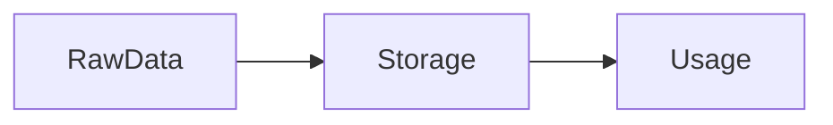

EduOS uses:

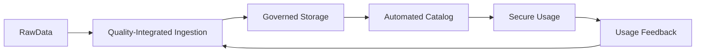

This requires governance throughout the data lifecycle.

---

# 3. Data Architecture Philosophy

DGS follows these core principles:

* **Data as a Product**: Each educational data domain has clear ownership, SLAs, and versioning
* **Polyglot Persistence**: Optimal storage technology selected per access pattern
* **Immutability-First**: Append-only logs and event sourcing for auditability
* **Privacy by Design**: GDPR, FERPA, and security controls embedded at storage layer
* **Automated Governance**: Policies enforced programmatically, not manually

---

# 4. Educational Data Domains

DGS manages six core educational data domains:

## 4.1 Learner Storage
Individual student profiles, progress, interactions, and learning paths.

## 4.2 Curriculum Storage
Educational content, structure, metadata, learning objectives, and prerequisite relationships.

## 4.3 Assessment Storage
Evaluations, results, feedback, rubrics, and competency mappings.

## 4.4 Research Storage
Academic projects, publications, datasets, collaborations, and grant information.

## 4.5 Memory Storage
Long-term knowledge retention traces, spaced repetition schedules, and cognitive models.

## 4.6 Metadata Storage
System configuration, ontologies, taxonomies, data dictionaries, and lineage graphs.

---

# 5. Data Ownership Model

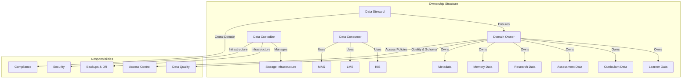

---

# 6. Data Lineage Implementation

DGS captures both technical and business lineage:

```mermaid
flowchart TD
    subgraph TechnicalLineage[Technical Lineage]
        Source[Source Systems] --> Ingestion[Ingestion Layer]
        Ingestion --> Transformation[Transformation Engine]
        Transformation --> Storage[Storage Layer]
        Storage --> Consumption[Consumption Layer]
    end
    
    subgraph BusinessLineage[Business Lineage]
        Concept[Educational Concept] -->|MappedTo| DataElement[Data Element]
        DataElement -->|UsedIn| LearningOutcome[Learning Outcome]
        LearningOutcome -->|MeasuredBy| Assessment[Assessment]
        Assessment -->|Informs| Competency[Competency]
    end
    
    subgraph Storage[Lineage Storage]
        TechnicalLineage --> LineageDB[(Lineage Graph Database)]
        BusinessLineage --> LineageDB
    end
```

Technical lineage tracked via OpenLineage integration.
Business lineage maps educational concepts to source data elements.

---

# 7. Data Lifecycle Management

Five-stage lifecycle with automated policies:

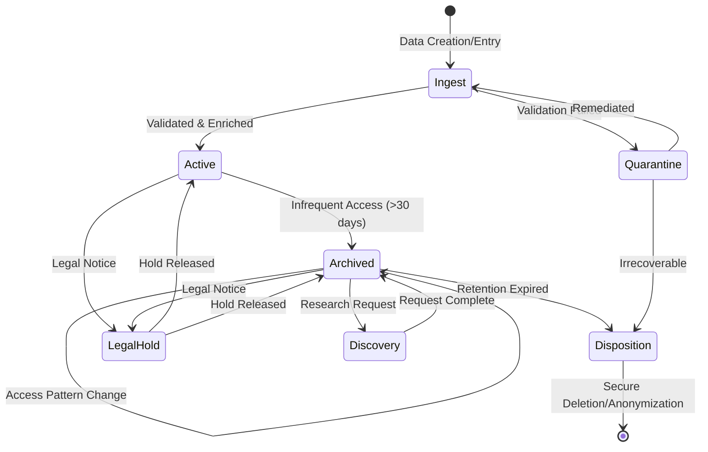

Stage 1: Ingestion - Real-time streaming and batch processing
Stage 2: Active Use - Hot storage for frequent access
Stage 3: Archival - Warm storage for infrequent access
Stage 4: Discovery - Cold storage for long-term retention
Stage 5: Disposition - Secure deletion or anonymization

---

# 8. Data Governance Framework

Based on DGIC model (Define, Govern, Improve, Control):

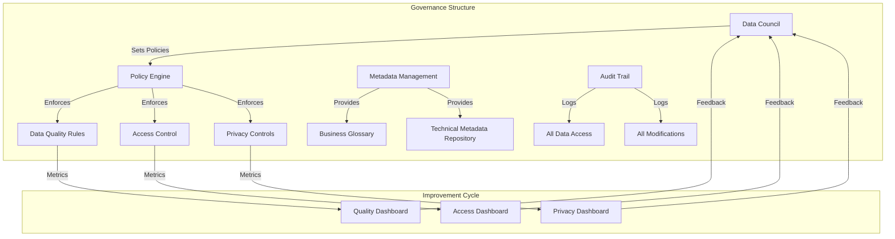

Data Council: Cross-functional body setting policies and standards.
Policy Engine: Open Policy Agent (OPA) for dynamic access control.
Metadata Management: Centralized business glossary and technical repository.
Audit Trail: Immutable logs of all data access and modifications.

---

# 9. Data Quality Assurance

Multi-dimensional quality measurement:

| Dimension | Measurement Technique | Target |
|-----------|----------------------|---------|
| Accuracy | Cross-reference with authoritative sources | >99% |
| Completeness | Null value analysis per domain | >95% |
| Consistency | Referential integrity checks | 100% |
| Timeliness | Latency from event to availability | <5s (real-time), <1hr (batch) |
| Validity | Schema and constraint validation | 100% |
| Uniqueness | Duplicate detection algorithms | <0.1% |

Example quality rule for learner data:
```yaml
learner_record_quality:
  rules:
    - field: student_id
      constraint: not_null
      weight: 0.3
    - field: email
      constraint: email_format
      weight: 0.2
    - field: enrollment_date
      constraint: not_future_date
      weight: 0.2
    - field: gpa
      constraint: between_0_and_4
      weight: 0.3
  threshold: 0.95
```

---

# 10. Data Versioning System

Implemented through event sourcing and snapshotting:

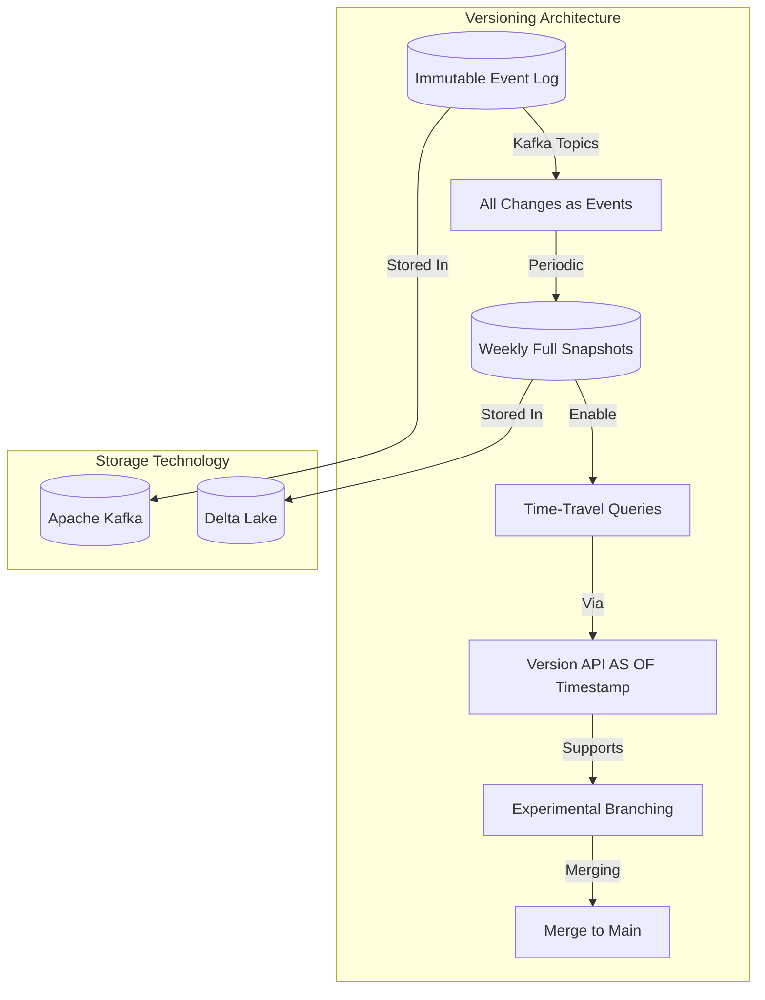

Features:
- Immutable event log: All changes stored as timestamped events
- Periodic snapshots: Weekly full backups for fast recovery
- Version API: Time-travel queries via `AS OF` timestamp syntax
- Branching & merging: Support for experimental changes
- Storage: Kafka (events) and Delta Lake (snapshots)

---

# 11. Comprehensive Auditing

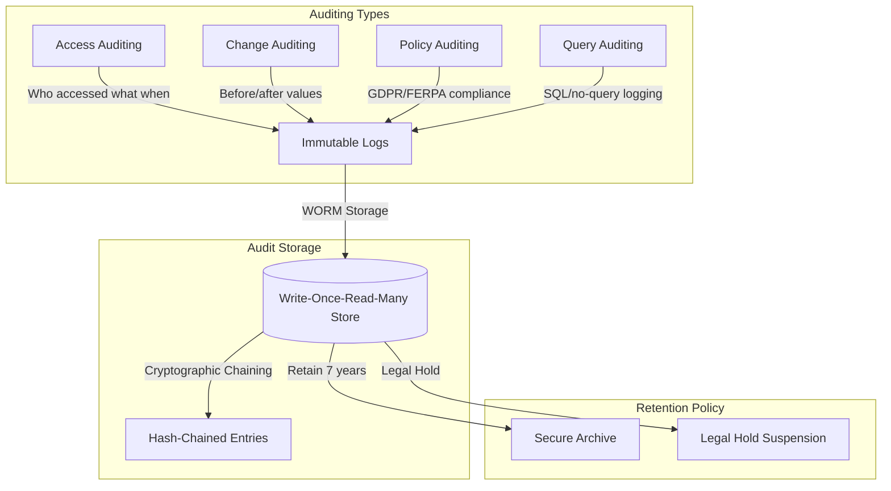

Audit capabilities:
- Access auditing: Who accessed what data and when
- Change auditing: Before/after values for all modifications
- Policy auditing: Validation of GDPR/FERPA compliance
- Query auditing: SQL/no-query logging for anomaly detection
- Storage: WORM object storage with cryptographic chaining
- Retention: 7-year retention with legal hold capabilities

---

# 12. Data Privacy Techniques

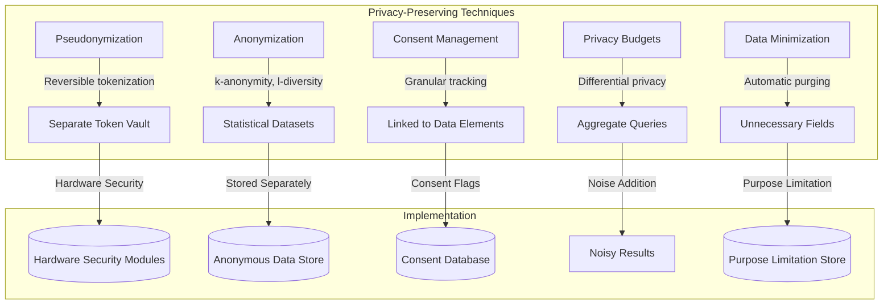

Privacy techniques:
- Pseudonymization: Reversible tokenization of direct identifiers
- Anonymization: k-anonymity and l-diversity for statistical datasets
- Consent Management: Granular consent tracking linked to data elements
- Privacy Budgets: Differential privacy mechanisms for aggregate queries
- Data Minimization: Automatic purging of unnecessary fields per purpose limitation

---

# 13. Data Retention Policies

Retention driven by legal and educational requirements:

| Data Type | Retention Period | Legal Basis | Disposition Method |
|-----------|------------------|-------------|---------------------|
| Student Records | 7 years post-graduation | FERPA | Secure deletion |
| Assessment Results | 5 years | State regulations | Anonymization |
| Research Data | Project-dependent | Grant requirements | Archive or delete |
| Behavioral Logs | 18 months | GDPR | Pseudonymization then delete |
| Metadata | Permanent | Operational | Continuous archival |
| Audit Logs | 7 years | GDPR/FERPA | Secure deletion |

Retention policies enforced automatically through storage lifecycle policies.

---

# 14. Data Archival Strategy

Tiered archival approach:

```mermaid
flowchart TD
    subgraph Active[Active Data (<1 year)]
        HotStorage[Hot Object Storage] -->|Instant Retrieval| S3Standard[S3-Standard]
    end
    
    subgraph Warm[Warm Data (1-7 years)]
        WarmStorage[Warm Object Storage] -->|Infrequent Access| S3IA[S3-IA or Glacier Instant]
    end
    
    subgraph Cold[Cold Data (>7 years)]
        ColdStorage[Cold Object Storage] -->|Deep Archive| GlacierDA[Glacier Deep Archive]
        GlacierDA -->|Retention Locks| LegalHold[Mandatory Retention Locks]
    end
    
    subgraph LegalHold[Legal Hold]
        Active -->|Suspend disposition| LegalHold
        Warm -->|Suspend disposition| LegalHold
        Cold -->|Suspend disposition| LegalHold
    end
    
    subgraph MetadataPreservation[Metadata Preservation]
        Active -->|Preserve with data| SchemaLineage[Schema & Lineage]
        Warm -->|Preserve with data| SchemaLineage
        Cold -->|Preserve with data| SchemaLineage
    end
```

Features:
- Hot Archive (<1 year): Object storage with instant retrieval
- Warm Archive (1-7 years): Infrequent access tier
- Cold Archive (>7 years): Glacier Deep Archive with retention locks
- Legal Hold: Immediate suspension of disposition policies
- Metadata Preservation: Schema and lineage preserved with archived data

---

# 15. Storage Systems Specifications

## 15.1 Graph Databases
- **Technology**: JanusGraph with Cassandra backend
- **Use Cases**: Knowledge graphs, social learning networks, lineage analysis, recommendation engines
- **Query Language**: Gremlin and SPARQL via Apache TinkerPop
- **Example Curriculum Prerequisite**:
  ```gremlin
  g.V().hasLabel('Course').has('code', 'CS101').
    out('prerequisite_of').
    values('title')
  ```

## 15.2 Vector Databases
- **Technology**: Milvus (CPU/GPU hybrid)
- **Use Cases**: Semantic search, adaptive learning recommendations, plagiarism detection, skill embeddings
- **Indexing**: IVF_FLAT and HNSW for balanced performance
- **Example Semantic Search**:
  ```python
  results = milvus.search(
      embedding_vector,
      anns_field="embedding",
      param={"metric_type": "IP", "params": {"nprobe": 10}},
      limit=10
  )
  ```

## 15.3 Relational Databases
- **Technology**: PostgreSQL 15 with TimescaleDB extension
- **Use Cases**: Transactional learner records, assessment results, financial data, user management
- **Features**: Row-level security, logical replication, JSONB, automatic partitioning
- **Example Row-Level Security**:
  ```sql
  CREATE POLICY learner_privacy ON learner_records
  FOR SELECT USING (
    student_id = current_setting('app.current_student_id')::uuid
    OR current_setting('app.user_role') = 'instructor'
  );
  ```

## 15.4 Object Storage
- **Technology**: MinIO (S3-compatible) with encryption
- **Use Cases**: Multimedia content, backup/disaster recovery, data lake zones, long-term archival
- **Features**: Object locking (WORM), cross-region replication, lifecycle policies, SSE-S3
- **Example Lifecycle Policy**:
  ```json
  {
    "Rules": [
      {
        "ID": "MoveToIA",
        "Status": "Enabled",
        "Filter": {"Prefix": "learner-content/"},
        "Transitions": [
          {
            "Days": 30,
            "StorageClass": "STANDARD_IA"
          },
          {
            "Days": 365,
            "StorageClass": "GLACIER"
          }
        ]
      }
    ]
  }
  ```

## 15.5 Document Databases
- **Technology**: MongoDB 6.0 with encrypted storage engine
- **Use Cases**: Learner portfolios, content management, research metadata, configuration
- **Features**: Attribute-based access control, change streams, native JSON schema validation
- **Example Schema Validation**:
  ```json
  {
    "$jsonSchema": {
      "bsonType": "object",
      "required": ["student_id", "learning_goals"],
      "properties": {
        "student_id": {
          "bsonType": "string",
          "pattern": "^[0-9a-f]{8}-[0-9a-f]{4}-[0-9a-f]{4}-[0-9a-f]{4}-[0-9a-f]{12}$"
        },
        "learning_goals": {
          "bsonType": "array",
          "items": {
            "bsonType": "object",
            "required": ["goal_id", "target_date"],
            "properties": {
              "goal_id": {"bsonType": "string"},
              "target_date": {"bsonType": "date"}
            }
          }
        }
      }
    }
  }
  ```

## 15.6 Time-Series Databases
- **Technology**: InfluxDB 3.0 (based on Apache Arrow)
- **Use Cases**: Learning analytics, system monitoring, adaptive learning response times, research metrics
- **Features**: Downsample policies, continuous queries, retention policies, built-in mathematical functions
- **Example Continuous Query**:
  ```sql
  CREATE CONTINUOUS QUERY "cq_engagement_5m" ON "learner_db"
  BEGIN
    SELECT mean("engagement_score") AS "mean_engagement"
    INTO "learner_db"."downsampled"."engagement_5m"
    FROM "learner_db"."autogen"."engagement"
    GROUP BY time(5m), "student_id"
  END
  ```

---

# 16. Educational Storage Deep Dive

## 16.1 Learner Storage
- **Core**: PostgreSQL for structured data (enrollment, demographics)
- **Extensions**: MongoDB for competency maps, InfluxDB for engagement time-series, MinIO for learner-generated content
- **Privacy**: Field-level encryption for sensitive data (health, IEPs, biometrics)

## 16.2 Curriculum Storage
- **Core**: Neo4j for prerequisite graphs and learning pathways
- **Extensions**: MinIO for SCORM packages, PostgreSQL for course instances, Milvus for semantic search
- **Versioning**: Git-like branching for curriculum experimentation
- **Example Prerequisite Query**:
  ```cypher
  MATCH (course:Course {code: 'CS202'})-[:PREREQUISITE_OF*0..]->(prereq)
  RETURN prereq.title AS prerequisite
  ```

## 16.3 Assessment Storage
- **Core**: PostgreSQL for test results and rubrics
- **Extensions**: MongoDB for complex item responses, MinIO for scanned artifacts, Redis for proctoring caches
- **Security**: Homomorphic encryption for blind grading (research)
- **Example Rubric Storage**:
  ```json
  {
    "assessment_id": "assess_123",
    "rubric": {
      "criteria": [
        {
          "name": "Code Correctness",
          "levels": [
            {"score": 4, "description": "All test cases pass"},
            {"score": 3, "description": "Minor bugs"},
            {"score": 2, "description": "Major bugs"},
            {"score": 1, "description": "Does not compile"}
          ]
        }
      ]
    }
  }
  ```

## 16.4 Research Storage
- **Core**: PostgreSQL for grant metadata and project tracking
- **Extensions**: MinIO for datasets, MongoDB for publications, Graph database for collaboration networks
- **Compliance**: IRB consent tracking integrated with data access
- **Example Consent Tracking**:
  ```json
  {
    "research_project_id": "proj_456",
    "participant_consents": [
      {
        "participant_id": "part_789",
        "consent_date": "2026-01-15",
        "consent_version": "v2.1",
        "data_elements": ["survey_responses", "interview_transcripts"],
        "withdrawal_right": true
      }
    ]
  }
  ```

## 16.5 Memory Storage
- **Core**: Redis for active recall queues and spaced repetition schedules
- **Extensions**: PostgreSQL for long-term memory trace consolidation, MinIO for mnemonic assets
- **Algorithm**: SM-2/ASTM variants with individual learning factor adjustments
- **Example Recall Schedule**:
  ```json
  {
    "student_id": "stud_123",
    "memory_trace": "trace_456",
    "next_review": "2026-06-20",
    "interval": 5,
    "ease_factor": 2.5,
    "repetitions": 3
  }
  ```

---

# 17. Security & Compliance

## 17.1 GDPR Compliance
- **Lawful Basis**: Explicit consent for processing, legitimate interest for educational necessity
- **Data Subject Rights**:
  - Right to access: Self-service portal with automated data export (JSON-LD)
  - Right to rectification: Profile management interface with audit trail
  - Right to erasure: Automated workflow with cryptographic shredding
  - Right to portability: Standardized APIs for data transfer
- **Privacy Impact Assessments**: Automated DPIA triggers for new processing activities
- **Example Data Subject Request Workflow**:
  ```mermaid
  sequenceDiagram
      Student->>DGS Portal: Data Export Request
      DGS Portal->>Consent Service: Verify Consent
      Consent Service-->>DGS Portal: Consent Verified
      DGS Portal->>Data Locator: Find All Data
      Data Locator-->>DGS Portal: Data Locations
      DGS Portal->>Export Generator: Generate Portable Copy
      Export Generator-->>DGS Portal: Export Package
      DGS Portal-->>Student: Downloadable Export
  ```

## 17.2 FERPA Compliance
- **Directory Information**: Configurable opt-outs with immediate effect
- **Education Records**:
  - Access logging with immutable audit trails
  - Rediscovered consent for third-party disclosures
  - Annual training requirement tracking for administrators
- **Security Controls**:
  - Encryption at rest and in transit (AES-256, TLS 1.3)
  - Regular penetration testing and vulnerability scanning
  - Incident response plan with 72-hour breach notification
  - Regular compliance audits and reporting

## 17.3 Access Control Model
- **Model**: RBAC extended with ABAC for contextual policies
- **Attributes**:
  - Subject: Role, department, clearance level, consent status, FERPA flags
  - Resource: Classification (public, internal, confidential, restricted), purpose, retention category
  - Environment: Time, location, device trust score, network zone
- **Enforcement**:
  - API Gateway (Kong) for external requests
  - Service mesh (Istio) for service-to-service communication
  - Database-level (PostgreSQL RLS, MongoDB FLE, Cassandra transparent encryption)
  - Example ABAC Policy:
    ```json
    {
      "rule": "Allow access to assessment results",
      "condition": [
        {"subject.role": "instructor"},
        {"resource.classification": "confidential"},
        {"environment.time": "during_work_hours"},
        {"environment.location": "on_campus"}
      ],
      "action": "read"
    }
    ```

## 17.4 Encryption Strategy
- **Data at Rest**:
  - Transparent database encryption (TDE) for all databases
  - File-level encryption for object storage (SSE-KMS with customer-managed keys)
  - Column-level encryption for PII fields (AEAD with AES-256-GCM)
  - Backup encryption with separate key hierarchy
- **Data in Transit**:
  - Mutual TLS for all service-to-service communication
  - HTTPS enforcement via HSTS preloading
  - SSH v2 for administrative access with key rotation
  - VPN for external partner connections
- **Key Management**:
  - HashiCorp Vault for dynamic secrets and database credentials
  - Hardware Security Modules (HSM) for master keys and root of trust
  - Automatic key rotation every 90 days for data encryption keys
  - Master key rotation annually with split knowledge procedure

---

# 18. Architecture Integration

DGS integrates with all EduOS modules:

```mermaid
flowchart TD
    subgraph DGS[Data Governance & Storage]
        direction TB
        GraphDB[(Graph Database)]:::storage
        VectorDB[(Vector Database)]:::storage
        RelationalDB[(Relational DB)]:::storage
        ObjectStore[(Object Storage)]:::storage
        DocumentDB[(Document DB)]:::storage
        TimeSeriesDB[(Time-Series DB)]:::storage
        AuditStore[(Immutable Audit Log)]:::storage
        LineageDB[(Lineage Graph)]:::storage
        ConsentDB[(Consent Database)]:::storage
    end
    
    subgraph Modules[EduOS Modules]
        KIS[Knowledge Ingestion Systems]:::module
        KGS[Knowledge Graph Systems]:::module
        LMS[Learning Management Systems]:::module
        MAS[Management & Admin Systems]:::module
        RCS[Research & Collab Systems]:::module
        TCS[Talent & Career Systems]:::module
        AOS[Agent Orchestration Systems]:::module
    end
    
    %% Data flows from modules to DGS
    KIS -->|Knowledge objects, concepts, relationships| DGS
    LMS -->|Learner interactions, progress, grades| DGS
    MAS -->|Administrative transactions, HR, finance| DGS
    RCS -->|Project metadata, collaborations, datasets| DGS
    TCS -->|Skill assessments, career paths, outcomes| DGS
    AOS -->|Agent interactions, decisions, reasoning traces| DGS
    KGS -->|Concept maps, taxonomic relationships| DGS
    
    %% Data flows from DGS to modules
    DGS -->|Curriculum content, learning objectives| LMS
    DGS -->|Learner profiles, preferences, mastery| KIS
    DGS -->|Prerequisite graphs, concept relationships| KGS
    DGS -->|Credential verification, skill inventories| TCS
    DGS -->|Research datasets, publication metadata| RCS
    DGS -->|Financial data, HR records, compliance reports| MAS
    DGS -->|Agent memories, decision contexts, learning histories| AOS
    DGS -->|Ontologies, taxonomies, data dictionaries| KGS
    
    classDef storage fill:#f9f,stroke:#333,stroke-width:2px;
    classDef module fill:#bbf,stroke:#333,stroke-width:2px;
```

---

# 19. Data Flow Diagrams

## 19.1 Real-Time Learning Analytics Pipeline
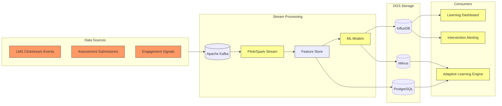

## 19.2 Batch ETL for Nightly Reporting
```mermaid
flowchart TD
    %% Extraction
    subgraph Extraction[Extraction]
        OLTP_Systems[Operational DBs]:::source
        App_Logs[Application Logs]:::source
        External_Feeds[External Data Feeds]:::source
    end
    
    %% Staging
    subgraph Staging[Data Lake Staging]
        Raw_Zone[Raw Zone (MinIO)]:::store
        Clean_Zone[Cleaned Zone (MinIO)]:::store
    end
    
    %% Transformation
    subgraph Transformation[Batch Processing]
        Spark_Cluster[Apache Spark Cluster]:::process
        Transformation_Scripts[dbt/SQL Scripts]:::process
        Quality_Checks[Great Expectations]:::process
    end
    
    %% Loading
    subgraph Loading[Data Warehouse]
        Data_Warehouse[(PostgreSQL/Delta Lake)]:::store
        Marts[Departmental Marts]:::store
    end
    
    %% Consumption
    subgraph Consumption[Consumers]
        BI_Tools[BI & Reporting Tools]:::process
        ML_Training[ML Model Training]:::process
        Data_Science[Data Science Workspace]:::process
    end
    
    %% Connections
    Extraction --> Staging
    Staging --> Transformation
    Transformation --> Loading
    Loading --> Consumption
    
    classDef source fill:#f96,stroke:#333,stroke-width:1px;
    classDef store fill:#9f9,stroke:#333,stroke-width:1px;
    classDef process fill:#ff9,stroke:#333,stroke-width:1px;
```

---

# 20. Backup & Disaster Recovery Architecture

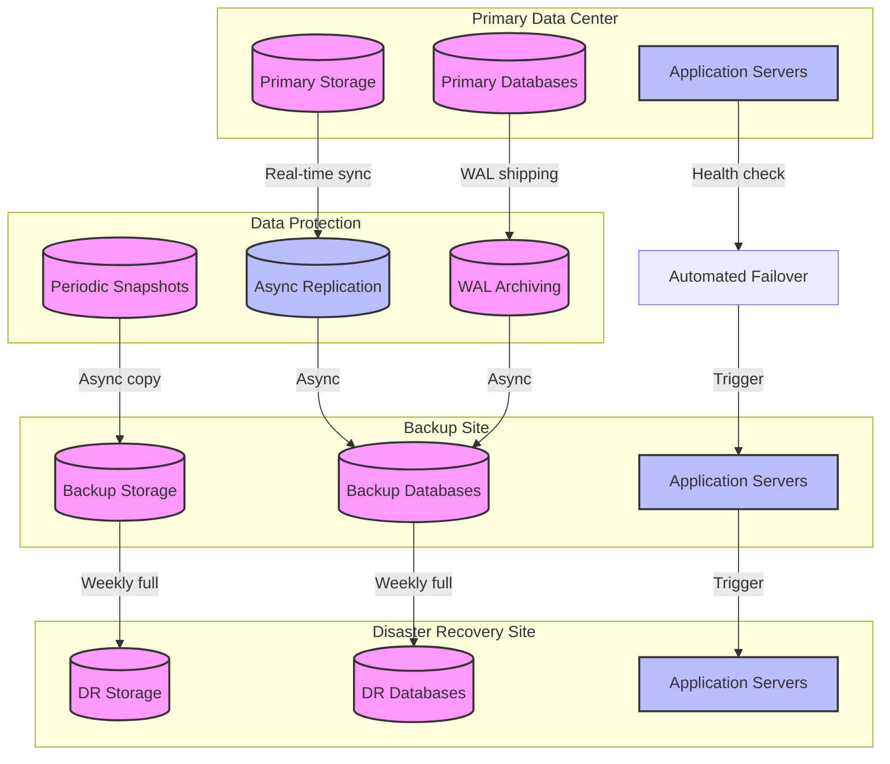

---

# 21. Implementation Roadmap

### Phase 1: Foundation (Months 1-3)
- Implement core relational database (PostgreSQL) with row-level security
- Deploy MinIO object storage with encryption and lifecycle policies
- Establish Kafka event streaming platform for data ingestion
- Implement basic access control and audit logging framework

### Phase 2: Specialized Stores (Months 4-6)
- Deploy graph database (JanusGraph) for knowledge graphs and lineage
- Implement vector database (Milvus) for semantic search capabilities
- Deploy document database (MongoDB) for flexible schema storage
- Implement time-series database (InfluxDB) for learning analytics

### Phase 3: Governance & Quality (Months 7-9)
- Implement data quality monitoring framework with automated alerts
- Deploy metadata management and lineage tracking system
- Establish privacy controls and consent management platform
- Implement data versioning and time-travel query capabilities

### Phase 4: Optimization & DR (Months 10-12)
- Implement comprehensive backup and disaster recovery solutions
- Optimize storage tiers and automated lifecycle policies
- Implement advanced encryption and key management infrastructure
- Conduct security audits, penetration testing, and compliance validation

---

# 22. Success Criteria

DGS succeeds when:

1. Any educational data can be ingested, stored, and retrieved with validated quality
2. Data lineage is automatically captured and queryable for impact analysis
3. GDPR and FERPA compliance is automated and continuously monitored
4. Data quality metrics are measurable and improving over time
5. Storage costs are optimized through intelligent tiering and lifecycle management
6. Audit trails are immutable, complete, and tamper-evident
7. Data versioning enables time-travel queries and experimental branching
8. Privacy techniques protect sensitive data while enabling legitimate educational use
9. Disaster recovery meets RTO < 4 hours and RPO < 15 minutes for critical data
10. EduOS modules can access trusted data through standardized, governed interfaces

---