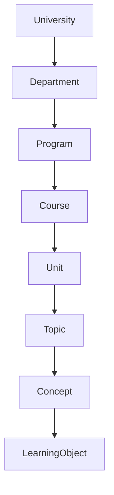
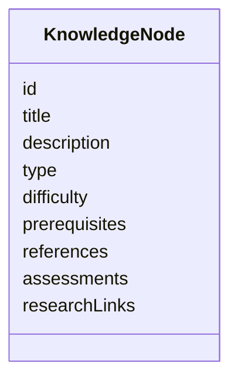
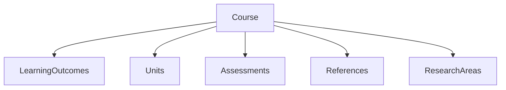
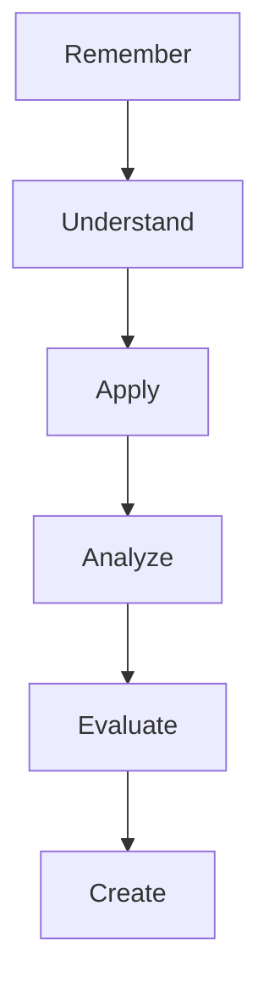
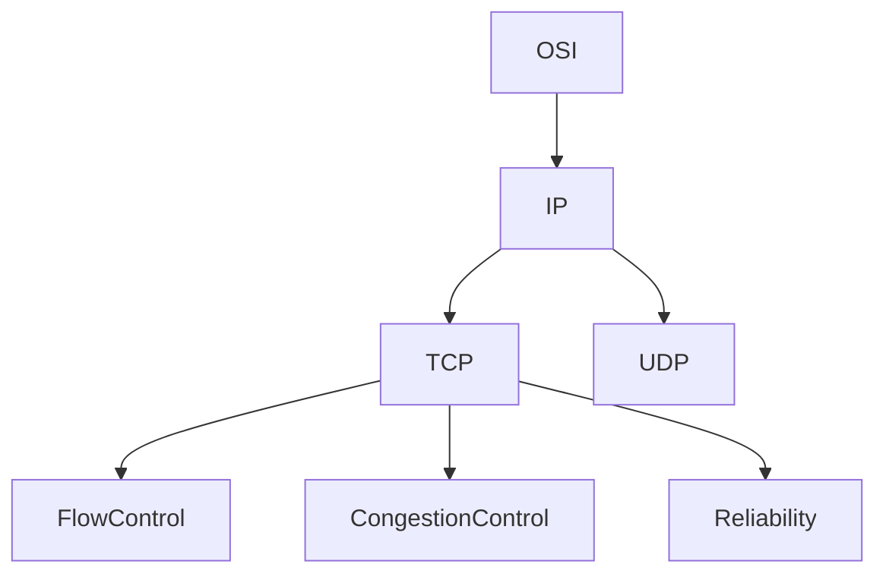
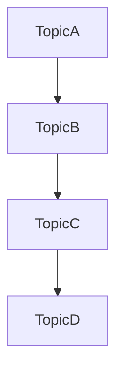
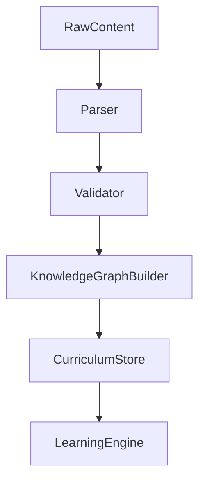
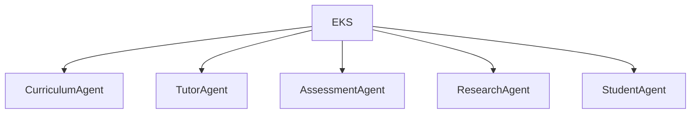

# Educational Knowledge Standard (EKS)

Version: 1.0

Status: Foundational Specification

Purpose:

Define a universal, structured, machine-readable educational knowledge format for EduOS.

EKS serves as the canonical representation of:

* Universities
* Programs
* Courses
* Units
* Topics
* Concepts
* Learning Outcomes
* Assessments
* Research Links
* Teaching Strategies
* Learning Paths

The goal is to create an educational equivalent of:

* HTML → Documents
* Markdown → Content
* OpenAPI → APIs

EKS → Educational Knowledge

---

# 1. Why EKS Exists

Traditional educational resources are fragmented.

Examples:

```text
PDF Notes
PowerPoint Slides
Books
Research Papers
Question Banks
Lab Manuals
Videos
```

These formats are human-readable but not educationally structured.

Problems:

* Difficult to search
* Difficult to relate concepts
* Difficult to personalize
* Difficult to generate learning paths

EKS converts educational content into a structured graph.

---

# 2. Educational Knowledge Hierarchy



---

# 3. Core Knowledge Model

Every educational item is represented as a node.



---

# 4. Educational Entity Types

## Institution

Example:

```yaml
institution:
  id: rvce
  name: RV College of Engineering
  country: India
```

---

## Department

Example:

```yaml
department:
  id: cse
  name: Computer Science and Engineering
```

---

## Program

Example:

```yaml
program:
  id: btech-cse
  name: B.Tech Computer Science
```

---

## Course

Example:

```yaml
course:
  id: cn
  title: Computer Networks
  credits: 4
  semester: 5
```

---

## Unit

Example:

```yaml
unit:
  id: cn-unit4
  title: Internetworking
```

---

## Topic

Example:

```yaml
topic:
  id: ospf
  title: Open Shortest Path First
```

---

## Concept

Example:

```yaml
concept:
  id: shortest-path
  title: Shortest Path Routing
```

---

# 5. Course Model



---

## Course Schema

```yaml
course:
  id:
  title:
  description:
  credits:
  semester:
  prerequisites:
  outcomes:
  units:
  references:
  research_topics:
```

---

# 6. Unit Model

A unit represents a major syllabus section.

---

## Unit Schema

```yaml
unit:
  id:
  title:
  description:
  weightage:
  outcomes:
  topics:
```

---

# 7. Topic Model

Topics are the fundamental teaching objects.

---

## Topic Schema

```yaml
topic:
  id:
  title:
  summary:
  difficulty:
  prerequisites:
  concepts:
  examples:
  assessments:
  research_links:
```

---

## Example

```yaml
topic:
  id: tcp
  title: Transmission Control Protocol

  difficulty: medium

  prerequisites:
    - ip
    - osi-model

  concepts:
    - reliability
    - congestion-control
    - flow-control

  assessments:
    - tcp-mcq
    - tcp-assignment
```

---

# 8. Concept Model

Concepts are atomic learning units.

---

## Concept Schema

```yaml
concept:
  id:
  title:
  definition:
  explanation:
  examples:
  misconceptions:
  references:
```

---

# 9. Learning Outcome Standard

Learning outcomes are first-class entities.

---

## Outcome Schema

```yaml
learning_outcome:
  id:
  description:
  bloom_level:
  assessment_methods:
```

---

## Bloom Taxonomy Support



---

# 10. Assessment Standard

Every assessment links to:

* Topics
* Outcomes
* Difficulty

---

## Assessment Schema

```yaml
assessment:
  id:
  title:
  type:
  difficulty:
  topics:
  outcomes:
```

---

## Supported Types

```text
MCQ
Short Answer
Long Answer
Coding
Lab
Assignment
Project
Research
```

---

# 11. Knowledge Graph Standard

Educational content should be represented as a graph.

---

## Example



---

## Edge Types

```text
PREREQUISITE
PART_OF
RELATES_TO
DEPENDS_ON
EXTENDS
CONTRASTS_WITH
```

---

# 12. Learning Path Standard

Learning paths are generated dynamically.

---

## Structure



---

## Example

```text
OSI
↓
IP
↓
TCP
↓
Congestion Control
↓
Advanced TCP Research
```

---

# 13. Teaching Strategy Metadata

Each topic stores teaching recommendations.

---

## Schema

```yaml
teaching:
  beginner:
    strategy: analogy-first

  intermediate:
    strategy: example-first

  advanced:
    strategy: theory-first

  research:
    strategy: paper-driven
```

---

# 14. Misconception Model

Critical for educational systems.

---

## Example

```yaml
misconception:
  statement: TCP guarantees no packet loss

  correction: TCP ensures reliability but packets can still be lost during transmission.
```

---

# 15. Research Integration Standard

Research should be connected directly to topics.

---

## Example

```yaml
research:
  topic: tcp

  papers:
    - paper1
    - paper2

  trends:
    - congestion control
    - QUIC
```

---

# 16. Resource Standard

Resources are educational artifacts.

---

## Types

```text
Book
Video
Lecture
Paper
Website
Lab Manual
Assignment
Simulation
```

---

## Schema

```yaml
resource:
  id:
  title:
  type:
  author:
  url:
```

---

# 17. Multimodal Knowledge Objects

Future-proofing for image/audio/video.

---

## Image Object

```yaml
image:
  id:
  title:
  explanation:
  tags:
```

---

## Audio Object

```yaml
audio:
  id:
  transcript:
  duration:
```

---

## Video Object

```yaml
video:
  id:
  transcript:
  chapters:
```

---

# 18. Student Interaction Metadata

Educational nodes can store interaction history.

---

## Example

```yaml
student_interaction:
  attempts:
  mastery:
  last_accessed:
  confidence:
```

---

# 19. Versioning Standard

Universities change syllabi.

EKS must support versions.

---

## Example

```yaml
course:
  id: cn

  versions:
    - 2025
    - 2026
    - 2027
```

---

# 20. Validation Rules

Every node must contain:

```text
ID
Title
Description
Type
Relationships
```

Optional:

```text
Research
Assessments
Resources
```

---

# 21. Open Source Contribution Format

Contributors add content through EKS.

---

## Example Repository Structure

```text
curriculum/

├── rvce/
│   ├── cn/
│   ├── daa/
│   └── iot/

├── mit/
├── stanford/
└── nptel/
```

---

# 22. EKS Processing Pipeline



---

# 23. EKS and Agent Interaction



---

# 24. Long-Term Vision

EKS becomes the universal educational content layer for EduOS.

Benefits:

* Curriculum portability
* Agent interoperability
* Model independence
* Knowledge graph generation
* Personalized learning
* Research integration
* Open-source collaboration

---

# Success Criteria

EKS succeeds when:

1. Any university curriculum can be represented.
2. Any educational agent can consume it.
3. Learning paths can be generated automatically.
4. Assessments can be generated from structured knowledge.
5. Research can be linked directly to concepts.
6. New modalities can be added without changing the standard.
7. Educational knowledge becomes independent of specific AI models.
