# Knowledge Graph Specification (KGS)

Version: 1.0

Status: Core Infrastructure Specification

Document Type: Knowledge Architecture Specification

Dependencies:

* TAS.md
* ADS.md
* EKS.md

---

# 1. Purpose

The EduOS Knowledge Graph (EKG) is the central intelligence layer responsible for representing educational knowledge, curriculum relationships, student mastery states, research connections, and learning pathways.

Unlike traditional databases that store isolated records, the Knowledge Graph stores relationships between concepts.

Example:

```text
TCP
├── depends_on → IP
├── contains → Congestion Control
├── contains → Flow Control
├── prerequisite_for → QUIC
└── related_to → Network Reliability
```

This enables:

* Prerequisite Reasoning
* Adaptive Learning Paths
* Personalized Recommendations
* Curriculum Navigation
* Research Discovery
* Knowledge Gap Detection

---

# 2. Why a Knowledge Graph?

Traditional Educational Systems:

```text
PDF
↓
Search
↓
Answer
```

Graph-Based Educational Systems:

```text
Concept
↓
Relationships
↓
Reasoning
↓
Teaching
```

---

## Example

Student asks:

```text
Explain OSPF
```

Traditional system:

```text
Returns OSPF content
```

EduOS:

```text
Checks:
- Routing knowledge
- Graph algorithms knowledge
- Previous mastery
- Curriculum context
```

Then generates a personalized explanation.

---

# 3. High-Level Architecture

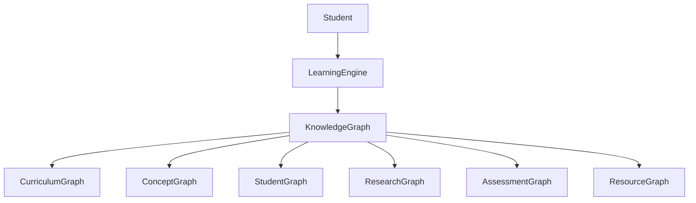

---

# 4. Graph Layers

EduOS maintains multiple interconnected graphs.

---

## Curriculum Graph

Represents syllabus structure.

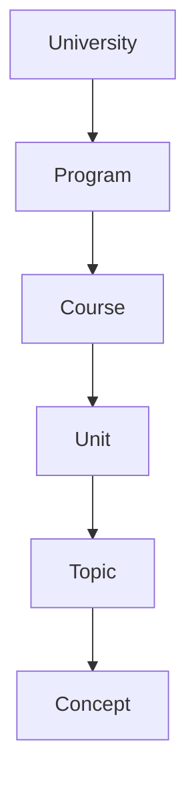

---

## Concept Graph

Represents knowledge relationships.

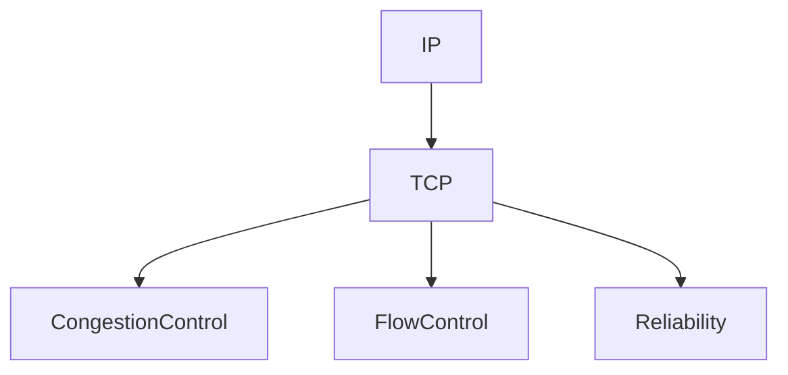

---

## Student Graph

Represents learner state.

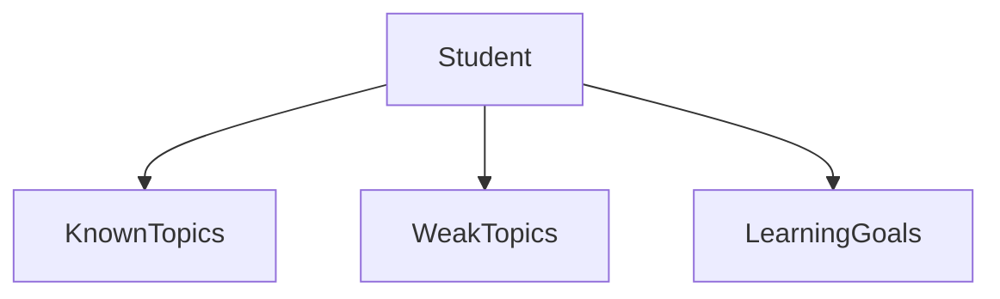

---

## Research Graph

Represents academic knowledge.

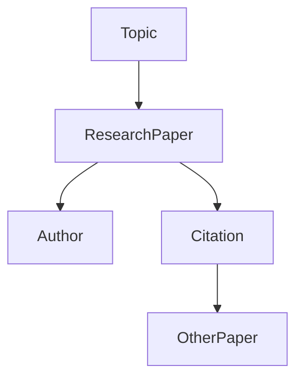

---

# 5. Core Node Types

Every node follows a standard schema.

---

## Universal Node Structure

```yaml
node:
  id:
  title:
  type:
  description:
  metadata:
  created_at:
  updated_at:
```

---

# 6. Educational Node Types

## Institution Node

```yaml
institution:
  id:
  name:
  country:
```

---

## Course Node

```yaml
course:
  id:
  title:
  credits:
  semester:
```

---

## Topic Node

```yaml
topic:
  id:
  title:
  difficulty:
```

---

## Concept Node

```yaml
concept:
  id:
  title:
  explanation:
```

---

## Assessment Node

```yaml
assessment:
  id:
  type:
  difficulty:
```

---

## Research Node

```yaml
research:
  id:
  title:
  publication:
```

---

# 7. Relationship Types

The graph's intelligence comes from relationships.

---

## Structural Relationships

```text
PART_OF
CONTAINS
BELONGS_TO
```

Example:

```text
TCP
PART_OF
Transport Layer
```

---

## Learning Relationships

```text
PREREQUISITE_OF
DEPENDS_ON
EXTENDS
```

Example:

```text
IP
PREREQUISITE_OF
TCP
```

---

## Semantic Relationships

```text
SIMILAR_TO
CONTRASTS_WITH
RELATED_TO
```

Example:

```text
TCP
CONTRASTS_WITH
UDP
```

---

## Assessment Relationships

```text
TESTS
VALIDATES
MEASURES
```

---

## Research Relationships

```text
CITES
BUILDS_ON
EXTENDS
REFUTES
```

---

# 8. Graph Schema

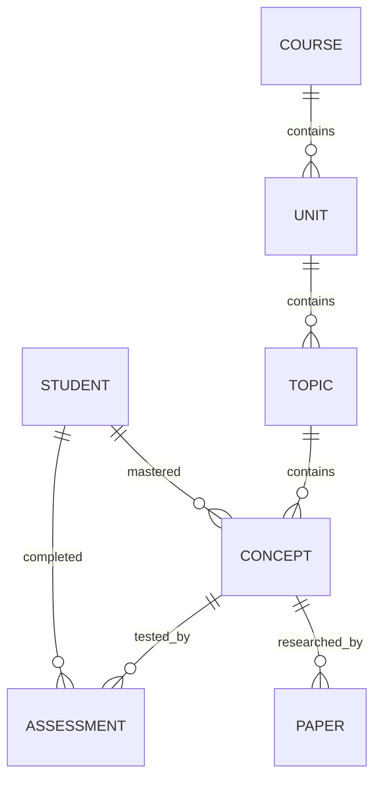

---

# 9. Learning Path Generation

One of the most important capabilities.

---

## Goal

Generate:

```text
Current State
↓
Target Topic
↓
Optimal Learning Path
```

---

### Example

Student wants:

```text
Learn BGP
```

Graph traversal:

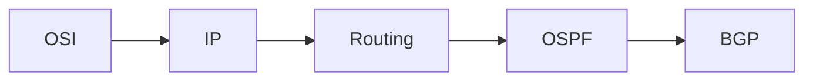

Generated path:

```text
OSI
↓
IP
↓
Routing
↓
OSPF
↓
BGP
```

---

# 10. Knowledge Gap Detection

Purpose:

Detect missing prerequisites.

---

Example:

Student asks:

```text
Explain TCP Congestion Control
```

Graph checks:

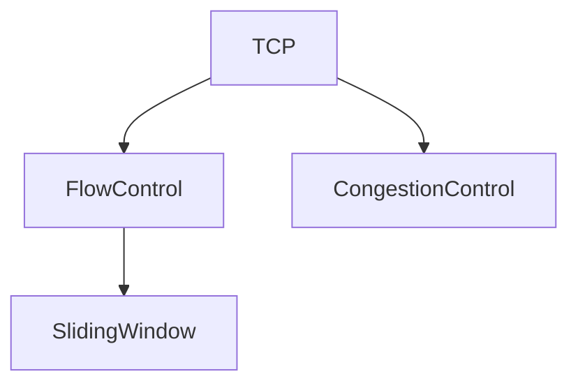

If Sliding Window not mastered:

```text
Knowledge Gap Detected
```

System recommends prerequisite review.

---

# 11. Personalized Learning Graph

Each student has a personalized graph.

---

## Example

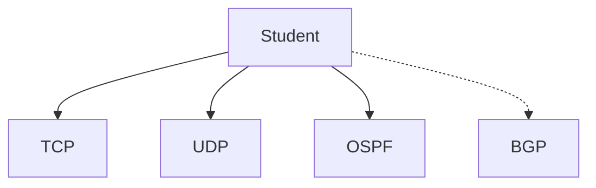

Legend:

```text
Solid Edge = Mastered

Dashed Edge = Not Mastered
```

---

# 12. Research Integration Layer

Research is not separate.

Research becomes part of the graph.

---

## Structure

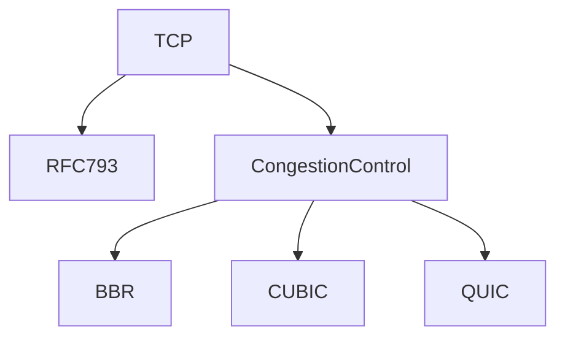

---

# 13. Assessment Intelligence

Assessments are graph-connected.

---

## Example

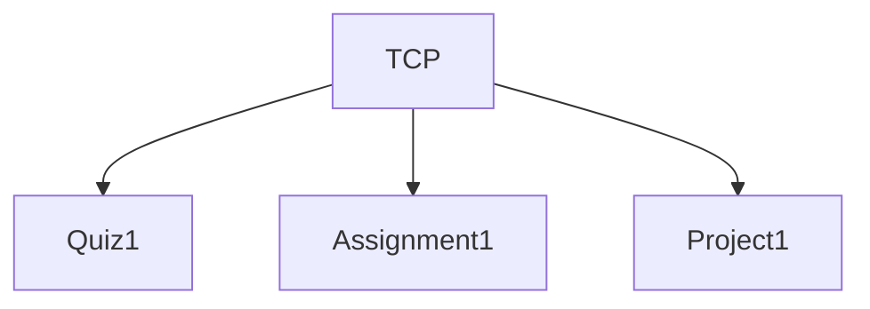

System can determine:

```text
Topic Mastery
Assessment Difficulty
Learning Progress
```

---

# 14. Graph Query Examples

## Example 1

Find prerequisites.

```sql
MATCH path
WHERE target = "BGP"
RETURN prerequisites
```

---

## Example 2

Find weak topics.

```sql
MATCH student
RETURN weak_concepts
```

---

## Example 3

Find research topics.

```sql
MATCH topic
RETURN related_research
```

---

# 15. Graph Reasoning Engine

The graph supports reasoning before the LLM.

---

Workflow:

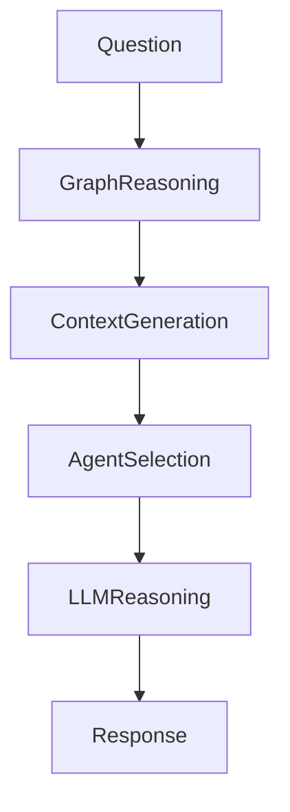

This is critical.

Graph reasoning should happen BEFORE LLM reasoning.

---

# 16. Graph Memory Integration

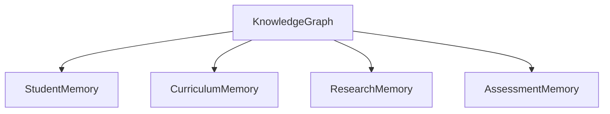

Graph acts as the central memory layer.

---

# 17. Multimodal Graph Support

Future node types:

---

## Image Node

```yaml
image:
  id:
  title:
  explanation:
```

---

## Audio Node

```yaml
audio:
  id:
  transcript:
```

---

## Video Node

```yaml
video:
  id:
  chapters:
```

---

## Whiteboard Node

```yaml
whiteboard:
  id:
  annotations:
```

---

# 18. Scalability Strategy

Level 1

Single Course

```text
Computer Networks
```

Level 2

Department

```text
Computer Science
```

Level 3

University

```text
Entire Curriculum
```

Level 4

Global Educational Graph

```text
Multiple Universities
Multiple Domains
Multiple Languages
```

---

# 19. Open Source Contribution Model

Contributors can add:

* Courses
* Topics
* Concepts
* Assessments
* Research Papers
* Learning Paths

through EKS-compliant files.

---

# 20. Long-Term Vision

Current Educational Systems:

```text
PDF Search
```

EduOS Vision:

```text
Educational Knowledge Graph
↓
Reasoning
↓
Teaching
↓
Personalization
↓
Research Integration
↓
Lifelong Learning
```

---

# References & Design Influences

## Knowledge Graphs

1. Gruber, T. R.
   "A Translation Approach to Portable Ontology Specifications."
   Knowledge Acquisition, 1993.

2. Hogan et al.
   "Knowledge Graphs."
   ACM Computing Surveys, 2021.

---

## Intelligent Tutoring Systems

3. Woolf, B. P.
   Building Intelligent Interactive Tutors.
   Morgan Kaufmann.

4. Koedinger et al.
   Intelligent Tutoring Goes To School.
   Educational Psychology Review.

---

## Learning Sciences

5. Bloom, B. S.
   Taxonomy of Educational Objectives.

6. Vygotsky, L.
   Zone of Proximal Development.

---

## Adaptive Learning

7. Brusilovsky, P.
   Adaptive Educational Hypermedia.

8. Anderson, J. R.
   ACT-R Cognitive Architecture.

---

## Educational Knowledge Graphs

9. Chen et al.
   Knowledge Graph-Based Personalized Learning Systems.

10. IEEE Learning Technology Standards Committee (LTSC)

11. Experience API (xAPI / Tin Can API)

12. IMS Global Learning Consortium Standards

---

# Success Criteria

The Knowledge Graph succeeds when:

1. Every educational concept is connected.
2. Learning paths can be generated automatically.
3. Knowledge gaps can be detected automatically.
4. Research can be linked directly to concepts.
5. Student mastery can be represented as graph state.
6. The graph remains useful even if every underlying AI model changes.
7. EduOS intelligence increasingly comes from graph reasoning rather than prompt engineering.
