# KIS.md

# Knowledge Ingestion System Specification

Version: 2.0

Status: Foundational Knowledge Infrastructure

Dependencies:

* EKS.md
* KGS.md
* LMS.md
* MAS.md
* RCS.md
* TCS.md

---

# 1. Executive Summary

The Knowledge Ingestion System (KIS) is responsible for transforming raw educational and research content into structured educational intelligence.

KIS is not a document loader.

KIS is not a RAG pipeline.

KIS is not a PDF parser.

KIS is a Knowledge Compiler.

---

# Core Mission

Transform:

```text
Books
Papers
Videos
Curricula
Assignments
Labs
Documentation
```

Into:

```text
Concepts

Relationships

Prerequisites

Learning Outcomes

Bloom Levels

Assessments

Knowledge Graphs

Research Graphs

Educational Assets
```

---

# 2. Why KIS Exists

Most educational systems:

```text
PDF
↓
Chunk
↓
Embedding
↓
Vector Search
↓
LLM
```

Problems:

* No prerequisite understanding
* No curriculum awareness
* No Bloom taxonomy
* No learning outcomes
* No assessment intelligence
* No educational structure

---

EduOS:

```text
Content
↓
Knowledge Extraction
↓
Educational Structuring
↓
Knowledge Graph
↓
Educational Intelligence
```

---

# 3. KIS Philosophy

Educational content is not knowledge.

Knowledge is not intelligence.

Educational Intelligence requires:

```text
Structure

Relationships

Context

Pedagogy

Validation
```

KIS performs this transformation.

---

# 4. System Architecture

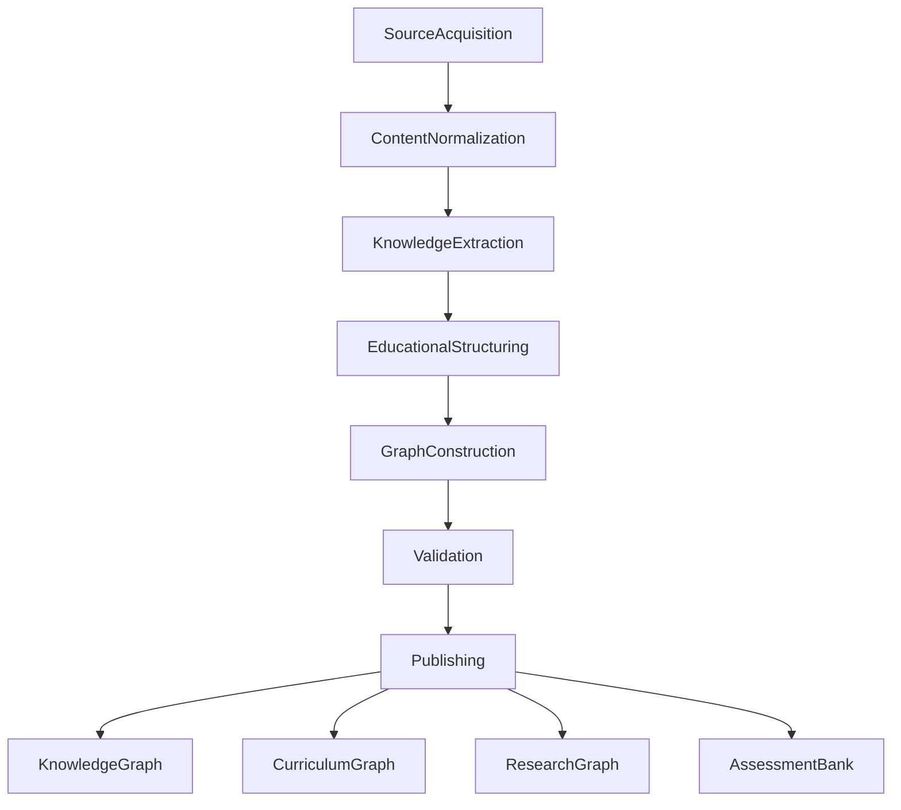

---

# 5. Knowledge Sources

---

## Curriculum Sources

```text
University Syllabi

Program Outcomes

Course Outcomes

Unit Plans

Academic Regulations
```

---

## Educational Sources

```text
Textbooks

Lecture Notes

Slides

Assignments

Lab Manuals

Tutorial Sheets
```

---

## Research Sources

```text
IEEE

ACM

arXiv

Springer

Elsevier

Nature

Science
```

---

## Multimedia Sources

```text
Recorded Lectures

Whiteboards

Educational Videos

Podcasts
```

---

## Standards Sources

```text
RFCs

ISO

IEEE Standards

Government Standards
```

---

# 6. Knowledge Object Model

Everything becomes a Knowledge Object.

---

```yaml
knowledge_object:

  id:

  title:

  source:

  source_type:

  domain:

  content:

  concepts:

  relationships:

  prerequisites:

  outcomes:

  bloom_level:

  confidence:

  version:
```

---

# 7. Acquisition Layer

Purpose:

Collect content.

---

Architecture

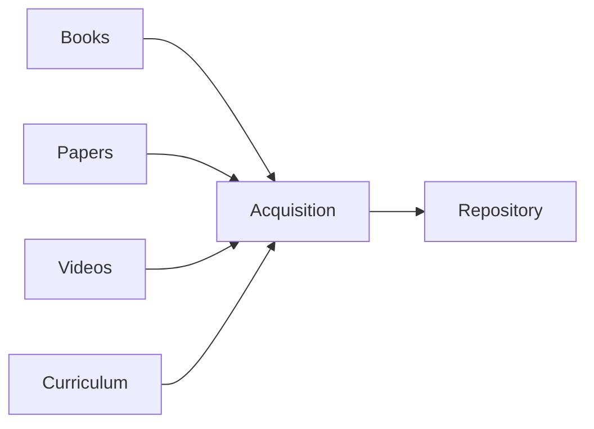

---

Responsibilities

* Source registration
* Source metadata
* Version tracking
* Source trust scoring

---

# 8. Normalization Layer

Purpose:

Convert all content into a common format.

---

Input Types

```text
PDF

DOCX

PPT

HTML

Video

Audio

Images
```

---

Output

```yaml
normalized_document:

  metadata:

  structure:

  sections:

  content:
```

---

# 9. Semantic Understanding Engine

Purpose:

Understand content meaning.

---

Tasks

```text
Entity Extraction

Concept Extraction

Topic Classification

Domain Classification

Context Understanding
```

---

Example

Input

```text
TCP provides reliable communication.
```

Output

```yaml
concepts:

  TCP

  Reliability

relationship:

  TCP
  provides
  Reliability
```

---

# 10. Concept Extraction System

Purpose:

Identify educational concepts.

---

Architecture

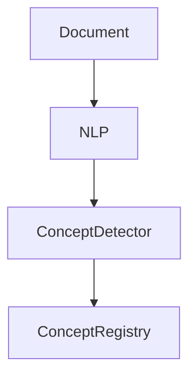

---

Example

Input

```text
OSPF is a link-state routing protocol.
```

Output

```yaml
concepts:

  OSPF

  Routing

  Link-State
```

---

# 11. Relationship Extraction System

Purpose:

Build knowledge connections.

---

Relationship Types

```text
depends_on

part_of

causes

uses

implements

extends

similar_to
```

---

Example

```yaml
relationship:

  source:
    TCP

  type:
    depends_on

  target:
    IP
```

---

Graph

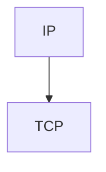

---

# 12. Curriculum Intelligence Engine

One of the most important KIS components.

---

Purpose

Convert academic documents into structured curriculum models.

---

Input

```text
Syllabus

Course Handbook

Accreditation Documents
```

---

Output

```yaml
course:

  outcomes:

  units:

  topics:

  assessments:

  prerequisites:
```

---

Architecture

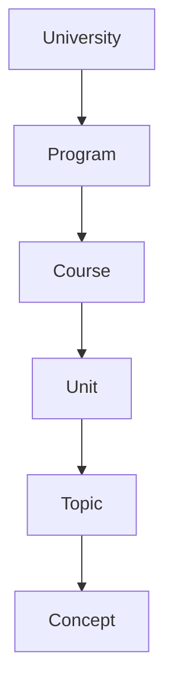

---

# 13. Learning Outcome Extraction

Purpose

Automatically discover educational objectives.

---

Example

Input

```text
Students should understand routing algorithms.
```

Output

```yaml
outcome:

  Understand Routing Algorithms
```

---

Mappings

```text
Topic

→ Outcome

Outcome

→ Assessment

Assessment

→ Mastery
```

---

# 14. Bloom Taxonomy Engine

Reference:

Bloom (1956)

Anderson Revision (2001)

---

Architecture

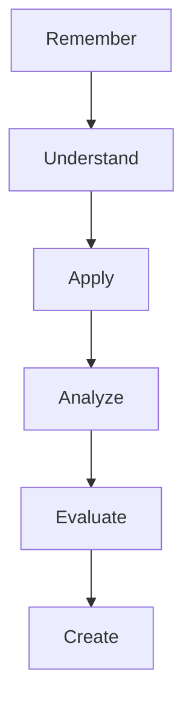

---

Classification Examples

```text
Define TCP
```

↓

Remember

---

```text
Configure OSPF
```

↓

Apply

---

```text
Design Routing Protocol
```

↓

Create

---

# 15. Prerequisite Discovery Engine

Purpose

Automatically build learning dependencies.

---

Input

```text
TCP uses IP.
```

Output

```yaml
prerequisite:

  TCP:

    - IP
```

---

Graph

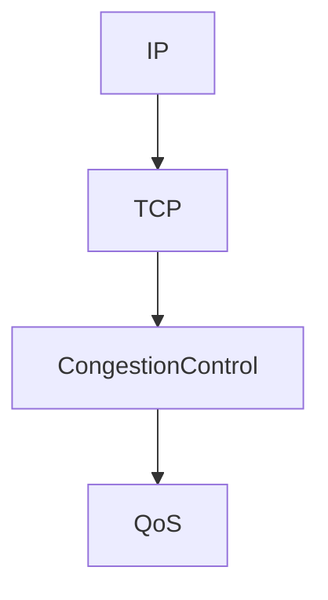

---

Used By

* LMS
* PES
* RCS

---

# 16. Assessment Extraction Engine

Purpose

Transform educational questions into structured assets.

---

Input

```text
Exercises

MCQs

Problems

Labs
```

---

Output

```yaml
assessment:

  topic:

  bloom:

  difficulty:

  outcome:

  solution:
```

---

# 17. Misconception Extraction Engine

Future Advanced Component

---

Purpose

Identify common misconceptions.

---

Example

```text
TCP prevents packet loss.
```

Output

```yaml
misconception:

  topic:
    TCP

  confidence:
    92
```

---

Used By

* PES
* LMS
* Assessment Agent

---

# 18. Research Ingestion Pipeline

Separate from educational content.

---

Architecture

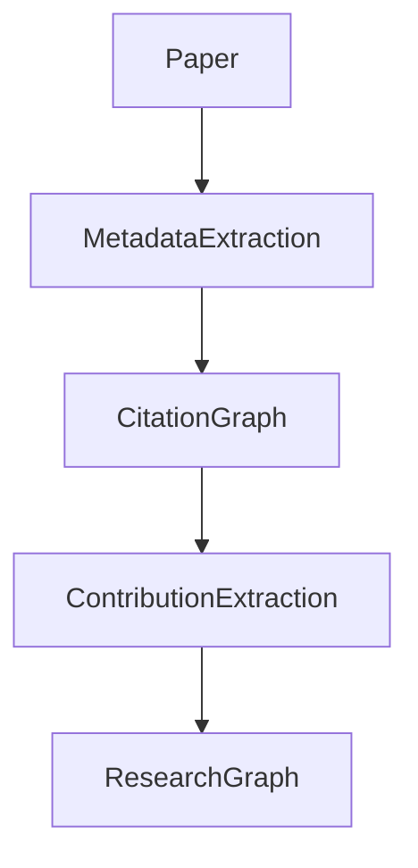

---

Extracted Elements

```text
Authors

Institutions

Citations

Methods

Results

Open Problems
```

---

# 19. Citation Graph Engine

Purpose

Understand research evolution.

---

Graph

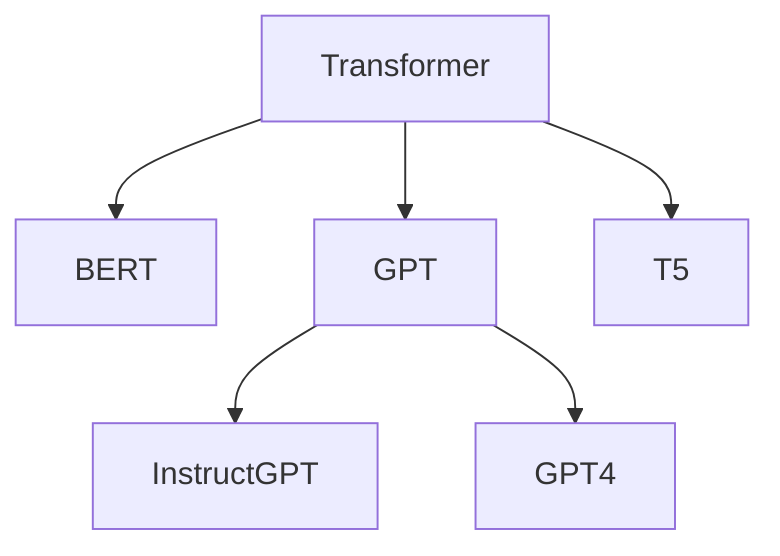

---

Capabilities

```text
Trend Analysis

Influence Detection

Research Recommendations
```

---

# 20. Multimedia Knowledge Pipeline

Purpose

Convert multimedia into educational knowledge.

---

Architecture

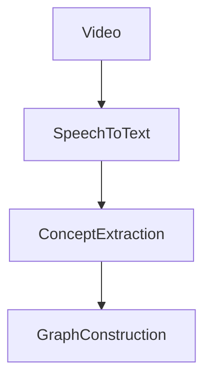

---

Future Components

```text
Diagram Understanding

Whiteboard Analysis

Animation Understanding

Simulation Analysis
```

---

# 21. Knowledge Validation Framework

Every extracted fact must be validated.

---

Validation Types

### Structural

### Semantic

### Educational

### Research

### Source-Based

---

Architecture

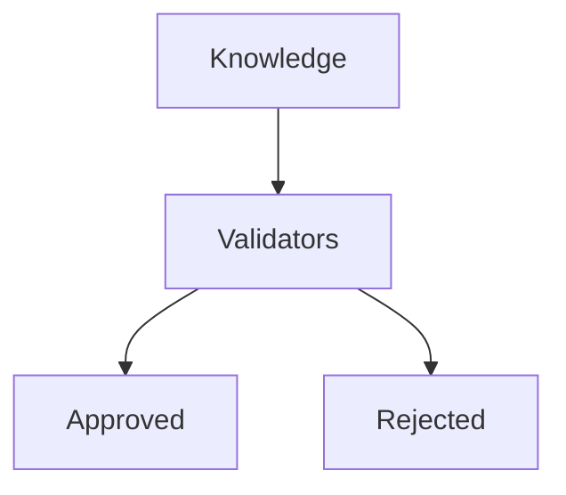

---

# 22. Source Trust System

Every source receives a trust score.

---

Example

```yaml
source_scores:

  ieee:
    98

  acm:
    97

  textbook:
    90

  blog:
    40
```

---

Factors

```text
Authority

Recency

Citation Count

Peer Review

Educational Usage
```

---

# 23. Knowledge Versioning

Knowledge evolves.

---

Architecture

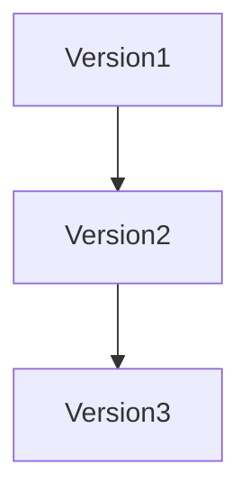

---

Tracks

```text
Curriculum Changes

Research Updates

Corrections

Deprecations
```

---

# 24. Knowledge Publishing Layer

Validated knowledge becomes:

---

Knowledge Graph

```text
Concept Intelligence
```

---

Curriculum Graph

```text
Educational Structure
```

---

Research Graph

```text
Research Intelligence
```

---

Assessment Graph

```text
Assessment Intelligence
```

---

Architecture

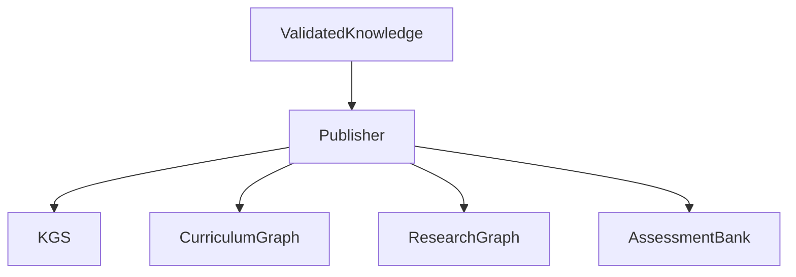

---

# 25. Human-in-the-Loop Framework

Not all knowledge should be accepted automatically.

---

Review Levels

```text
Faculty Review

Research Review

Community Review

Expert Review
```

---

Architecture

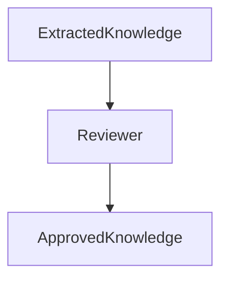

---

# 26. Integration with EduOS

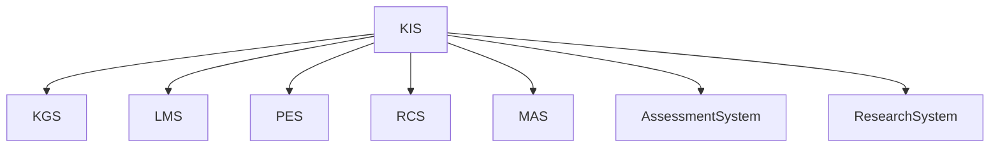

---

# 27. Long-Term Vision

Phase 1

```text
PDF Ingestion
```

↓

Phase 2

```text
Curriculum Intelligence
```

↓

Phase 3

```text
Research Intelligence
```

↓

Phase 4

```text
Multimedia Knowledge
```

↓

Phase 5

```text
Automatic Knowledge Discovery
```

↓

Phase 6

```text
Educational World Model
```

---

# 28. Research Foundations

## Educational Knowledge Graphs

Hogan et al. (2021)

Knowledge Graphs

ACM Computing Surveys

---

## Information Extraction

Jurafsky & Martin

Speech and Language Processing

---

## Educational Data Mining

Baker & Inventado

Educational Data Mining

---

## Learning Analytics

Siemens & Baker

Learning Analytics

---

## Knowledge Tracing

Corbett & Anderson (1994)

Knowledge Tracing

---

## Retrieval-Augmented Generation

Lewis et al. (2020)

RAG

---

## Generative Agents

Park et al. (2023)

Generative Agents

---

# 29. Success Criteria

The Knowledge Ingestion System succeeds when:

1. Any educational content can be transformed into structured knowledge.
2. Knowledge graphs grow automatically.
3. Curriculum structures remain traceable.
4. Research knowledge remains current.
5. Learning outcomes are automatically identified.
6. Prerequisites are explicitly modeled.
7. Misconceptions are captured.
8. Educational quality is measurable.
9. The educational intelligence layer becomes independent of any particular LLM.
10. EduOS can continuously learn from new knowledge sources without architectural redesign.
