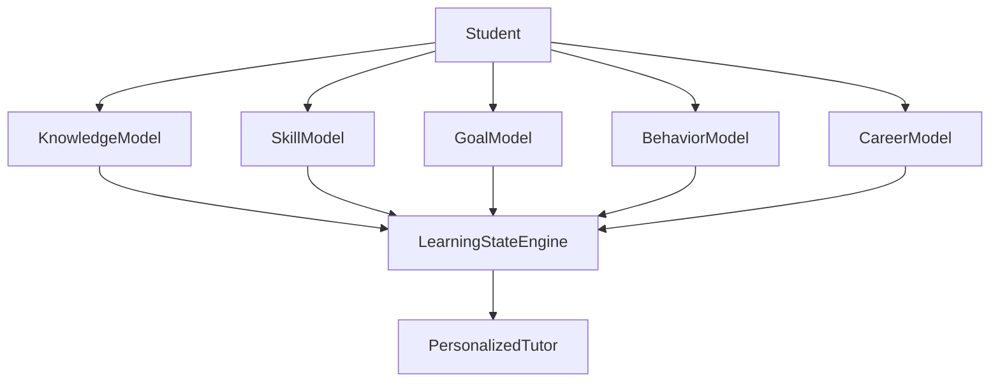
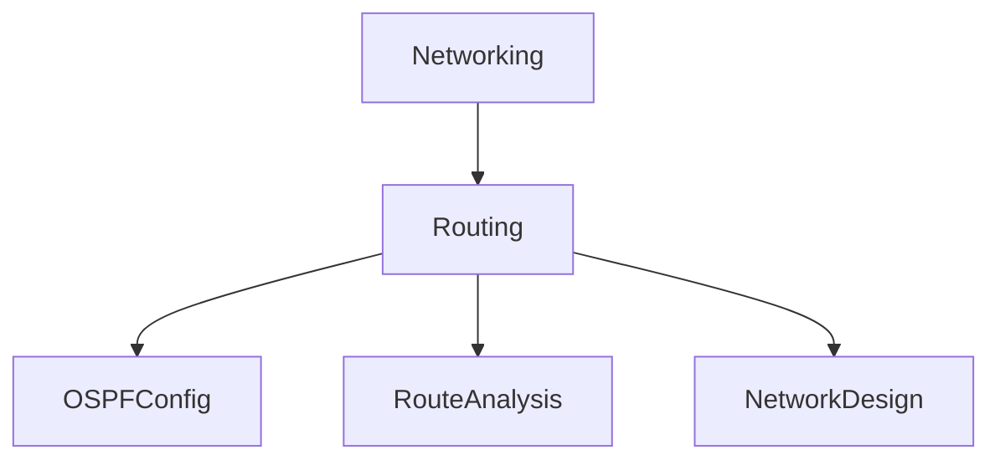
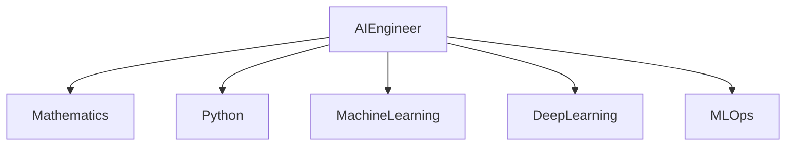
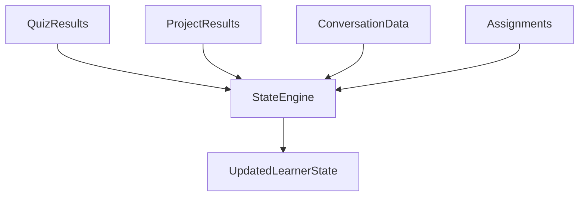
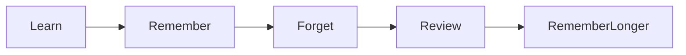
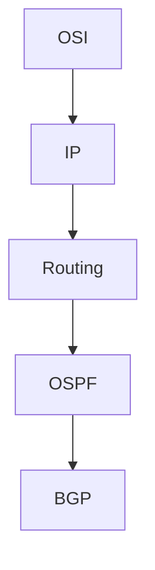
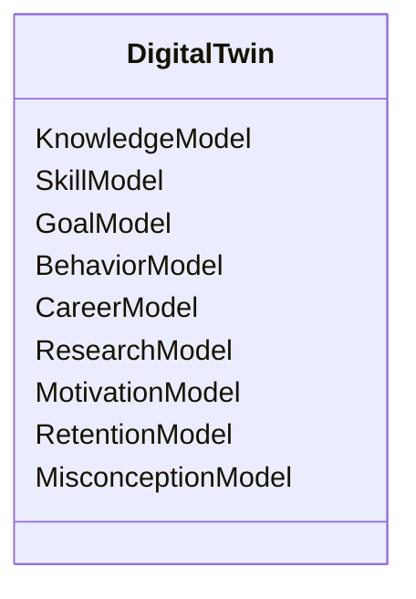

# LMS Deep Dive: Learning Modeling System Internal Architecture

## Core Idea

The Learning Modeling System is not a database.

It is a continuously evolving cognitive model of the learner.

Think:

```text
GitHub
    tracks code history

EduOS LMS
    tracks learning history
```

The LMS should know:

* What the student knows
* What the student partially knows
* What the student forgot
* What the student is currently learning
* What the student wants to learn next

---

# Learning Digital Twin Architecture



---

# Subsystem 1: Knowledge Model

Purpose:

Track conceptual understanding.

Example:

```text
Computer Networks

TCP → 85%

UDP → 90%

Routing → 60%

OSPF → 45%

BGP → 10%
```

Most systems stop here.

EduOS should go further.

---

## Knowledge Confidence

For every concept:

```yaml
concept:
  id: tcp

  mastery: 85

  confidence: 62

  last_verified: 2026-06-15
```

Why?

Student may get lucky.

Mastery and confidence are different.

Example:

```text
Student guessed MCQ

Score = High

Confidence = Low
```

---

# Subsystem 2: Skill Model

Knowledge ≠ Skill

Example:

Student knows:

```text
What OSPF is
```

But cannot:

```text
Configure OSPF
```

Skill graph:



Every skill should have:

```yaml
skill:
  mastery:
  attempts:
  projects:
  evidence:
```

---

# Subsystem 3: Goal Model

Most learning systems teach randomly.

EduOS should teach toward goals.

Example:

```yaml
goal:
  type: interview

  target:
    software-engineer

  deadline:
    2027-05
```

This changes recommendations.

---

## Example

Student A

Goal:

```text
Pass Exam
```

Student B

Goal:

```text
Research Career
```

Same topic.

Different teaching strategy.

---

# Subsystem 4: Behavior Model

This is where personalization becomes powerful.

Track:

```yaml
behavior:
  average_session:
  preferred_time:
  completion_rate:
  quiz_frequency:
  engagement:
```

Example:

Student learns best:

```text
10 PM - 1 AM
```

System adapts.

---

# Subsystem 5: Career Model

This is missing from most tutoring systems.

Example:

```text
Student
    wants to become

AI Engineer
```

The LMS should know:



Then compare:

```text
Required Skills

vs

Current Skills
```

Gap becomes visible.

---

# Learning State Engine

This is the brain of LMS.

It combines:

```text
Knowledge
Skills
Goals
Behavior
Career
```

into one state.

---

## Internal Flow



---

# Mastery Calculation

Do NOT use:

```text
Quiz Score
=
Mastery
```

Bad idea.

Instead:

```text
Mastery =
Quiz
+
Assignments
+
Projects
+
Conversations
+
Retention
```

Example:

```yaml
mastery:
  tcp:

    quiz: 80

    assignment: 90

    conversation: 75

    retention: 70

    final: 79
```

---

# Retention Engine

Inspired by Ebbinghaus.

Knowledge decays.



Every topic should store:

```yaml
retention:
  probability:
  next_review:
```

---

# Knowledge Gap Engine

One of the strongest future features.

Student asks:

```text
Explain BGP
```

System checks graph:



Missing:

```text
Routing
```

The tutor changes behavior:

```text
Teach Routing First
```

instead of answering directly.

---

# Misconception Engine

Most tutoring systems ignore misconceptions.

Example:

Student believes:

```text
TCP prevents packet loss.
```

Incorrect.

Store:

```yaml
misconception:
  statement:
  correction:
  confidence:
```

Track misconceptions separately from knowledge.

---

# Learning Velocity Model

Track:

```yaml
velocity:
  topics_per_week:
  mastery_growth:
```

Example:

```text
Fast Learner

Slow Learner

Inconsistent Learner
```

This changes pacing.

---

# Motivation Engine

Future Phase.

Track:

```yaml
motivation:
  streak:
  engagement:
  dropout_risk:
```

Example:

```text
High Risk
```

System responds with:

```text
Smaller Goals
Gamification
Simplified Plans
```

---

# Research Interest Engine

Unique feature for universities.

Track:

```yaml
research:
  ai: 95
  networking: 45
  cybersecurity: 30
```

Research Agent uses this profile.

---

# Cognitive Load Estimator

Critical for teaching.

Too much information:

```text
Learning ↓
```

System estimates:

```yaml
cognitive_load:
  low
  medium
  high
```

Teaching adjusts automatically.

---

# Student Digital Twin

Final learner representation:



---

# Why This Matters

Without LMS:

```text
Question
↓
Answer
```

With LMS:

```text
Question
↓
Who is asking?
↓
What do they know?
↓
What are their goals?
↓
What are they missing?
↓
How should it be taught?
↓
Answer
```

That distinction is what separates a chatbot from a true educational intelligence system.
