# MAS.md

# Memory Architecture Specification

Version: 3.0

Status: Foundational Cognitive Infrastructure

Dependencies:

* TAS.md
* ADS.md
* EKS.md
* KGS.md
* LMS.md
* PES.md
* AOS.md
* RCS.md

---

# 1. Overview

The Memory Architecture System (MAS) is the persistent cognitive substrate of EduOS.

It is responsible for:

* Knowledge retention
* Context persistence
* Student personalization
* Longitudinal learning
* Experience accumulation
* Curriculum awareness
* Research awareness
* Cognitive continuity

MAS enables EduOS to function as a long-term educational intelligence system rather than a stateless chatbot.

---

# 2. Vision

Current AI Systems

```text
User Question
↓
Temporary Context
↓
Answer
↓
Forget
```

EduOS

```text
Learn
↓
Remember
↓
Reflect
↓
Adapt
↓
Personalize
↓
Teach Better
```

---

# 3. Cognitive Foundations

The architecture draws inspiration from:

### Cognitive Psychology

Atkinson & Shiffrin (1968)

Human Memory Model

---

### Episodic Memory

Tulving (1972)

---

### Working Memory

Baddeley & Hitch (1974)

---

### ACT-R

Anderson (1996)

---

### Complementary Learning Systems

McClelland et al. (1995)

---

### Generative Agents

Park et al. (2023)

---

### MemGPT

Packer et al. (2023)

---

# 4. Memory Architecture Overview

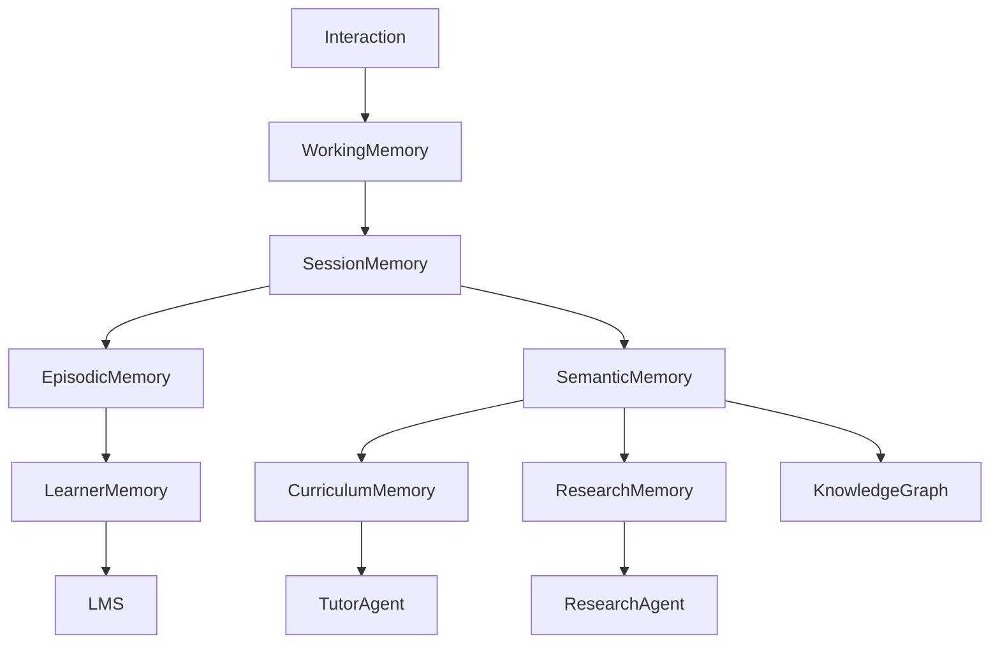

---

# 5. Memory Hierarchy

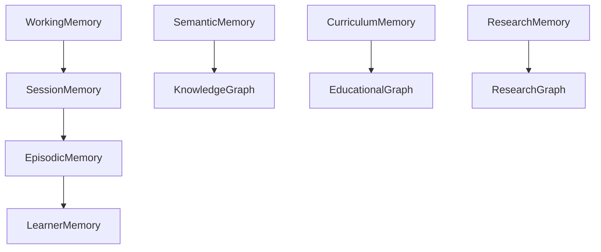

---

# 6. Working Memory

## Purpose

Stores active cognitive state.

Equivalent to human conscious processing.

---

## Lifetime

```text
Seconds → Minutes
```

---

## Responsibilities

* Current question
* Current reasoning chain
* Active agents
* Active tools
* Temporary conclusions

---

## Schema

```yaml
working_memory:

  query:

  intent:

  active_agents:

  active_tools:

  reasoning_state:

  temporary_context:

  confidence:
```

---

## Example

Student asks:

```text
Explain OSPF.
```

Working Memory contains:

```yaml
topic:
  ospf

agent:
  tutor

curriculum:
  routing

strategy:
  beginner

reasoning:
  shortest_path
```

---

## Research Basis

Baddeley (2000)

Working Memory Framework

---

# 7. Session Memory

## Purpose

Maintain continuity during learning sessions.

---

## Lifetime

```text
Minutes → Hours
```

---

## Responsibilities

Remember:

* Topics discussed
* Questions asked
* Current objectives
* Recent mistakes
* Active learning plan

---

## Schema

```yaml
session:

  session_id:

  active_course:

  active_topics:

  active_goal:

  discussed_concepts:

  mistakes:

  assessments:
```

---

## Example

```yaml
active_course:
  computer_networks

active_topics:
  - routing
  - ospf
  - bgp

mistakes:
  - routing_loops
```

---

## Why It Matters

Without Session Memory:

```text
Conversation resets.
```

With Session Memory:

```text
Learning continues.
```

---

# 8. Episodic Memory

## Purpose

Store educational experiences.

Not facts.

Experiences.

---

## Reference

Tulving (1972)

Episodic Memory Theory

---

## Examples

```text
Failed OSPF Quiz

Completed AI Project

Struggled With TCP
```

---

## Schema

```yaml
episode:

  timestamp:

  event_type:

  topic:

  performance:

  observations:

  evidence:
```

---

## Event Types

```text
QuestionAsked

QuizCompleted

AssignmentSubmitted

ProjectCompleted

ResearchExplored

MisconceptionDetected
```

---

## Architecture

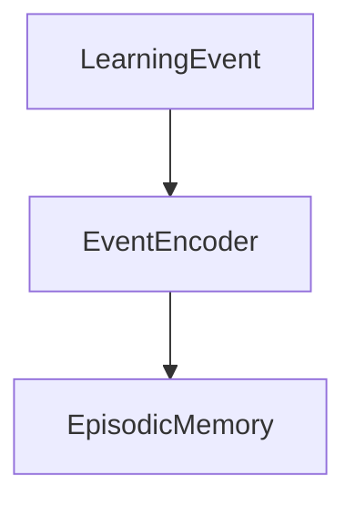

---

# 9. Semantic Memory

## Purpose

Store educational knowledge.

Equivalent to long-term conceptual knowledge.

---

## Contents

```text
Definitions

Concepts

Theories

Relationships

Models

Formulas
```

---

## Example

```yaml
concept:

  id:
    tcp

  title:
    Transmission Control Protocol

  relationships:

    prerequisite:
      ip

    related:
      udp
```

---

## Integration

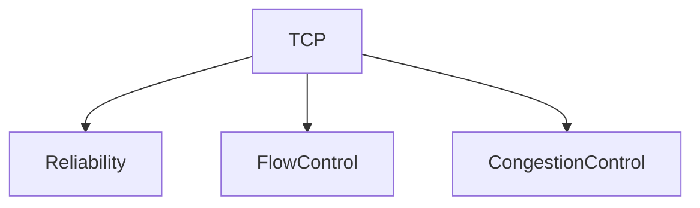

---

## Source Systems

* Textbooks
* Curriculum
* Research
* Knowledge Graph

---

# 10. Curriculum Memory

## Purpose

Store educational structures.

Not knowledge itself.

Knowledge organization.

---

## Example

RVCE

```text
Unit 1
Unit 2
Unit 3
```

MIT

```text
Different structure
```

---

## Schema

```yaml
course:

  university:

  department:

  program:

  units:

  outcomes:
```

---

## Architecture

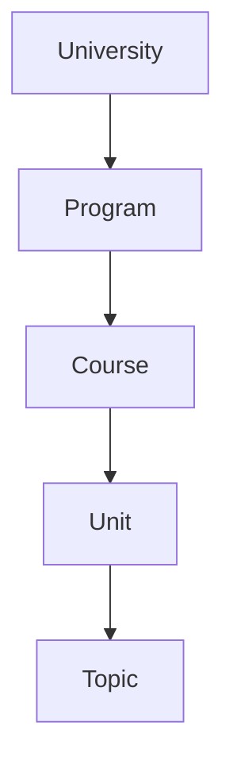

---

## Responsibilities

* Course sequencing
* Learning outcomes
* Assessment mappings
* Curriculum versions

---

# 11. Research Memory

## Purpose

Store evolving academic knowledge.

---

## Characteristics

Unlike curriculum memory:

```text
Dynamic
```

Unlike semantic memory:

```text
Rapidly evolving
```

---

## Contents

```text
Papers

Authors

Trends

Citations

Open Problems

Research Summaries
```

---

## Architecture

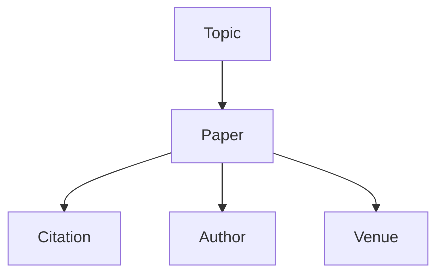

---

## Example

```yaml
paper:

  title:

  year:

  authors:

  citations:

  summary:
```

---

# 12. Learner Memory

## Purpose

Store learner-specific intelligence.

This is the most important memory layer.

---

## Question Answered

Not:

```text
What is TCP?
```

But:

```text
What does this learner know about TCP?
```

---

## Components

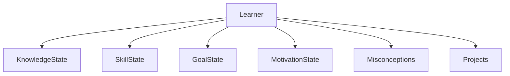

---

## Schema

```yaml
learner:

  mastery:

  confidence:

  goals:

  interests:

  preferences:

  misconceptions:

  projects:

  achievements:
```

---

## Example

```yaml
tcp:

  mastery:
    82

  confidence:
    61

  misconception:
    packet_loss
```

---

# 13. Memory Consolidation System

## Purpose

Convert temporary memories into long-term memories.

Inspired by:

Complementary Learning Systems

McClelland et al. (1995)

---

## Architecture

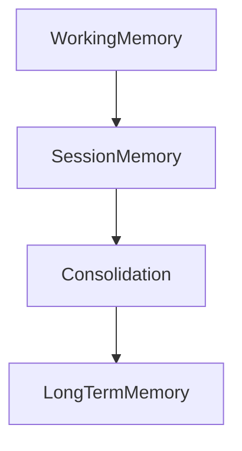

---

## Consolidation Triggers

### Repetition

### High Importance

### Assessment Results

### Project Usage

### Research Usage

---

# 14. Memory Retrieval Engine

## Purpose

Retrieve relevant memories.

---

## Retrieval Types

### Semantic Retrieval

Knowledge

---

### Temporal Retrieval

Time-based

---

### Graph Retrieval

Relationship-based

---

### Learner Retrieval

Student-specific

---

### Research Retrieval

Paper-specific

---

## Workflow

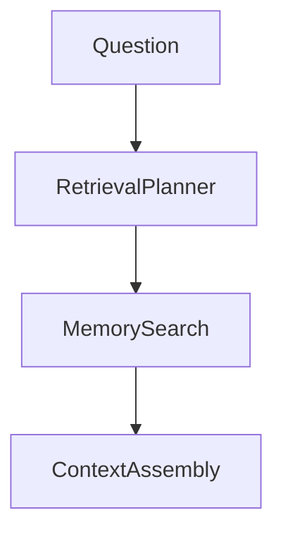

---

# 15. Context Assembly Engine

## Purpose

Build reasoning context.

---

## Inputs

```text
Memory

Knowledge Graph

Student Model

Research Data

Curriculum Data
```

---

## Architecture

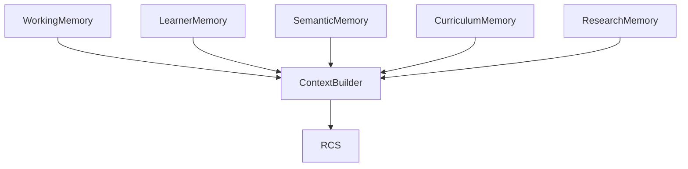

---

# 16. Forgetting System

## Purpose

Model human forgetting.

---

## Research Basis

Ebbinghaus (1885)

Forgetting Curve

---

## Architecture

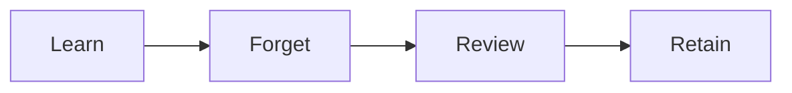

---

## Uses

* Spaced repetition
* Review recommendations
* Knowledge decay estimation

---

# 17. Misconception Memory

## Purpose

Track persistent misconceptions.

---

## Example

```yaml
misconception:

  statement:
    TCP prevents packet loss

  confidence:
    92
```

---

## Workflow

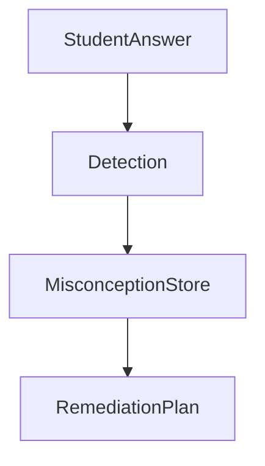

---

# 18. Project Memory

## Purpose

Track long-term educational projects.

---

## Example

```text
Smart Shopping Cart

EduOS

Blockchain Voting System
```

---

## Schema

```yaml
project:

  title:

  status:

  milestones:

  artifacts:

  lessons_learned:
```

---

# 19. Research Interest Memory

## Purpose

Track intellectual evolution.

---

## Example

```yaml
interests:

  ai:
    95

  llms:
    92

  networking:
    65
```

---

## Used By

* Research Agent
* Career Agent
* Tutor Agent

---

# 20. Memory Governance

## Requirements

### Explainability

Every memory should be traceable.

---

### Auditing

Every update logged.

---

### Deletion

Students can remove memories.

---

### Portability

Export learner profile.

---

### Privacy

GDPR

FERPA

Institutional Policies

---

# 21. Memory Security

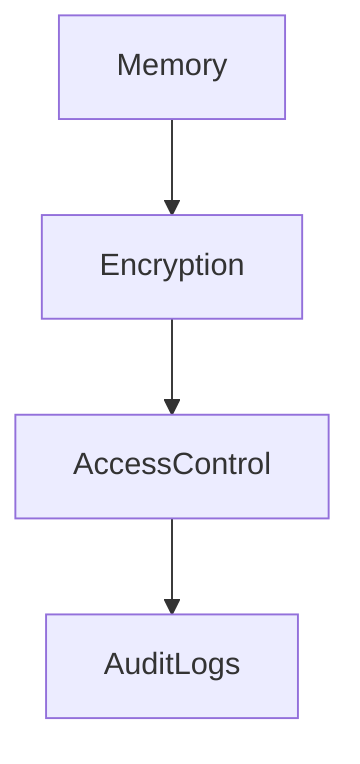

---

## Access Rules

Tutor Agent:

Read selected learner memories

---

Assessment Agent:

Read assessment history

---

Research Agent:

Read research interests only

---

# 22. Memory Lifecycle

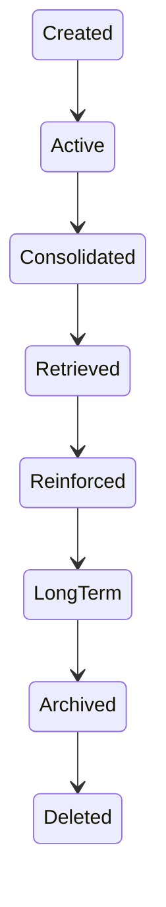

---

# 23. Future Evolution

Phase 1

Conversation Memory

↓

Phase 2

Learner Memory

↓

Phase 3

Project Memory

↓

Phase 4

Research Memory

↓

Phase 5

Cross-Year Learning Memory

↓

Phase 6

Lifelong Learning Memory

↓

Phase 7

Collective Educational Intelligence

---

# 24. Research Foundations

Atkinson & Shiffrin (1968)

Human Memory Model

---

Tulving (1972)

Episodic and Semantic Memory

---

Baddeley & Hitch (1974)

Working Memory

---

Anderson (1996)

ACT-R

---

McClelland et al. (1995)

Complementary Learning Systems

---

Ebbinghaus (1885)

Forgetting Curve

---

Lewis et al. (2020)

Retrieval-Augmented Generation

---

Park et al. (2023)

Generative Agents

---

Packer et al. (2023)

MemGPT

---

Weston et al. (2014)

Memory Networks

---

# 25. Success Criteria

The Memory Architecture succeeds when:

1. Learning persists across years.
2. Personalization improves over time.
3. Knowledge retrieval remains efficient.
4. Student growth is explainable.
5. Forgetting is modeled explicitly.
6. Misconceptions are tracked and corrected.
7. Memory remains secure and auditable.
8. EduOS develops a true lifelong learner model rather than storing chat history.
9. Memory becomes a cognitive system rather than a database.
