# Pedagogical Engine Specification (PES) v2.0

## Research-Informed Teaching Intelligence Architecture

Version: 2.0

Status: Research Architecture

Purpose:

Define how EduOS teaches rather than merely answers.

The Pedagogical Engine is responsible for transforming knowledge into learning.

Unlike the LLM, which generates language, the Pedagogical Engine generates learning experiences.

---

# 1. Theoretical Foundations

The Pedagogical Engine is built on multiple learning science frameworks.

---

## Bloom's Taxonomy

Reference:

Bloom, B. S. (1956)
Taxonomy of Educational Objectives

Framework:

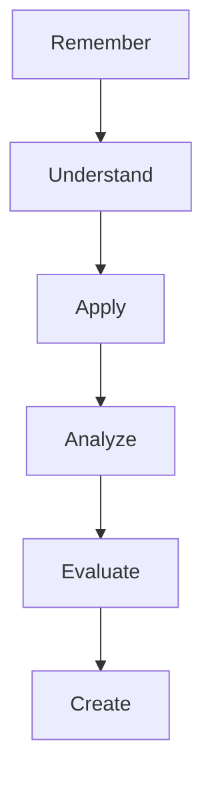

Implication:

The system must identify:

* Current Bloom Level
* Target Bloom Level

before teaching.

Example:

Student:

"What is TCP?"

Target:

Remember

Student:

"Design a congestion control mechanism"

Target:

Create

Different teaching strategy required.

---

## Vygotsky's Zone of Proximal Development (ZPD)

Reference:

Vygotsky, L. S.
Mind in Society (1978)

Core Idea:

Learning occurs in the region between:


Where:

CanDoAlone:

Already mastered

CannotDo:

Too difficult

ZPD:

Optimal learning zone

---

Pedagogical Implication

The system should not answer:

```text
Too Easy
```

or

```text
Too Difficult
```

questions.

Instead:

Identify:

```text
Optimal Challenge
```

---

# 2. Learner Cognitive State Model

Traditional ITS:

```text
Knowledge Only
```

EduOS:

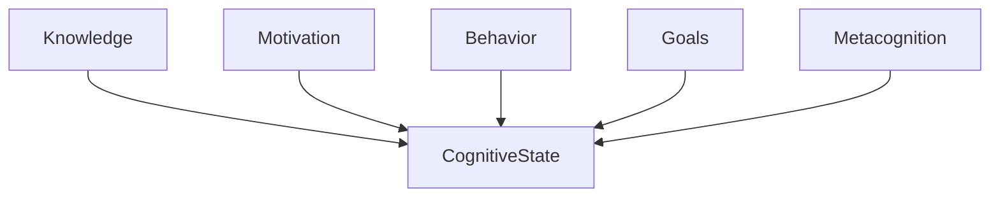

---

## Cognitive State Variables

```yaml
cognitive_state:

  knowledge:
    score:

  confidence:
    score:

  motivation:
    score:

  cognitive_load:
    score:

  curiosity:
    score:

  frustration:
    score:
```

---

Why?

Two students may know TCP equally.

Student A:

```yaml
confidence: 90
```

Student B:

```yaml
confidence: 20
```

Teaching should differ.

---

# 3. Cognitive Load Management

Reference:

Sweller, J.
Cognitive Load Theory (1988)

Learning fails when working memory overloads.

---

Three Load Types

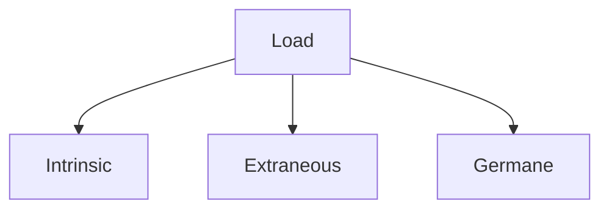

---

Intrinsic

Difficulty of topic.

Example:

```text
BGP
```

Higher than:

```text
OSI Model
```

---

Extraneous

Poor teaching design.

Example:

Bad explanation.

---

Germane

Mental effort contributing to learning.

Desired.

---

Pedagogical Rule

If:

```yaml
cognitive_load > threshold
```

then:

```text
Reduce Complexity
Introduce Visualization
Break Concept Into Chunks
```

---

# 4. Scaffolding Engine

Reference:

Wood, Bruner & Ross (1976)

Scaffolding is temporary support.

---

Example

Student asks:

```text
Explain OSPF
```

System response stages:

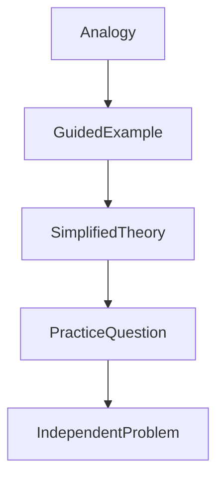

Support gradually removed.

---

# 5. Socratic Tutoring System

Reference:

Graesser et al.
AutoTutor Research

One of the most effective tutoring approaches.

---

Instead of:

```text
Question
↓
Answer
```

Use:

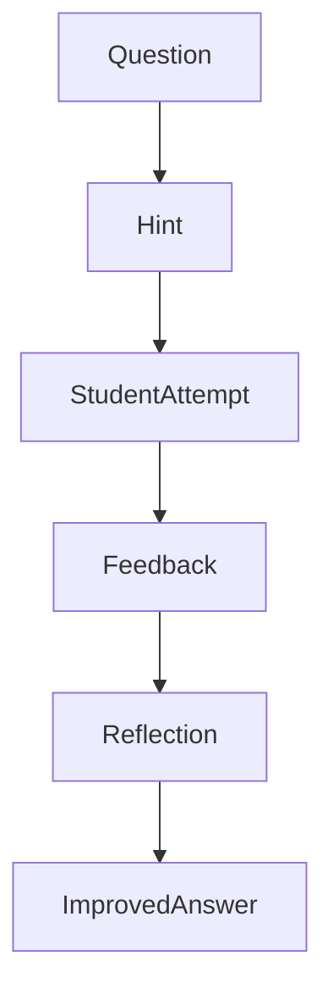

---

Research Findings

AutoTutor demonstrated learning gains comparable to human tutors in several domains.

---

Pedagogical Rule

If:

```yaml
student_mastery > 40
```

Prefer:

```text
Socratic Dialogue
```

instead of direct answers.

---

# 6. Metacognitive Engine

Reference:

Flavell (1979)

Metacognition:

Thinking about thinking.

---

Students should learn:

```text
What they know

What they don't know

How they learn
```

---

Workflow

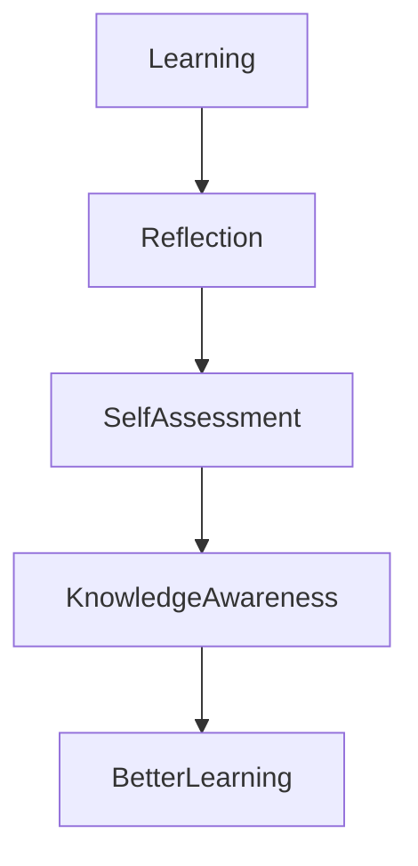

---

Example Prompts

Before answering:

```text
What do you already know about routing?
```

After answering:

```text
Which part remains unclear?
```

---

# 7. Misconception Detection System

Reference:

Chi, M. T. H.
Conceptual Change Theory

---

Example

Student:

```text
TCP prevents packet loss.
```

System stores:

```yaml
misconception:
  topic: tcp
  confidence: 95
```

---

Correction Strategy

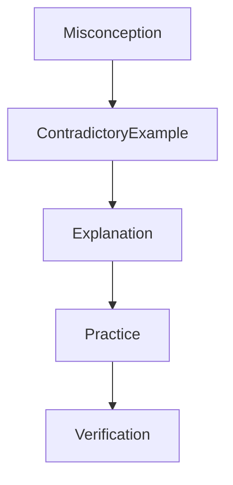

---

Research shows misconception correction requires active conceptual restructuring.

Direct correction alone is often ineffective.

---

# 8. Mastery Learning Engine

Reference:

Bloom (1968)

Mastery Learning

---

Principle

Students progress after mastery.

Not after exposure.

---

Workflow

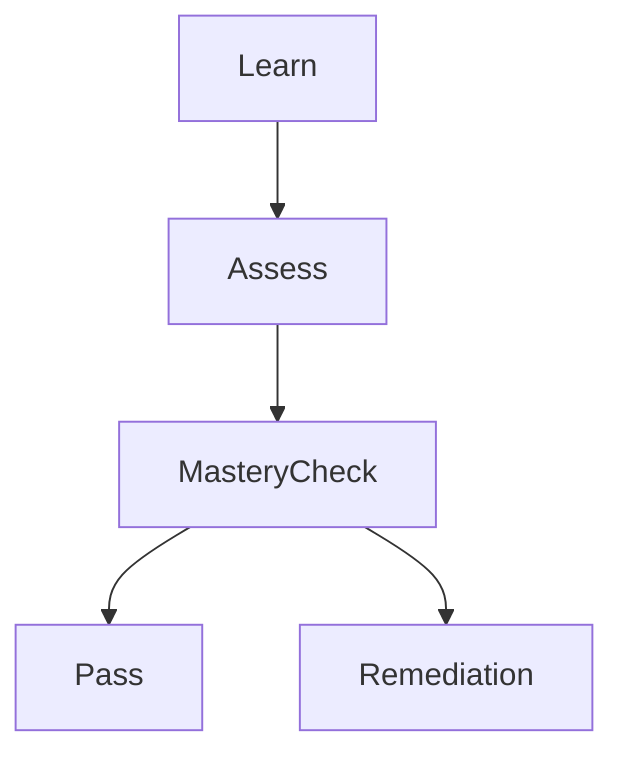

---

Example

Mastery Threshold:

```yaml
tcp:
  mastery_required: 80
```

Below threshold:

```text
Remediation
```

---

# 9. Curiosity Engine

Reference:

Berlyne (1960)

Curiosity Theory

Loewenstein (1994)

Information Gap Theory

---

Principle

Humans learn best when curiosity is triggered.

---

Workflow

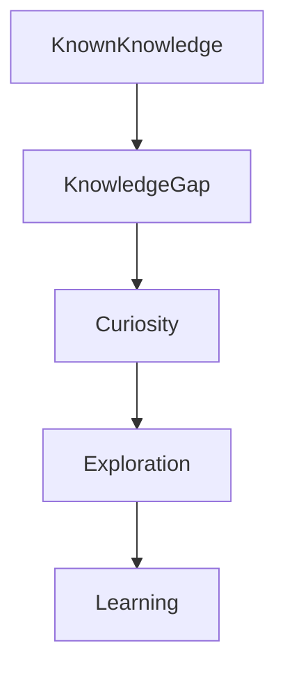

---

Example

Instead of:

```text
TCP uses congestion control.
```

Ask:

```text
What happens if every computer sends data at maximum speed?
```

Curiosity precedes explanation.

---

# 10. Research-Oriented Pedagogy

Reference:

Inquiry-Based Learning

Problem-Based Learning

---

Advanced learners receive:

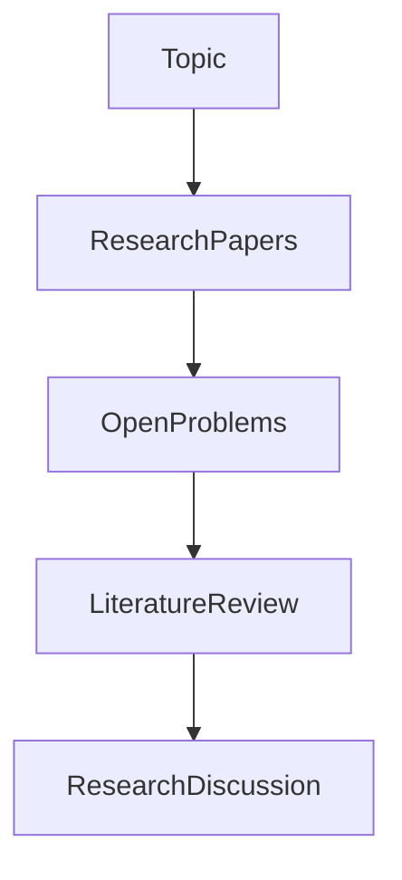

---

Example

Topic:

```text
LLMs
```

Advanced learner:

Receive:

* seminal papers
* recent papers
* unresolved challenges
* competing theories

---

# 11. Pedagogical Decision Engine

Core Intelligence

---

Inputs

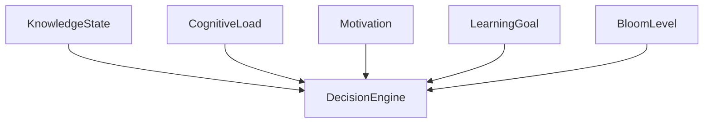

---

Outputs

```text
Analogy
Visualization
Socratic
Direct Teaching
Project
Research
Assessment
```

---

# 12. Educational Theories Integrated

## Bloom (1956)

Taxonomy of Educational Objectives

---

## Vygotsky (1978)

Zone of Proximal Development

---

## Sweller (1988)

Cognitive Load Theory

---

## Flavell (1979)

Metacognition

---

## Chi (2005)

Conceptual Change Theory

---

## Graesser et al. (2005)

AutoTutor

---

## Bruner (1960)

Scaffolding

---

## Anderson (ACT-R)

Cognitive Architecture

---

# 13. Future Research Directions

Potential Novel Contributions for EduOS

1. LLM + ZPD Modeling
2. Dynamic Cognitive Load Estimation
3. Graph-Based Misconception Detection
4. Personalized Bloom Progression
5. Research-Aware Tutoring
6. Longitudinal Learner Digital Twins
7. Multi-Agent Pedagogical Planning

These areas remain active research topics and provide stronger academic novelty than simply creating another educational chatbot.
