# RCS.md

# Reasoning Core Specification

Version: 2.0

Status: Foundational Cognitive Architecture

Dependencies:

* TAS.md
* ADS.md
* EKS.md
* KGS.md
* LMS.md
* PES.md
* AOS.md

---

# 1. Purpose

The Reasoning Core (RCS) is the cognitive engine of EduOS.

It is responsible for:

* Understanding
* Reasoning
* Planning
* Decision Making
* Verification
* Tool Utilization

The RCS does NOT teach.

Teaching belongs to the Pedagogical Engine.

The RCS thinks.

---

# 2. Design Philosophy

Traditional Educational AI:

```text
Question
↓
LLM
↓
Answer
```

EduOS:

```text
Question
↓
Understanding
↓
Reasoning
↓
Planning
↓
Verification
↓
Pedagogical Strategy
↓
Teaching Response
```

The answer is a consequence of reasoning.

Not the reasoning itself.

---

# 3. Cognitive Architecture Overview

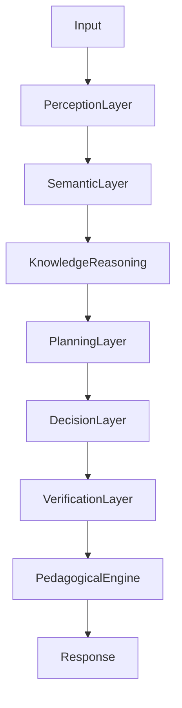

---

# 4. Core Design Principles

## Principle 1

Reason before generating.

---

## Principle 2

Retrieve before reasoning.

---

## Principle 3

Verify before responding.

---

## Principle 4

Plan before teaching.

---

## Principle 5

Graph before LLM.

---

# 5. Cognitive Pipeline

Every interaction follows:

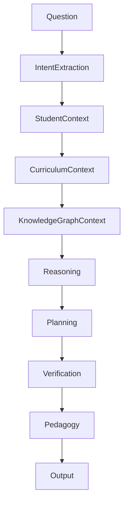

---

# 6. Perception Layer

Purpose:

Transform raw input into structured educational intent.

---

Example Input

```text
Explain TCP Congestion Control.
```

Output

```yaml
intent:
  learn

topic:
  tcp_congestion_control

difficulty:
  unknown

goal:
  understanding
```

---

Responsibilities

* Intent Recognition
* Topic Detection
* Entity Extraction
* Goal Detection
* Curriculum Mapping

---

# 7. Semantic Understanding Layer

Purpose:

Understand meaning.

---

Input

```text
Explain TCP like I'm 10 years old.
```

Output

```yaml
topic:
  tcp

pedagogy:
  analogy_first

difficulty:
  beginner
```

---

Research Basis

* Transformer Representations
* Semantic Parsing
* Knowledge Grounding

References:

Devlin et al. (BERT)

Brown et al. (GPT-3)

Touvron et al. (Llama)

---

# 8. Knowledge Reasoning Layer

Purpose:

Reason over educational knowledge.

---

Architecture

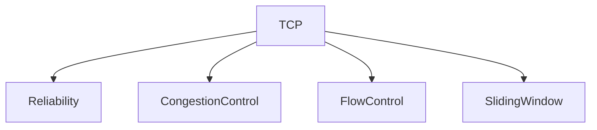

---

Tasks

* Dependency Analysis
* Concept Traversal
* Knowledge Gap Detection
* Curriculum Alignment

---

Example

Student asks:

```text
Explain BGP
```

Graph Analysis:

```yaml
mastered:
  routing: false
```

Result:

```text
Teach Routing First
```

---

# 9. Graph Reasoning Engine

One of EduOS's core differentiators.

---

Purpose

Use graph traversal before LLM generation.

---

Workflow

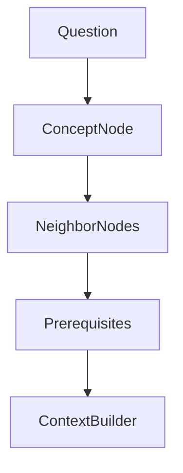

---

Reasoning Types

### Prerequisite Reasoning

### Dependency Reasoning

### Similarity Reasoning

### Curriculum Reasoning

### Learning Path Reasoning

### Research Relationship Reasoning

---

Research Foundations

Hogan et al. (2021)

Knowledge Graphs

ACM Computing Surveys

---

# 10. Symbolic Reasoning Layer

Purpose

Deterministic logic.

---

Why?

LLMs are probabilistic.

Education requires constraints.

---

Example Rule

```yaml
IF:
  mastery < 40

THEN:
  remediation_required
```

---

Architecture

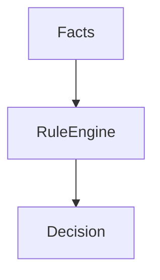

---

Research Foundations

Newell

Physical Symbol System Hypothesis

SOAR Architecture

---

# 11. Planning Engine

Purpose

Generate educational plans.

---

Question

```text
Become an AI Engineer.
```

---

Output

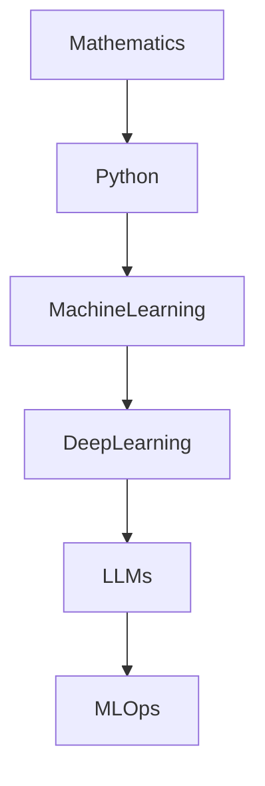

---

Responsibilities

* Goal Decomposition
* Roadmap Generation
* Learning Planning
* Resource Planning

---

Research Foundations

Tree of Thoughts

Yao et al., 2023

Graph of Thoughts

Besta et al., 2023

---

# 12. Tool Reasoning Engine

Purpose

Determine when external tools are required.

---

Workflow

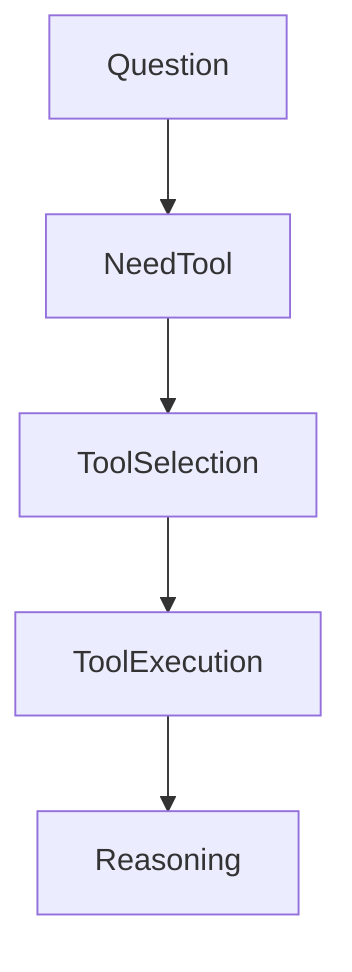

---

Examples

### Research Tool

Latest Papers

### Code Tool

Programming Questions

### Diagram Tool

Visual Explanations

### Simulation Tool

Interactive Learning

---

Research Foundations

ReAct

Yao et al., 2022

Toolformer

Schick et al., 2023

---

# 13. Educational Reasoning Layer

Purpose

Transform knowledge into educational decisions.

---

Question

```text
Explain OSPF.
```

Educational Reasoning:

```yaml
student_level:
  beginner

goal:
  exam

knowledge_gap:
  routing

teaching_mode:
  scaffolded
```

---

Output

Teaching Plan

Not Answer

---

# 14. Metacognitive Reasoning Layer

Purpose

Reason about reasoning.

---

Questions

```text
Am I confident?

Do I need verification?

Do I need another tool?

Should another agent review?
```

---

Architecture

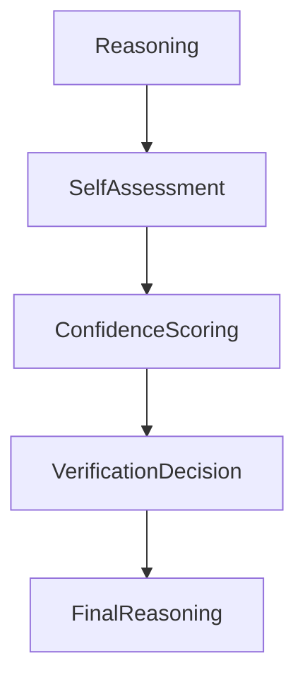

---

Research Foundations

Flavell (1979)

Metacognition Theory

---

# 15. Verification Engine

Purpose

Reduce hallucinations.

---

Verification Sources

```text
Knowledge Graph

Research Sources

Curriculum Sources

Tool Outputs

Agent Consensus
```

---

Workflow

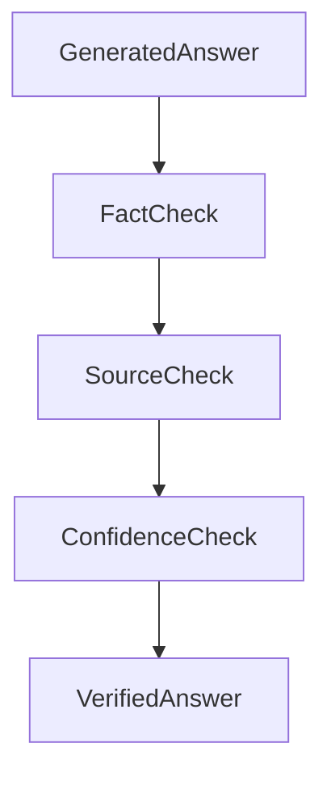

---

# 16. Multi-Agent Reasoning

Purpose

Collaborative intelligence.

---

Architecture

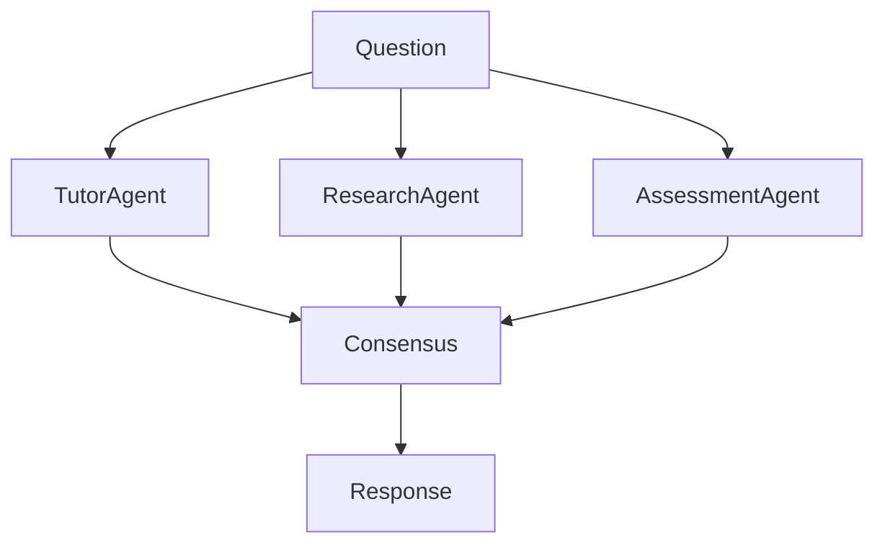

---

Benefits

* Reduced hallucination
* Better coverage
* Specialized expertise

---

Research Foundations

AutoGen

Wu et al., 2023

CAMEL

Li et al., 2023

MetaGPT

Hong et al., 2023

---

# 17. Confidence Framework

Every reasoning result contains:

```yaml
reasoning_result:

  answer:

  confidence:

  evidence:

  citations:

  verification_status:
```

---

Confidence Factors

```text
Knowledge Graph Match

Tool Verification

Research Evidence

Agent Consensus

Historical Accuracy
```

---

# 18. Long-Term Memory Reasoning

Purpose

Utilize years of learning history.

---

Architecture

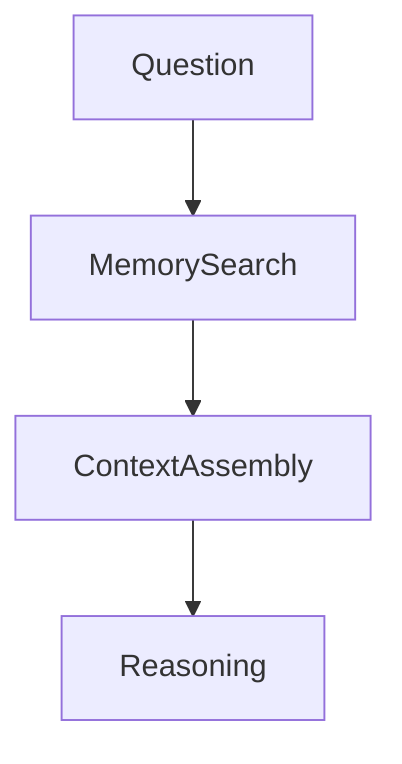

---

Example

Student:

```text
Explain OSPF again.
```

System:

```text
Last struggle:
Routing

Last review:
2 weeks ago
```

---

# 19. Multimodal Reasoning

Future Capability

---

Inputs

```text
Text

Image

Audio

Video

Whiteboard
```

---

Architecture

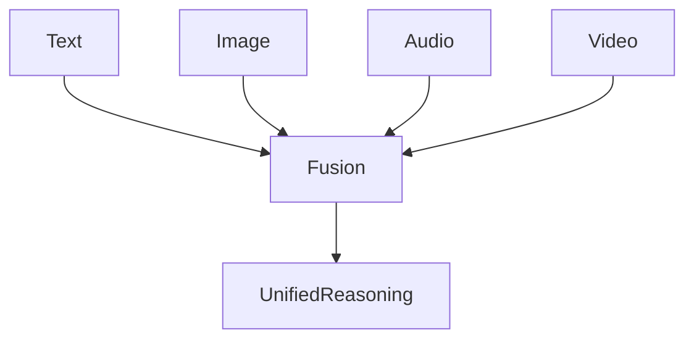

---

Examples

### Diagram Explanation

### Network Topology Analysis

### Handwritten Solution Analysis

### Lecture Video Understanding

---

# 20. Hybrid Cognitive Architecture

Long-Term Vision

---

Phase 1

```text
LLM
```

---

Phase 2

```text
Graph + LLM
```

---

Phase 3

```text
Graph + Symbolic + LLM
```

---

Phase 4

```text
Graph + Symbolic + Multi-Agent
```

---

Phase 5

```text
Educational Cognitive Architecture
```

---

# 21. Research Foundations

## Cognitive Architectures

Anderson

ACT-R

1996

---

Laird

SOAR

1987

---

Newell

Unified Theories of Cognition

1990

---

## Educational AI

Graesser et al.

AutoTutor

2005

---

Woolf

Building Intelligent Interactive Tutors

2009

---

## Modern LLM Reasoning

Wei et al.

Chain-of-Thought

2022

---

Yao et al.

ReAct

2022

---

Schick et al.

Toolformer

2023

---

Yao et al.

Tree of Thoughts

2023

---

Besta et al.

Graph of Thoughts

2023

---

Shinn et al.

Reflexion

2023

---

Wu et al.

AutoGen

2023

---

# 22. Success Criteria

The Reasoning Core succeeds when:

1. Graph reasoning occurs before language generation.
2. Educational reasoning influences every response.
3. Tool usage is deliberate and explainable.
4. Verification occurs before final output.
5. Multi-agent collaboration improves quality.
6. Student context affects reasoning.
7. The reasoning system remains independent of any specific foundation model.
8. Future cognitive architectures can replace transformer-based reasoning without redesigning EduOS.
