# EduOS Technical Architecture Specification (TAS)

**Version:** 1.0

**Status:** Foundational Architecture

**Document Type:** Technical Architecture Specification (TAS)

---

# 1. Purpose

EduOS is a Curriculum-Aware Educational Intelligence Platform designed to provide personalized, research-backed, multimodal learning experiences.

Unlike traditional tutoring systems, EduOS is designed as an Educational Operating System where:

* Educational knowledge is independent of the AI model.
* Multiple educational agents collaborate.
* Curriculum structures are first-class entities.
* Student learning state is continuously modeled.
* Research integration is built into the architecture.
* Future modalities (image, audio, video, whiteboard) are supported by design.

---

# 2. Architectural Principles

## Model Agnostic

The system must not depend on any single model provider.

Supported providers should be swappable:

* OpenAI
* Gemini
* Qwen
* Llama
* Mistral
* Future Models

---

## Agent-Oriented

All educational capabilities should be implemented through agents.

Agents own logic.

The orchestrator owns coordination.

---

## Tool-First

External capabilities must be exposed as tools.

Agents never directly access external systems.

---

## Knowledge-Centric

Knowledge should reside in structured systems:

* Knowledge Graph
* Curriculum Graph
* Research Repository
* Student Model

and not inside prompts.

---

## Multimodal-Native

Every major component should support future multimodal inputs and outputs.

---

# 3. High-Level System Architecture

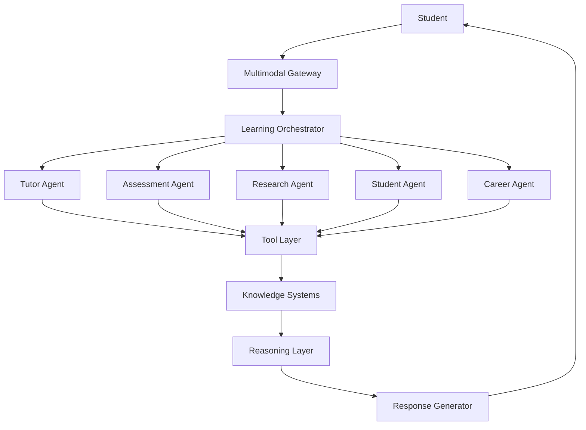

---

# 4. Layered Architecture

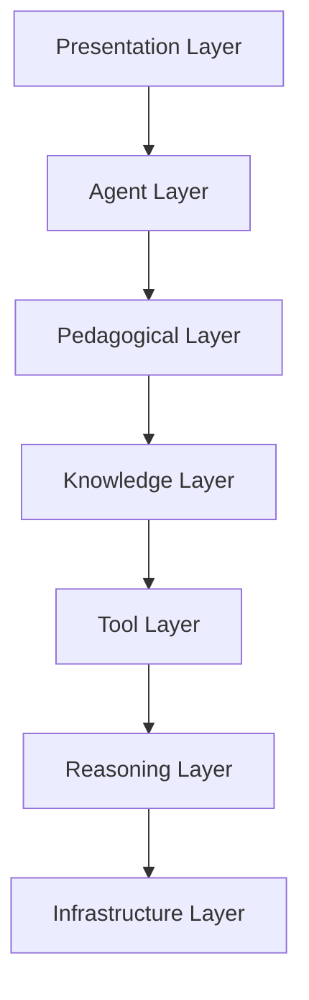

---

# 5. Multimodal Gateway

## Purpose

Handle all user interactions.

### Supported Inputs

* Text
* Voice
* Images
* Videos
* PDFs
* Whiteboard Data

### Supported Outputs

* Text
* Audio
* Images
* Diagrams
* Interactive Quizzes
* Simulations

---

## Gateway Architecture

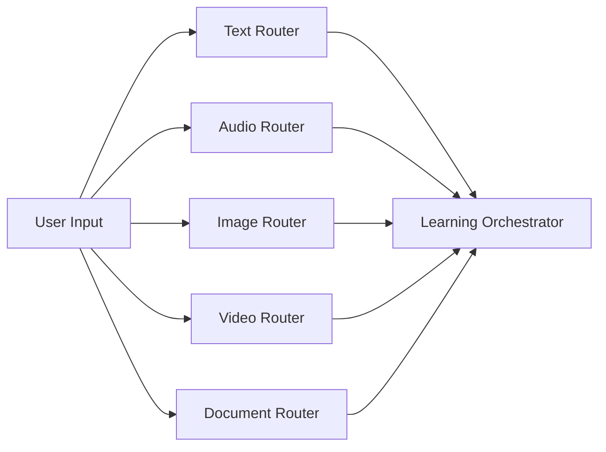

---

# 6. Learning Orchestrator

## Purpose

Central brain of the system.

### Responsibilities

* Intent detection
* Workflow planning
* Agent coordination
* Context construction
* Tool routing

---

## Workflow

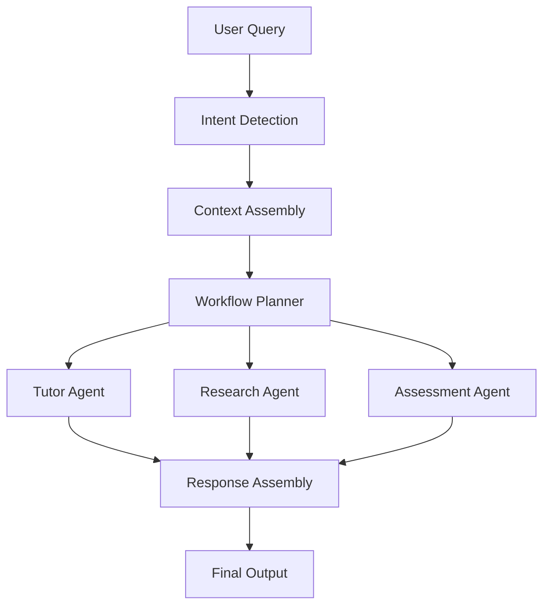

---

# 7. Agent Ecosystem

Agents are independent educational workers.

---

## Agent Hierarchy

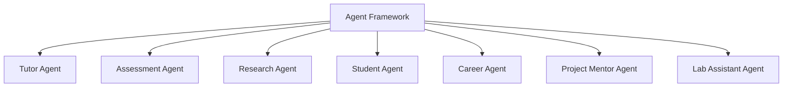

---

# 8. Tutor Agent

## Responsibilities

* Concept teaching
* Explanation generation
* Analogy generation
* Guided learning
* Socratic questioning

---

## Internal Workflow

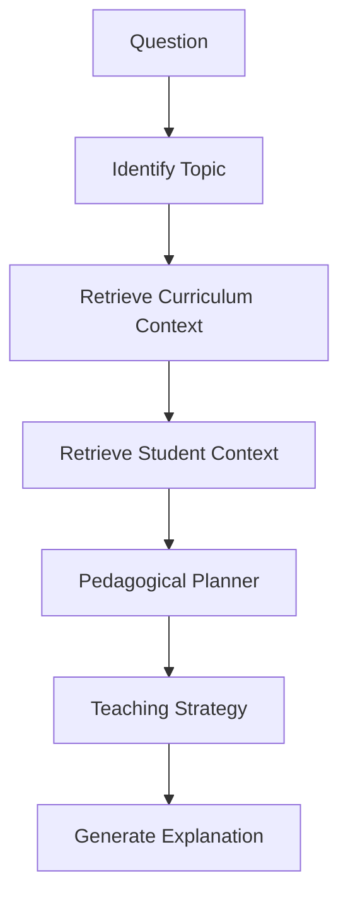

---

# 9. Pedagogical Planner

## Purpose

Decide how learning should occur.

---

## Teaching Modes

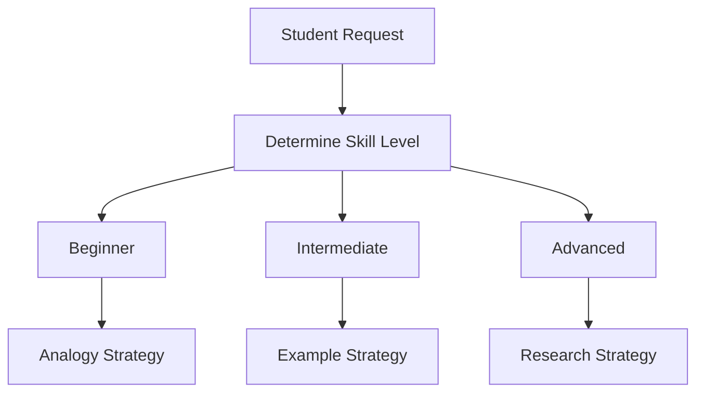

---

# 10. Student Modeling System

## Purpose

Maintain a digital twin of the learner.

---

## Student Profile

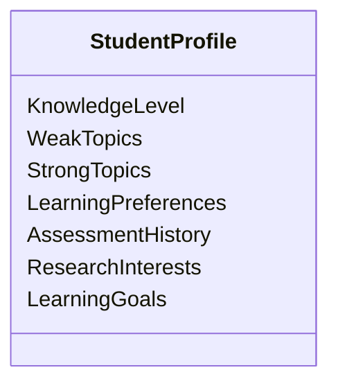

---

## Learning Lifecycle

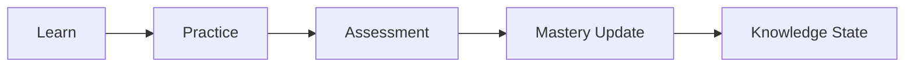

---

# 11. Curriculum Intelligence System

## Purpose

Represent institutional curricula.

---

## Structure

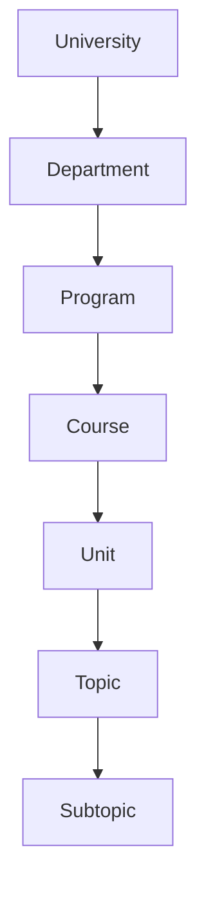

---

# 12. Curriculum Knowledge Graph

## Purpose

Represent conceptual relationships.

---

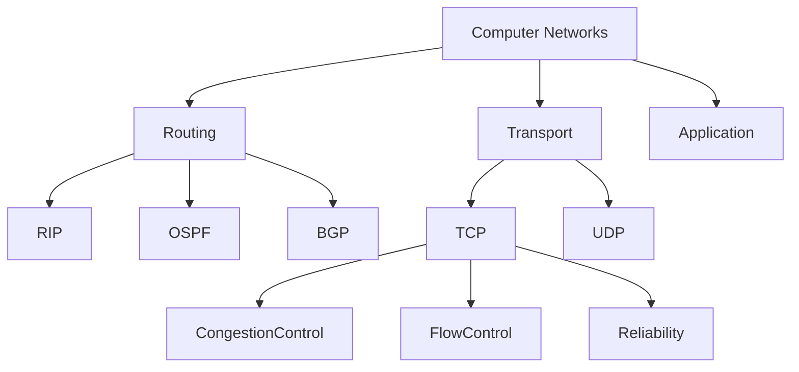

---

# 13. Research Intelligence System

## Purpose

Provide latest academic knowledge.

---

## Research Pipeline

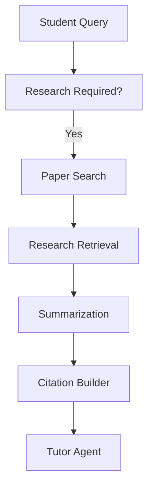

---

# 14. Assessment Engine

## Purpose

Generate adaptive assessments.

---

## Assessment Flow

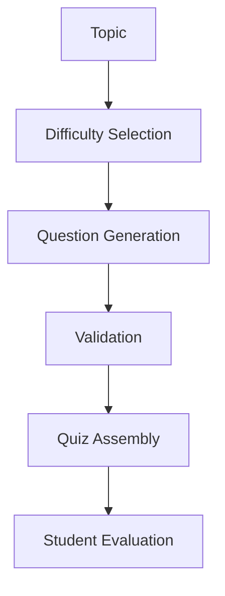

---

# 15. Tool Layer

## Tool Categories

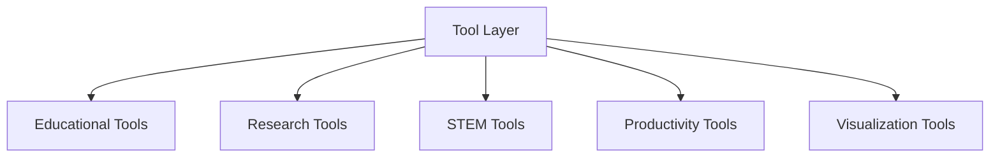

---

## Educational Tools

* Curriculum Search
* Concept Search
* Learning Outcome Search

---

## Research Tools

* Paper Search
* Citation Search
* Trend Analysis

---

## STEM Tools

* Code Execution
* Math Solver
* Simulation Engines

---

# 16. Memory Architecture

## Multi-Layer Memory

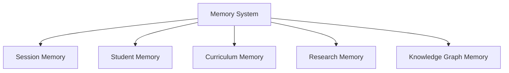

---

## Session Memory

Stores:

* Active conversation
* Current goals
* Temporary context

---

## Student Memory

Stores:

* Progress
* Assessments
* Learning history

---

# 17. Reasoning Layer

## Purpose

Provide language understanding and reasoning.

---

## Abstraction Layer

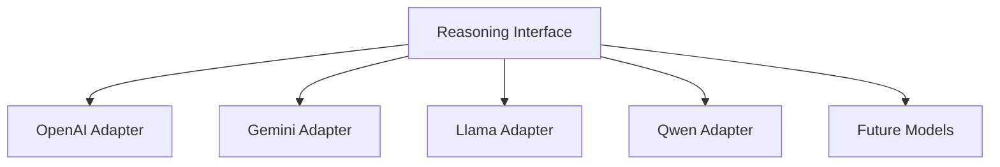

---

# 18. Plugin Architecture

## Purpose

Allow community-driven expansion.

---

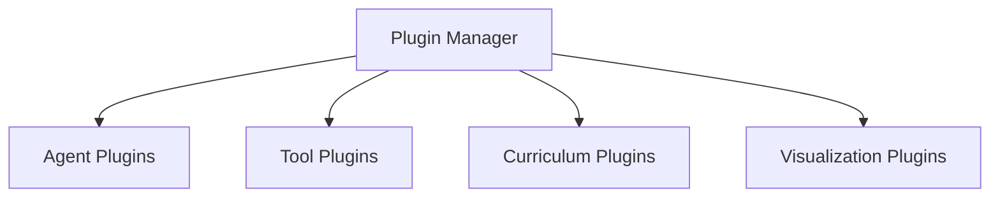

---

# 19. Event-Driven Architecture

## Core Events

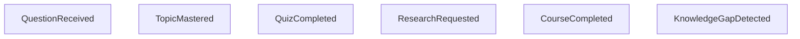

---

## Event Flow

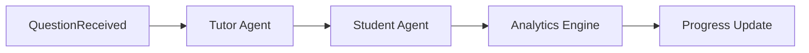

---

# 20. Analytics Layer

## Tracks

* Topic mastery
* Retention rates
* Assessment performance
* Learning velocity
* Agent effectiveness

---

## Analytics Architecture

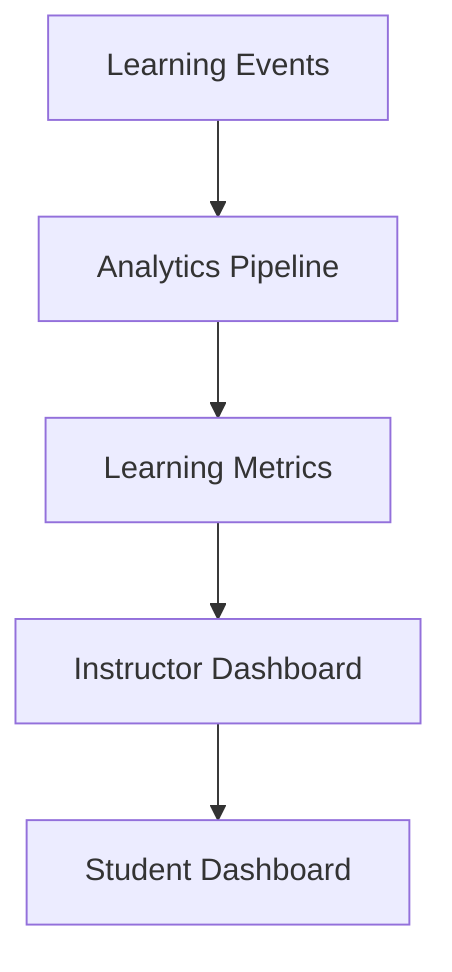

---

# 21. Security & Trust Layer

## Responsibilities

* Citation verification
* Source tracking
* Access control
* Content validation
* Hallucination detection

---

## Trust Pipeline

```mermaid
flowchart TD

A[Generated Response]

--> B[Source Verification]

--> C[Citation Validation]

--> D[Confidence Scoring]

--> E[Final Response]
```

---

# 22. Future Multimodal Expansion

## Phase 1

Text Learning

---

## Phase 2

Image Understanding

```text
Diagrams
Network Topologies
Circuit Schematics
```

---

## Phase 3

Audio Tutoring

```text
Voice Conversations
Spoken Explanations
Pronunciation Guidance
```

---

## Phase 4

Video Intelligence

```text
Lecture Analysis
Video Summaries
Automatic Quiz Generation
```

---

## Phase 5

Interactive Whiteboard

```text
Handwriting Recognition
Diagram Analysis
Collaborative Learning
```

---

# 23. Open Source Ecosystem

## Contribution Types

### Curriculum Contributors

Provide:

* Courses
* Learning Outcomes
* Question Banks

### Research Contributors

Provide:

* Paper Summaries
* Citation Databases

### Agent Developers

Provide:

* New Educational Agents

### Tool Developers

Provide:

* Simulators
* Visualizers
* Assessment Tools

---

# 24. Long-Term Vision

```mermaid
flowchart TD

Phase1[Curriculum Tutor]

--> Phase2[Personalized Learning]

--> Phase3[Research Intelligence]

--> Phase4[Multimodal Learning]

--> Phase5[Agent Marketplace]

--> Phase6[Educational Operating System]

--> Phase7[Global Learning Ecosystem]
```

---

# Success Definition

EduOS succeeds when:

1. Models can be replaced without redesign.
2. Universities can add curricula without code changes.
3. Contributors can add agents independently.
4. New modalities can be integrated via adapters.
5. Student learning continuously improves through personalization.
6. Research knowledge remains continuously updated.
7. The platform evolves into a complete educational ecosystem rather than a chatbot.
