# TCS.md

# Tool & Capability System Specification

Version: 1.0

Status: Core Action Infrastructure

Dependencies:

* TAS.md
* ADS.md
* AOS.md
* RCS.md
* MAS.md

---

# 1. Purpose

The Tool & Capability System (TCS) provides EduOS with the ability to interact with the external world.

The Reasoning Core can think.

The Tool System can act.

---

# 2. Philosophy

Traditional Educational Systems

```text
Question
↓
Answer
```

EduOS

```text
Question
↓
Reason
↓
Decide
↓
Use Tools
↓
Verify
↓
Teach
```

---

# 3. System Architecture

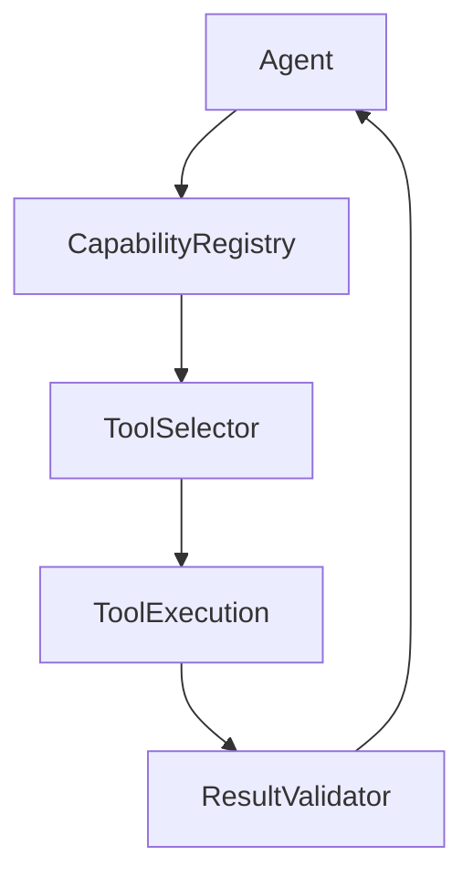

---

# 4. Capability Model

Important distinction:

Capability ≠ Tool

---

Example

Capability:

```text
Research
```

Possible Tools:

```text
IEEE Search

arXiv Search

Google Scholar

Semantic Scholar
```

---

Architecture

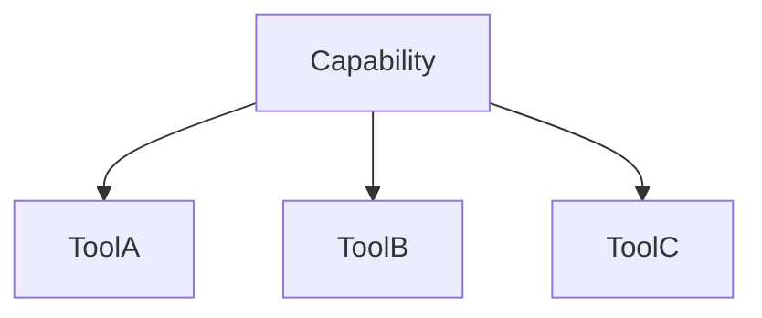

---

# 5. Capability Taxonomy

EduOS capabilities are grouped into domains.

---

## Educational

```text
Curriculum Search

Concept Search

Learning Path Generation

Assessment Generation
```

---

## Research

```text
Paper Search

Citation Analysis

Trend Analysis

Literature Review
```

---

## Coding

```text
Code Execution

Code Review

Debugging

Visualization
```

---

## Mathematical

```text
Equation Solving

Graph Plotting

Symbolic Reasoning
```

---

## Scientific

```text
Simulation

Experiment Design

Lab Analysis
```

---

## Creative

```text
Diagram Creation

Mind Maps

Presentations
```

---

# 6. Tool Hierarchy

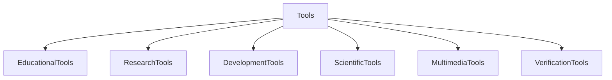

---

# 7. Tool Registry

Purpose:

Maintain discoverable tools.

---

Schema

```yaml
tool:

  id:

  name:

  version:

  capability:

  description:

  permissions:

  input_schema:

  output_schema:
```

---

Example

```yaml
tool:

  id:
    arxiv_search

  capability:
    research_search
```

---

# 8. Capability Registry

Higher-level abstraction.

---

Example

```yaml
capability:

  id:
    research

  tools:

    - arxiv_search

    - ieee_search

    - scholar_search
```

---

# 9. Tool Discovery Engine

Purpose

Determine available tools dynamically.

---

Architecture

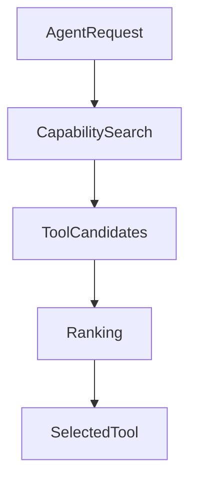

---

# 10. Tool Selection Engine

Inspired by:

* ReAct
* Toolformer
* Function Calling Models

---

Decision Variables

```text
Confidence

Cost

Latency

Accuracy

Availability
```

---

Example

Question:

```text
Latest LLM research?
```

Tool Decision:

```yaml
need_tool:
  true

tool:
  research_search
```

---

# 11. Tool Execution Engine

Purpose

Safely execute tools.

---

Architecture

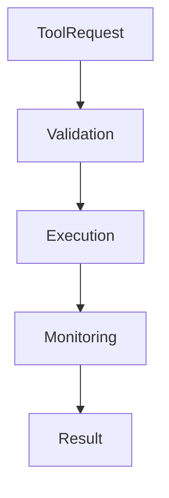

---

# 12. Tool Verification Layer

One of the most important components.

---

Problem

Tools can fail.

---

Solution

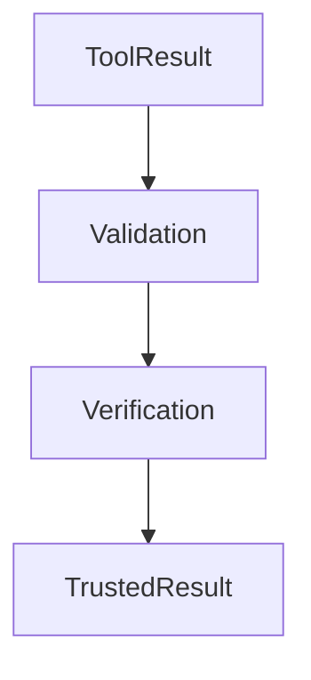

---

Checks

```text
Schema Validation

Source Validation

Result Validation

Consistency Validation
```

---

# 13. Educational Tool Suite

---

## Curriculum Tool

Responsibilities

```text
Topic Search

Outcome Search

Unit Search
```

---

## Assessment Tool

Responsibilities

```text
Quiz Generation

Question Banks

Difficulty Calibration
```

---

## Learning Path Tool

Responsibilities

```text
Prerequisite Mapping

Roadmap Generation
```

---

# 14. Research Tool Suite

---

## Paper Search

Sources

```text
arXiv

IEEE

ACM

Springer
```

---

## Citation Tool

Responsibilities

```text
Citation Graphs

Influence Analysis
```

---

## Trend Tool

Responsibilities

```text
Emerging Topics

Research Trends
```

---

# 15. Coding Tool Suite

---

## Code Execution

Responsibilities

```text
Run Programs

Validate Output
```

---

## Code Review

Responsibilities

```text
Static Analysis

Complexity Analysis
```

---

## Visualization

Responsibilities

```text
Flowcharts

Architecture Diagrams

Graphs
```

---

# 16. Simulation Framework

Future Critical Component

---

Capabilities

```text
Physics

Networking

IoT

Algorithms

Distributed Systems
```

---

Architecture

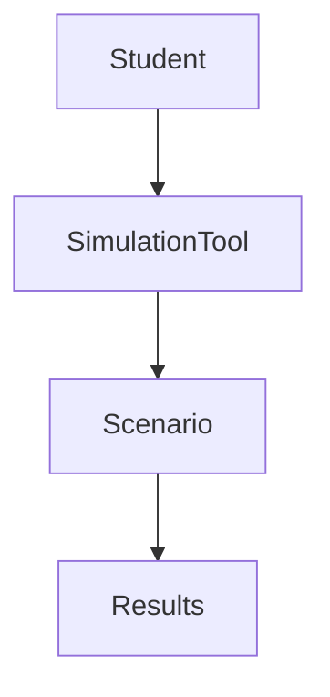

---

# 17. Multimodal Tool Framework

Future Expansion Layer

---

## Vision Tools

```text
Diagram Understanding

Image Analysis

Whiteboard Understanding
```

---

## Audio Tools

```text
Speech Recognition

Voice Tutoring
```

---

## Video Tools

```text
Lecture Understanding

Video Summarization
```

---

Architecture

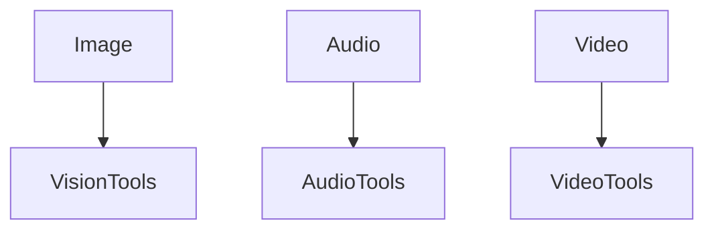

---

# 18. Agent Tool Permissions

Not every agent gets every tool.

---

Architecture

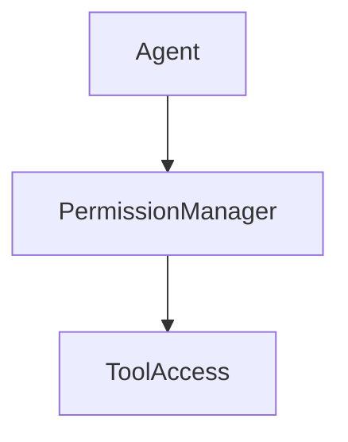

---

Example

Tutor Agent

```text
Curriculum Search

Knowledge Search
```

---

Research Agent

```text
Paper Search

Citation Analysis
```

---

Assessment Agent

```text
Assessment Tools
```

---

# 19. Tool Memory Integration

Every tool interaction creates memory.

---

Workflow

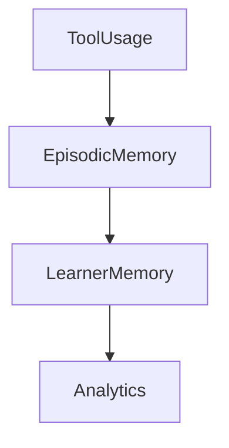

---

# 20. Capability Marketplace

Future Vision

External contributors can provide:

```text
Tools

Simulators

Research Connectors

Visualizers
```

---

Architecture

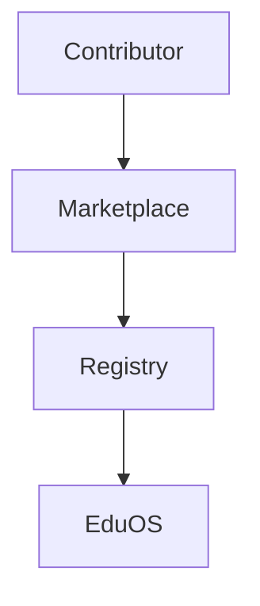

---

# 21. Security Framework

Requirements

```text
Sandboxing

Permission Control

Rate Limiting

Audit Logs

Source Validation
```

---

Architecture

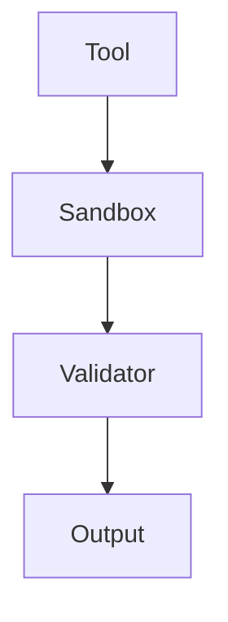

---

# 22. Research Foundations

ReAct

Yao et al. (2022)

---

Toolformer

Schick et al. (2023)

---

AutoGPT

Richards (2023)

---

AutoGen

Wu et al. (2023)

---

LangGraph

State-Based Agent Workflows

---

Function Calling Systems

Modern LLM Tool Use

---

# 23. Long-Term Evolution

Phase 1

```text
Simple Tools
```

↓

Phase 2

```text
Dynamic Tool Selection
```

↓

Phase 3

```text
Tool Composition
```

↓

Phase 4

```text
Multi-Agent Tool Usage
```

↓

Phase 5

```text
Simulation Ecosystem
```

↓

Phase 6

```text
Educational Capability Marketplace
```

---

# 24. Success Criteria

The Tool & Capability System succeeds when:

1. Agents can discover tools dynamically.
2. Tools are capability-driven.
3. New tools require no core modifications.
4. Tool usage is verifiable.
5. Tool permissions remain secure.
6. Simulations become first-class educational assets.
7. Multimodal tools integrate naturally.
8. EduOS can continuously expand its capabilities without architectural redesign.
